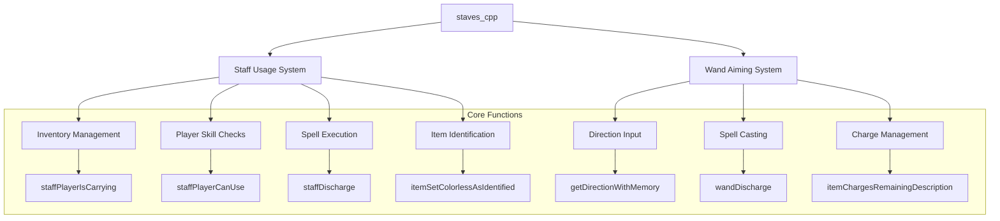
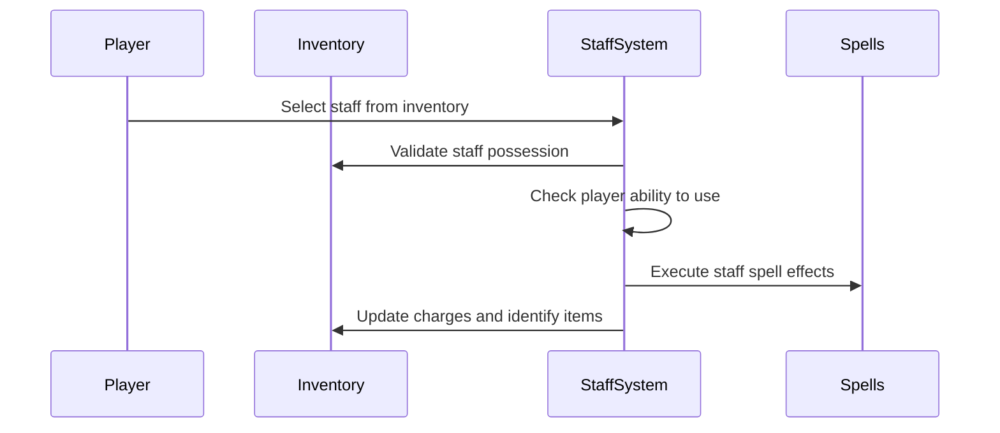
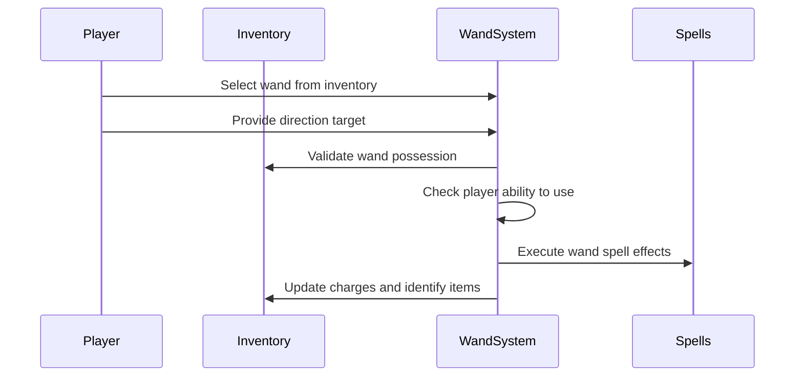
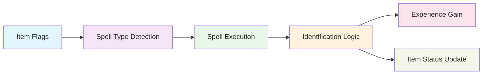

# staves_cpp Module Documentation

## Introduction

The `staves_cpp` module handles the functionality related to staff and wand usage in the game. This module implements the core logic for using magical staves and wands, including charge management, spell casting, identification mechanics, and player interaction. It interfaces with inventory systems, spell casting functions, and player status management.

## Module Overview

This module provides two primary functions for using magical items:
1. **Staff Usage** - Allows players to use staffs by selecting from their inventory and activating them
2. **Wand Aiming** - Enables players to aim wands at specific directions for spell casting

Both functions handle player skill checks, charge consumption, spell execution, and item identification processes.

## Component Architecture

## Detailed Component Descriptions

### Staff Usage System

The staff usage system handles all operations related to using magical staves:

Key components:
- `staffPlayerIsCarrying()` - Validates player has staffs in inventory
- `staffPlayerCanUse()` - Implements skill check for staff usage
- `staffDischarge()` - Executes the actual spell effects of the staff
- `staffUse()` - Main entry point for staff usage

### Wand Aiming System

The wand aiming system manages wand usage with directional targeting:

Key components:
- `wandDischarge()` - Executes wand spell effects based on direction
- `wandAim()` - Main entry point for wand aiming
- Direction handling through `getDirectionWithMemory()`

## Data Flow and Processing

### Spell Execution Flow

### Player Skill Check Process

The system implements a complex skill check mechanism that considers:
- Player saving throw base value
- Wisdom/Intelligence adjustments
- Item depth difficulty
- Class level modifiers
- Confusion state penalties

## Integration Points

This module integrates with several other system components:

### Inventory Management
- Uses `inventoryFindRange()` to locate staffs/wands
- Calls `inventoryGetInputForItemId()` for user selection
- Interfaces with `itemChargesRemainingDescription()` for charge display

### Spell System
- Depends on various spell functions like `spellLightArea()`, `spellEarthquake()`, etc.
- Integrates with spell naming through `spell_names[]`
- Uses `spellFireBolt()` and `spellFireBall()` for projectile spells

### Player Status
- Accesses `py.flags.confused` for confusion state
- Modifies `py.flags.fast/slow` for speed effects
- Updates `py.misc.exp` for experience gain

### Configuration
- Uses `config::player::PLAYER_USE_DEVICE_DIFFICULTY` for skill check thresholds
- References `class_level_adj[]` for class-specific modifiers

## Error Handling and Edge Cases

The module handles several important edge cases:

1. **No Items Available**: Returns appropriate messages when player has no staffs/wands
2. **Insufficient Charges**: Prevents use when items are empty
3. **Skill Failure**: Implements chance-based failure mechanics with confusion penalties
4. **Invalid Selection**: Handles cancelled input gracefully
5. **Unknown Spell Types**: Includes error handling for unexpected spell types

## Performance Considerations

The module is designed for efficient operation:
- Uses bit manipulation for spell flag processing
- Implements early returns for validation failures
- Minimizes redundant calculations through caching
- Processes spell effects in a single pass through flags

## Related Modules

This module works closely with:
- [inventory](inventory.md) - For item management and selection
- [spells](spells.md) - For actual spell execution functions
- [player](player.md) - For player status and statistics
- [identification](identification.md) - For item identification mechanics

## Configuration Dependencies

The module relies on configuration values from:
- `config::player::PLAYER_USE_DEVICE_DIFFICULTY` - Skill check threshold
- `class_level_adj[]` - Class-specific device usage modifiers
- Various spell-related configurations in the spells module

## Usage Examples

### Staff Usage Flow
1. Player selects a staff from inventory
2. System validates player can use it
3. If successful, spell effects are executed
4. Item is either identified or marked as tried
5. Charge count is updated and displayed

### Wand Aiming Flow
1. Player selects a wand from inventory
2. Player provides direction target
3. System validates player can use it
4. If successful, spell effects are cast in direction
5. Item is either identified or marked as tried
6. Charge count is updated and displayed

This module forms a critical part of the game's magic system, providing the foundation for staff and wand interactions that players rely on throughout their adventure.
