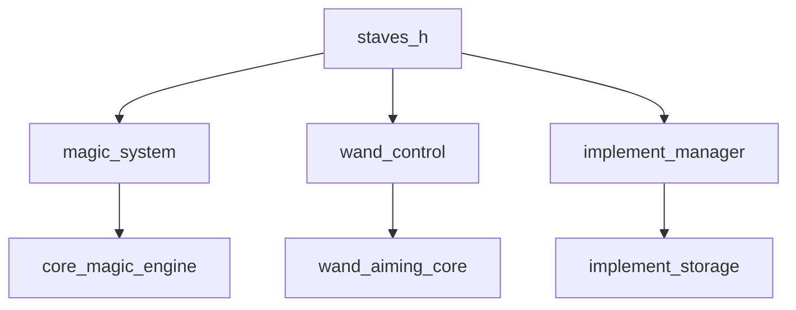
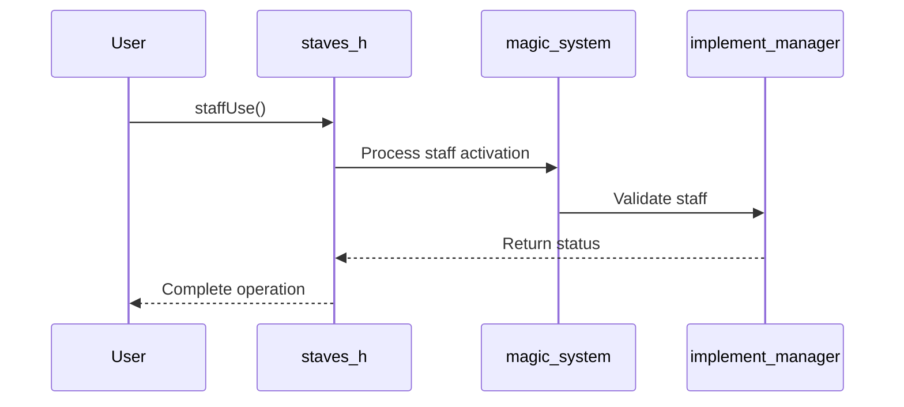

# staves_h Module Documentation

## Brief Introduction

The `staves_h` module provides the interface definitions for staff-related functionalities within the system. This header file declares the core functions that enable staff usage and wand aiming operations, serving as a contract between different components that interact with magical implements.

## Comprehensive Documentation

This module defines the public API for staff manipulation functionality. It contains function declarations that allow other parts of the system to utilize staff-based interactions and wand targeting capabilities.

### Function Declarations

The module exposes two primary functions:

- `staffUse()`: Handles the activation and usage of staff implements
- `wandAim()`: Manages wand targeting and aiming mechanics

These functions form the foundation for magical implement interaction within the system architecture.

### Module Relationships

This module interfaces with several other components in the magical system:

- **[magic_system](magic_system.md)**: Provides the overarching framework for magical operations
- **[wand_control](wand_control.md)**: Manages wand-specific functionality that complements staff operations
- **[implement_manager](implement_manager.md)**: Handles the lifecycle and management of magical implements including staves

### Architecture Integration

The `staves_h` module sits at the interface layer of the magical implement subsystem, providing clean abstractions for staff operations while maintaining compatibility with lower-level implementation details.

## Component Interactions

## Data Flow

## System Integration

The `staves_h` module integrates with the broader magical system through:

1. **Magic System Interface**: Connects to the core magic processing engine
2. **Implement Management**: Works with the implement manager for staff validation
3. **Wand Coordination**: Coordinates with wand control for combined magical operations

This integration ensures that staff operations are properly managed within the context of the entire magical framework.

## Dependencies

The module depends on:
- [magic_system.h](magic_system.md) - Core magical system definitions
- [wand_control.h](wand_control.md) - Wand-related functionality
- [implement_manager.h](implement_manager.md) - Magical implement handling

## Usage Context

This module should be included by any component that needs to perform staff-related operations or wand aiming functionality. The declarations provide the necessary interface for these operations while keeping implementation details abstracted away.

For detailed implementation specifics, see the corresponding [staves.c](staves.c) file which contains the actual function implementations.
