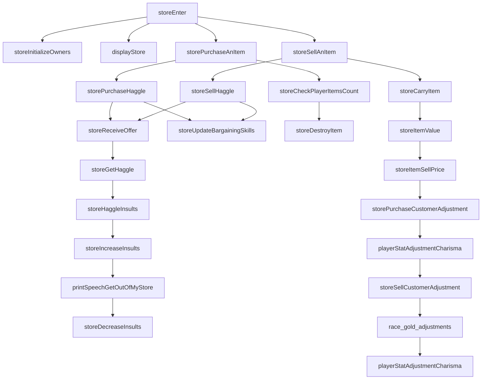
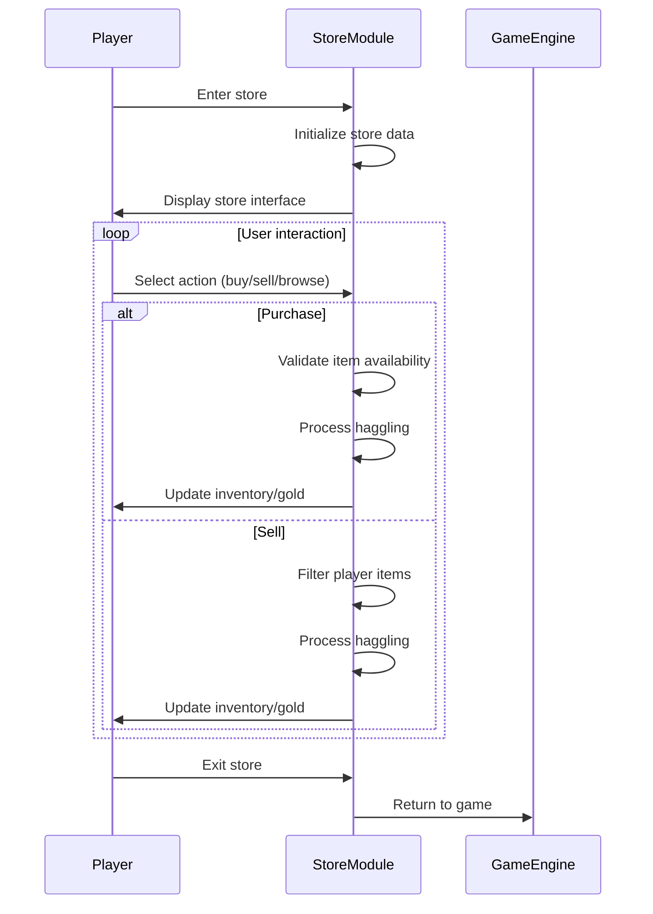

# Store C++ Module Documentation

## Introduction

The `store_cpp` module implements the core functionality for interacting with stores within the game. This module handles all aspects of store operations including initialization of store owners, inventory management, purchasing and selling mechanics, haggling systems, and player interactions with store interfaces.

## Architecture Overview

## Core Components

### Store Data Structures

The module works with several key data structures:

- **Store_t**: Represents a single store with owner information, inventory, and transaction counters
- **Owner_t**: Contains owner-specific properties like max insults, inflation rates, and haggling behavior
- **InventoryRecord_t**: Stores item information and pricing details within stores

### Main Functions

#### `storeEnter(int store_id)`
The primary entry point for store interactions. This function:
- Checks if the store is closed
- Displays the store interface
- Handles user commands for browsing, purchasing, selling, and inventory management
- Manages the main store interaction loop

#### `storeInitializeOwners()`
Initializes all store owners with:
- Random owner assignments
- Default counter values (insults, turns before closing)
- Empty inventory initialization

#### `storePurchaseAnItem(int store_id, int &current_top_item_id)`
Handles the purchase logic for items from stores:
- Validates item availability
- Processes haggling if needed
- Updates player inventory and gold
- Manages store inventory updates

#### `storeSellAnItem(int store_id, int &current_top_item_id)`
Handles the selling logic for items to stores:
- Filters player inventory by store-buyable categories
- Processes haggling for selling prices
- Updates player inventory and gold
- Manages store inventory additions

### Haggling System

The haggling system is implemented through several interconnected functions:

#### `storePurchaseHaggle(int store_id, int32_t &price, Inventory_t const &item)`
Manages the buying process with haggling:
- Calculates initial price ranges based on owner characteristics
- Implements negotiation mechanics with insult tracking
- Handles multiple bid rounds with dynamic price adjustments

#### `storeSellHaggle(int store_id, int32_t &price, Inventory_t const &item)`
Manages the selling process with haggling:
- Calculates selling prices considering player charisma and race modifiers
- Implements bid acceptance/rejection logic
- Handles final offer negotiations

#### `storeReceiveOffer(int store_id, const char *prompt, int32_t &new_offer, int32_t last_offer, int offer_count, int factor)`
Core haggling input handler:
- Processes user input for offers/prices
- Validates offer amounts against previous bids
- Manages insult counter and rejection conditions

### Store Management Functions

#### `storeCheckPlayerItemsCount(Store_t &store, Inventory_t const &item)`
Validates if a store can accept an item for purchase.

#### `storeCarryItem(int store_id, int &item_pos_id, Inventory_t const &item)`
Adds an item to a store's inventory.

#### `storeDestroyItem(int store_id, int item_id, bool update_counter)`
Removes an item from a store's inventory.

### Utility Functions

#### `storeNoNeedToBargain(Store_t const &store, int32_t min_price)`
Determines when haggling is unnecessary based on store's transaction history.

#### `storeUpdateBargainingSkills(Store_t &store, int32_t price, int32_t min_price)`
Updates store's bargaining experience based on transaction outcomes.

#### `storeIncreaseInsults(int store_id)` and `storeDecreaseInsults(int store_id)`
Manage the insult counter that affects store behavior and potential closure.

## Data Flow

## Integration Points

This module integrates with several other system components:

- **[player_stats](player_stats.md)**: Uses charisma adjustments for pricing calculations
- **[inventory](inventory.md)**: Manages item transfers between player and store inventories
- **[game_state](game_state.md)**: Accesses global game turn information for store closures
- **[messages](messages.md)**: Displays various store-related messages and dialogues
- **[config](config.md)**: References configuration data for object definitions and limits

## Dependencies

The module depends on:
- `headers.h`: Standard game headers and definitions
- Player statistics and inventory systems
- Message display and input handling systems
- Configuration data for object types and store settings

## Error Handling

The module implements robust error handling for:
- Insufficient gold situations
- Inventory capacity limits
- Invalid item selections
- Store closure conditions
- Haggling insult thresholds

## Performance Considerations

The store system is designed to be efficient with:
- Minimal memory allocations during normal operation
- Optimized inventory display updates
- Cached calculation results where appropriate
- Early termination of invalid operations

## Security and Validation

All user inputs are validated:
- Item selection ranges are checked
- Price offers are validated against acceptable ranges
- Gold amounts are verified before transactions
- Store state is maintained consistently across operations
