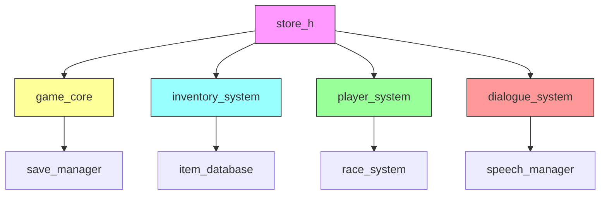
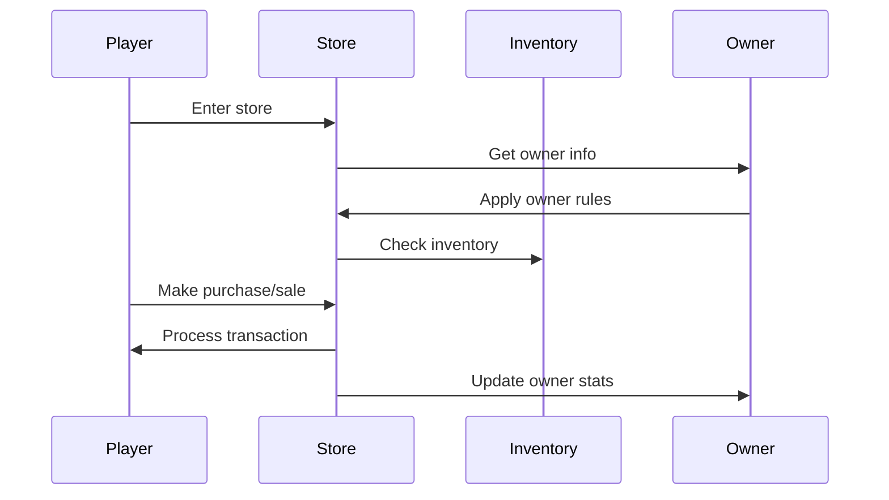
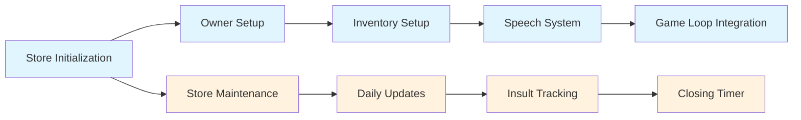

# Store H Module Documentation

## Brief Introduction

The `store_h` module provides the core data structures and function declarations for managing game stores and their associated owners. This module defines the fundamental types used to represent store inventory, owner characteristics, and the various speech elements used during store interactions. It serves as the foundation for store-related gameplay mechanics including item trading, pricing calculations, and NPC behavior management.

## Detailed Documentation

### Data Structures

The module defines several key data structures that form the backbone of store functionality:

#### Store Structure (`Store_t`)
```c
typedef struct {
    int32_t turns_left_before_closing;
    int16_t insults_counter;
    uint8_t owner_id;
    uint8_t unique_items_counter;
    uint16_t good_purchases;
    uint16_t bad_purchases;
    InventoryRecord_t inventory[STORE_MAX_DISCRETE_ITEMS];
} Store_t;
```

This structure represents a single store in the game world, containing:
- Timing information for store closure
- Player interaction counters (insults, purchases)
- Owner identification
- Inventory management data
- Actual inventory records

#### Owner Structure (`Owner_t`)
```c
typedef struct {
    const char *name;
    int16_t max_cost;
    uint8_t max_inflate;
    uint8_t min_inflate;
    uint8_t haggles_per;
    uint8_t race;
    uint8_t max_insults;
} Owner_t;
```

This structure defines the characteristics of store owners:
- Name and racial attributes
- Pricing parameters (cost limits, inflation rates)
- Haggling behavior settings
- Interaction limits

#### Inventory Record (`InventoryRecord_t`)
```c
typedef struct {
    int32_t cost;
    Inventory_t item;
} InventoryRecord_t;
```

This structure combines item data with its current selling price for store inventory tracking.

### Constants

The module defines several important constants:
- `MAX_OWNERS`: Maximum number of store owners (18)
- `MAX_STORES`: Maximum number of stores (6)
- `STORE_MAX_DISCRETE_ITEMS`: Maximum items per store (24)
- `STORE_MAX_ITEM_TYPES`: Maximum item types tracked per store (26)
- `COST_ADJUSTMENT`: Base cost adjustment value (100)

### Global Variables

The module exposes several global arrays and variables for store management:

```c
extern uint8_t race_gold_adjustments[PLAYER_MAX_RACES][PLAYER_MAX_RACES];
extern Owner_t store_owners[MAX_OWNERS];
extern Store_t stores[MAX_STORES];
extern uint16_t store_choices[MAX_STORES][STORE_MAX_ITEM_TYPES];
extern bool (*store_buy[MAX_STORES])(uint8_t);
extern const char *speech_sale_accepted[14];
extern const char *speech_selling_haggle_final[3];
extern const char *speech_selling_haggle[16];
extern const char *speech_buying_haggle_final[3];
extern const char *speech_buying_haggle[15];
extern const char *speech_insulted_haggling_done[5];
extern const char *speech_get_out_of_my_store[5];
extern const char *speech_haggling_try_again[10];
extern const char *speech_sorry[5];
```

### Function Declarations

The module provides functions for store initialization, maintenance, and item management:

```c
void storeInitializeOwners();
void storeEnter(int store_id);
void storeMaintenance();
int32_t storeItemValue(Inventory_t const &item);
int32_t storeItemSellPrice(Store_t const &store, int32_t &min_price, int32_t &max_price, Inventory_t const &item);
bool storeCheckPlayerItemsCount(Store_t const &store, Inventory_t const &item);
void storeCarryItem(int store_id, int &index_id, Inventory_t &item);
void storeDestroyItem(int store_id, int item_id, bool only_one_of);
```

### Component Interactions

The store system interacts with several other modules in the game architecture:



### Data Flow

The store system follows a specific data flow pattern:



### Store Management Process

The store management process involves several key steps:



### Integration Points

The `store_h` module integrates with several other systems:

- **[inventory_system](inventory_system.md)**: Manages item storage and retrieval within stores
- **[player_system](player_system.md)**: Handles player interactions with store owners
- **[race_system](race_system.md)**: Provides racial adjustments for pricing
- **[dialogue_system](dialogue_system.md)**: Manages all store-related speech and conversation
- **[save_manager](save_manager.md)**: Persists store state between game sessions

### Dependencies

The module depends on:
- `inventory.h` for item definitions
- `player.h` for player-related constants
- `race.h` for racial data structures
- `speech.h` for dialogue management

### Usage Context

This module is primarily used during:
- Game initialization when stores are first set up
- Player store visits and transactions
- Daily store maintenance operations
- Save/load operations for persistent store data

The store system forms a critical part of the economic gameplay loop, providing players with opportunities to trade goods while maintaining realistic NPC behaviors and market dynamics.
