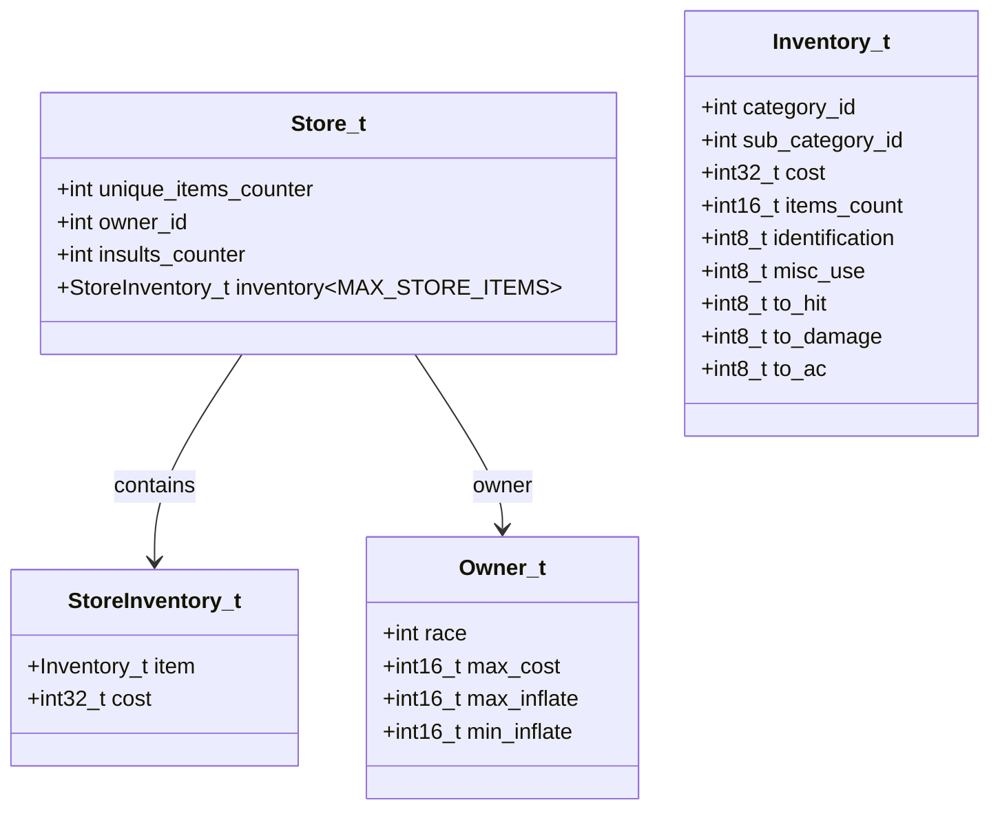
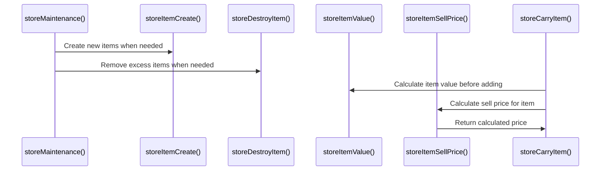

# Store Inventory C++ Module Documentation

## Brief Introduction

The `store_inventory_cpp` module handles all store-related inventory management operations within the game system. This module manages the creation, maintenance, pricing, and item handling for player stores, ensuring proper inventory control and economic balance within the game world.

## Module Overview

This module provides core functionality for managing store inventories including:
- Store maintenance routines (stock replenishment and reduction)
- Item valuation and pricing calculations
- Inventory insertion and removal operations
- Player item stacking and storage checks

## Architecture and Component Relationships

### Core Components

The main component in this module is `store_inventory.cpp`, which contains all the primary functions for store inventory management.

### Dependencies

This module depends on several other system components:

- **[headers.h](headers.h.md)** - Provides essential definitions and includes
- **[config](config.md)** - Configuration settings for store behavior
- **[game_objects](game_objects.md)** - Game object definitions and properties
- **[inventory](inventory.md)** - Inventory management utilities
- **[magic_treasure](magic_treasure.md)** - Magical item generation
- **[random_number](random_number.md)** - Random number generation utilities
- **[store_owners](store_owners.md)** - Store owner information and behaviors
- **[race_gold_adjustments](race_gold_adjustments.md)** - Gold adjustment calculations by race

### Data Structures



## Data Flow and Processing

### Store Maintenance Process

```mermaid
flowchart TD
    A[storeMaintenance()] --> B{Unique Items Count}
    B -->|>= Min Auto Sell| C[Calculate Turnaround]
    C --> D[Remove Items]
    B -->|<= Max Auto Buy| E[Calculate Turnaround]
    E --> F[Add New Items]
    D --> G[storeDestroyItem()]
    F --> H[storeItemCreate()]
```

### Item Valuation Process

```mermaid
flowchart TD
    A[storeItemValue()] --> B{Item Category}
    B -->|Weapon/Armor| C[getWeaponArmorBuyPrice()]
    B -->|Ammunition| D[getAmmoBuyPrice()]
    B -->|Potions/Scrolls| E[getPotionScrollBuyPrice()]
    B -->|Food| F[getFoodBuyPrice()]
    B -->|Rings/Amulets| G[getRingAmuletBuyPrice()]
    B -->|Wands/Staffs| H[getWandStaffBuyPrice()]
    B -->|Digging Tools| I[getPickShovelBuyPrice()]
    B -->|Other| J[return item.cost]
```

### Item Selling Price Calculation

```mermaid
flowchart TD
    A[storeItemSellPrice()] --> B[Calculate Base Value]
    B --> C[Apply Race Adjustment]
    C --> D[Calculate Min/Max Prices]
    D --> E[Return Final Price]
```

## Component Interaction Flow

### Main Functions Overview

1. **storeMaintenance()** - Manages automatic store stock adjustments
2. **storeItemValue()** - Calculates item value based on type and properties
3. **storeItemSellPrice()** - Determines selling prices with inflation factors
4. **storeCheckPlayerItemsCount()** - Validates item stacking capabilities
5. **storeCarryItem()** - Inserts items into store inventory
6. **storeDestroyItem()** - Removes items from store inventory
7. **storeItemCreate()** - Generates new items for store inventory

### Detailed Function Interactions



## System Integration Points

This module integrates with the broader game system through:

1. **Game Object Management** - Uses `game_objects` for item definitions
2. **Inventory System** - Works with `inventory` module for item handling
3. **Random Number Generation** - Utilizes `random_number` for item selection
4. **Store Owners** - References `store_owners` for pricing policies
5. **Magic Item Generation** - Integrates with `magic_treasure` for magical items

## Key Algorithms

### Store Stock Management Algorithm

The store maintenance algorithm balances inventory levels based on:
- Minimum auto-sell items threshold
- Maximum auto-buy items threshold  
- Stock turnover rate
- Dynamic adjustment based on current inventory levels

### Item Valuation Algorithm

Item valuation varies by category:
- Weapons and armor: Base cost plus property bonuses
- Ammunition: Base cost plus hit/damage/ac modifiers
- Potions and scrolls: Special identification handling
- Food items: Basic cost or identification-based pricing
- Rings and amulets: Identification-dependent pricing
- Wands and staffs: Charge-based pricing
- Digging tools: Durability-based pricing

### Pricing Calculation Algorithm

Selling prices are calculated using:
1. Base item value
2. Race-specific gold adjustment factors
3. Owner-specific inflation multipliers
4. Minimum and maximum price boundaries

## Configuration Dependencies

This module relies on configuration values from:
- `config::stores::STORE_MIN_AUTO_SELL_ITEMS`
- `config::stores::STORE_MAX_AUTO_BUY_ITEMS`
- `config::stores::STORE_STOCK_TURN_AROUND`
- `config::treasure::LEVEL_TOWN_OBJECTS`

These configurations control the dynamic behavior of store inventories and ensure appropriate game balance.

## Performance Considerations

The module implements efficient algorithms for:
- O(n) inventory searches during item insertion
- Constant-time price calculations
- Batch processing for stock maintenance
- Memory-efficient item copying operations

## Error Handling

The module handles edge cases such as:
- Negative item values due to damaged properties
- Stack overflow prevention for item quantities
- Invalid item categories gracefully
- Empty inventory conditions

## Usage Examples

The store inventory system is typically invoked during:
- Game tick processing for automatic store maintenance
- Player interactions with store interfaces
- Item purchase/sale transactions
- World generation and initialization phases

This module forms a critical part of the game economy system, ensuring stores maintain appropriate inventory levels and provide fair pricing to players.
