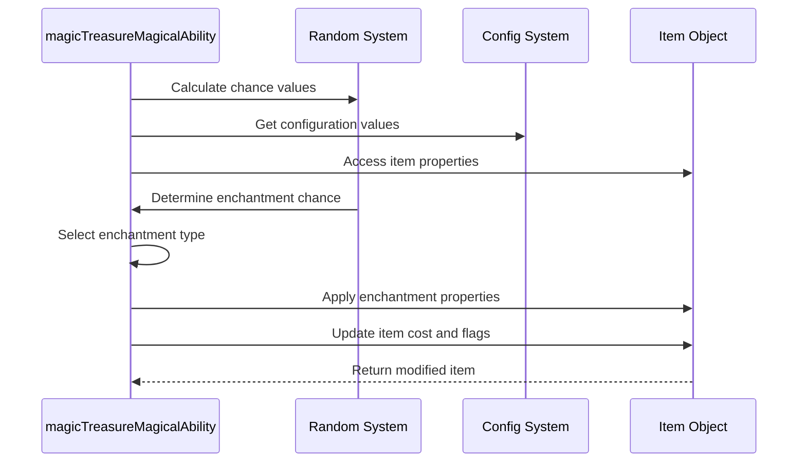
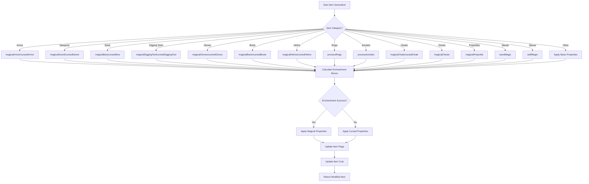
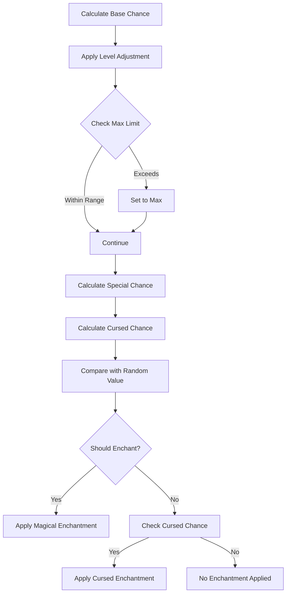

# treasure_cpp Module Documentation

## Introduction

The `treasure_cpp` module is responsible for generating and managing magical properties of items in the game world. This module handles the enchantment logic for various item categories including weapons, armor, rings, amulets, and magical objects. It determines whether items should be enchanted, what type of enchantments they receive, and how these affect item properties such as attack bonuses, defense ratings, and special abilities.

## Architecture Overview

```mermaid
graph TD
    A[treasure.cpp] --> B[magicTreasureMagicalAbility]
    A --> C[magicShouldBeEnchanted]
    A --> D[magicEnchantmentBonus]
    A --> E[magicalArmor]
    A --> F[cursedArmor]
    A --> G[magicalSword]
    A --> H[cursedSword]
    A --> I[magicalBow]
    A --> J[cursedBow]
    A --> K[magicalDiggingTool]
    A --> L[cursedDiggingTool]
    A --> M[magicalGloves]
    A --> N[cursedGloves]
    A --> O[magicalBoots]
    A --> P[cursedBoots]
    A --> Q[magicalHelms]
    A --> R[cursedHelms]
    A --> S[processRings]
    A --> T[processAmulets]
    A --> U[magicalCloak]
    A --> V[cursedCloak]
    A --> W[magicalChests]
    A --> X[magicalProjectile]
    A --> Y[magicalProjectileAdjustment]
    A --> Z[cursedProjectileAdjustment]
    A --> AA[wandMagic]
    A --> AB[staffMagic]
    
    subgraph "Core Functions"
        B
        C
        D
        E
        F
        G
        H
        I
        J
        K
        L
        M
        N
        O
        P
        Q
        R
        S
        T
        U
        V
        W
        X
        Y
        Z
        AA
        AB
    end
    
    subgraph "Dependencies"
        B -->|game.treasure.list| [game_state.md]
        B -->|config::treasure| [config.md]
        B -->|randomNumber| [random.md]
        B -->|randomNumberNormalDistribution| [random.md]
        B -->|maxDiceRoll| [dice.md]
    end
```

## Component Relationships

### Main Entry Point: magicTreasureMagicalAbility

The primary function that orchestrates all magical item generation logic. It takes an item ID and level as parameters and applies appropriate enchantments based on item category and random chance calculations.

### Enchantment Logic Components

#### Randomization Functions
- `magicShouldBeEnchanted`: Determines if an item should receive magical properties based on chance calculations
- `magicEnchantmentBonus`: Calculates the bonus value for magical enchantments using normal distribution

#### Item-Specific Enchantment Functions
Each item category has dedicated functions that handle their specific magical properties:

- **Armor**: `magicalArmor`, `cursedArmor`
- **Weapons**: `magicalSword`, `cursedSword`, `magicalBow`, `cursedBow`
- **Tools**: `magicalDiggingTool`, `cursedDiggingTool`
- **Accessories**: `magicalGloves`, `cursedGloves`, `magicalBoots`, `cursedBoots`, `magicalHelms`, `cursedHelms`
- **Rings/Amulets**: `processRings`, `processAmulets`
- **Special Items**: `magicalCloak`, `cursedCloak`, `magicalChests`, `magicalProjectile`, `wandMagic`, `staffMagic`

## Data Flow



## Configuration Dependencies

This module heavily relies on configuration values defined in the treasure configuration system. Key configuration elements include:

- `config::treasure::LEVEL_STD_OBJECT_ADJUST`
- `config::treasure::LEVEL_MIN_OBJECT_STD`
- `config::treasure::OBJECT_BASE_MAGIC`
- `config::treasure::OBJECT_MAX_BASE_MAGIC`
- `config::treasure::OBJECT_CHANCE_SPECIAL`
- `config::treasure::OBJECT_CHANCE_CURSED`

For detailed configuration definitions, see [config.md](config.md).

## Integration Points

### Game State Integration
The module interacts with the global game state through `game.treasure.list` which contains all items in the treasure system. This integration point is critical for modifying item properties during treasure generation.

### Random Number Generation
All enchantment decisions rely on random number generation functions from the random system module. The module uses both standard random numbers and normal distribution random numbers for calculating enchantment bonuses.

### Item Identification System
The module integrates with the identification system to mark items with appropriate flags indicating their magical properties and display characteristics.

## Process Flows

### Magical Item Generation Process



### Enchantment Chance Calculation



## Special Considerations

### Curse Handling
The module implements comprehensive curse handling for items that fail their enchantment checks. Cursed items typically lose positive properties while gaining negative ones, and their cost is set to zero.

### Normal Distribution Usage
The `magicEnchantmentBonus` function utilizes normal distribution to create more realistic enchantment values that follow statistical patterns rather than uniform random distributions.

### Item Category Specific Logic
Different item categories have unique behaviors:
- Weapons get hit/damage bonuses
- Armor gets AC bonuses and resistance flags
- Rings and amulets have special property modifications
- Chests get trap flags
- Projectiles get special attack properties

## External Module Dependencies

This module depends on several other core modules:

- [game_state.md](game_state.md): For accessing treasure list and game state
- [config.md](config.md): For configuration values related to treasure generation
- [random.md](random.md): For random number generation functions
- [dice.md](dice.md): For dice roll calculations

## Performance Considerations

The module performs calculations for each item during treasure generation, so efficiency is important. All functions are designed to be lightweight and avoid unnecessary computations. The use of static functions minimizes memory overhead and improves cache locality.

## Error Handling

The module does not explicitly handle error conditions since it operates within a controlled game environment where item types and categories are predefined. However, it includes bounds checking for calculated values to prevent overflow issues.

## Future Enhancements

Potential improvements could include:
1. More sophisticated enchantment balancing algorithms
2. Additional item category support
3. Enhanced curse effect variety
4. Integration with advanced random distribution systems
