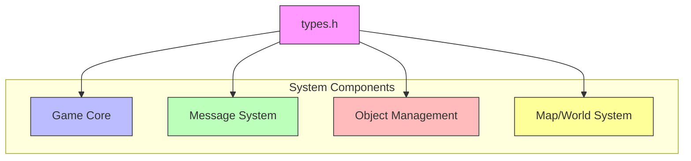
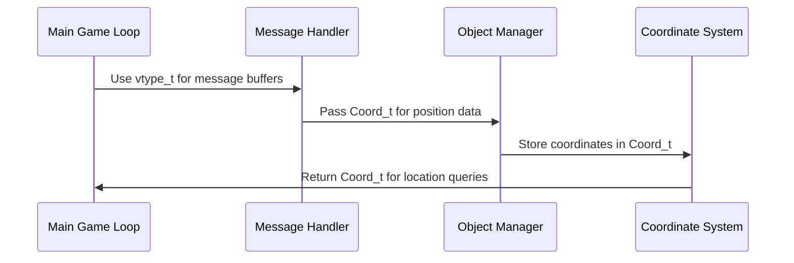

# types_h Module Documentation

## Brief Introduction

The `types_h` module defines fundamental data types and constants used throughout the Moria system. This module serves as a central repository for type definitions that are shared across multiple components, ensuring consistency and reducing code duplication. The module contains essential typedefs for coordinates and string types, along with important constants that define message and object description sizes.

## Detailed Documentation

### Core Components

The module consists of a single header file `types.h` that provides:

1. **Null Pointer Constant**: `CNIL` - A constexpr null pointer constant
2. **Size Constants**: 
   - `MORIA_MESSAGE_SIZE` - Defines the maximum size for messages (80 characters)
   - `MORIA_OBJ_DESC_SIZE` - Defines the maximum size for object descriptions (160 characters)
3. **Data Types**:
   - `vtype_t` - Character array type for messages
   - `obj_desc_t` - Character array type for object descriptions
   - `Coord_t` - Structure for coordinate pairs

### Type Definitions

#### Null Pointer Constant
```c
constexpr char *CNIL = nullptr;
```
A universal null pointer constant that can be used throughout the system where a null pointer is needed.

#### Message Size Constants
```c
constexpr uint8_t MORIA_MESSAGE_SIZE = 80;
constexpr uint8_t MORIA_OBJ_DESC_SIZE = 160;
```
These constants define the fixed buffer sizes for different text fields in the system:
- `MORIA_MESSAGE_SIZE`: Maximum length for game messages
- `MORIA_OBJ_DESC_SIZE`: Maximum length for object descriptions

#### Array Types
```c
typedef char vtype_t[MORIA_MESSAGE_SIZE];
typedef char obj_desc_t[MORIA_OBJ_DESC_SIZE];
```
These typedefs create convenient aliases for character arrays of specific sizes, making the code more readable and maintainable.

#### Coordinate Structure
```c
typedef struct {
    int y;
    int x;
} Coord_t;
```
A simple structure representing 2D coordinates with integer `y` and `x` components, commonly used for positioning in the game world.

### Architecture and Relationships

This module acts as a foundational component that is likely included by many other modules in the system. The types defined here are fundamental building blocks that support higher-level functionality.



### Data Flow and Usage Patterns

The types defined in this module flow through the system in the following patterns:



### Integration Points

This module is typically included by:
- [game_core](game_core.md) - Main game logic components
- [message_system](message_system.md) - Text messaging functionality  
- [object_manager](object_manager.md) - Item and entity handling
- [world_map](world_map.md) - Map and coordinate systems

### Dependencies

The `types_h` module has minimal dependencies and is designed to be included by other modules without creating circular dependencies. It depends only on standard C++ features and basic type definitions.

### Best Practices

When using types from this module:
1. Always include `types.h` when working with coordinate systems or text buffers
2. Use the predefined constants to ensure consistent sizing across the system
3. Prefer the typedef'd types over raw array declarations for better code readability
4. Remember that `CNIL` should be used instead of literal `nullptr` for consistency

### Version History

- **v1.0**: Initial release with core type definitions
- **v1.1**: Added null pointer constant for consistency

This module represents a critical infrastructure component that maintains type consistency throughout the Moria system architecture.
