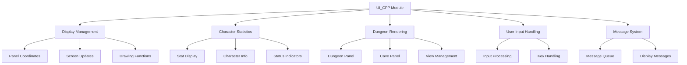
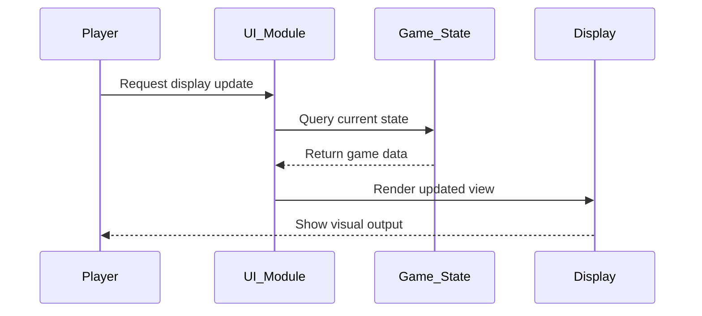
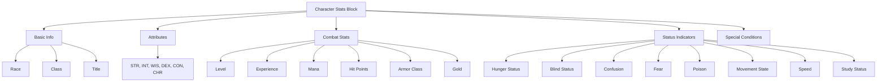

# UI C++ Module Documentation

## Introduction

The `ui_cpp` module serves as the primary user interface implementation for the Moria game engine. This module handles all visual display operations, character statistics rendering, dungeon panel management, and user interaction elements. It provides the core graphical interface components that allow players to interact with the game world through text-based displays.

## Architecture Overview



## Component Relationships

### Core Components

The `ui.cpp` file contains several key functional areas:

1. **Panel Management** - Handles coordinate calculations and panel boundaries
2. **Display Functions** - Manages character statistics and dungeon rendering
3. **Character Information** - Displays player attributes and status
4. **Message System** - Manages game messages and notifications
5. **Spell Display** - Renders spell lists and information

### Data Flow



## Detailed Functionality

### Panel Management System

The panel system manages the division of the screen into multiple viewing areas:

```mermaid
graph LR
    A[Panel Coordinates] --> B[Boundary Calculation]
    B --> C[Coordinate Validation]
    C --> D[Panel Switching]
    
    subgraph Panel_Functions
        B1[panelBounds()]
        B2[coordOutsidePanel()]
        B3[coordInsidePanel()]
    end
```

The `panelBounds()` function calculates panel boundaries based on screen dimensions, while `coordOutsidePanel()` and `coordInsidePanel()` handle coordinate validation and panel switching logic.

### Character Statistics Display

The character statistics system renders player information in organized blocks:



### Dungeon Rendering System

The dungeon rendering system handles the visualization of the game world:

```mermaid
graph TD
    A[Dungeon Rendering] --> B[Panel Drawing]
    A --> C[Character Position]
    A --> D[Lighting Effects]
    A --> E[Visibility Management]
    
    B --> B1[drawDungeonPanel()]
    B --> B2[drawCavePanel()]
    B --> B3[dungeonResetView()]
    
    D --> D1[Light Room]
    D --> D2[Character Light]
    D --> D3[Permanent Lighting]
```

### Message System Integration

The message system maintains and displays game events:

```mermaid
graph TD
    A[Message System] --> B[Message Storage]
    A --> C[Message Display]
    A --> D[Message Queue]
    
    B --> B1[vtype_t messages]
    B --> B2[last_message_id]
    B --> B3[message_ready_to_print]
    
    C --> C1[printMessage()]
    C --> C2[displaySpellsList()]
    C --> C3[printCharacterExperience()]
```

## Integration with Other Modules

This module interfaces with several other core systems:

- **[game_state](game_state.md)** - Accesses player data and game state information
- **[player](player.md)** - Uses player statistics and character information
- **[dungeon](dungeon.md)** - Interacts with dungeon tile data and visibility
- **[input](input.md)** - Processes user input for navigation and commands
- **[config](config.md)** - References configuration options and constants

## Key Constants and Definitions

The module uses several important constants:

- `STAT_COLUMN` - Column position for character statistics display
- `MESSAGE_HISTORY_SIZE` - Size of message history buffer
- `MORIA_MESSAGE_SIZE` - Maximum size for message strings
- `SCREEN_WIDTH` and `SCREEN_HEIGHT` - Screen dimension constants
- Various status flags from `config::player::status`

## Usage Patterns

### Display Update Flow

1. **Initialization**: Set up panel coordinates and boundaries
2. **State Query**: Retrieve current game state information
3. **Rendering**: Draw character stats, dungeon panels, and status indicators
4. **Update**: Refresh display with new information

### Character Information Display

The module follows a consistent pattern for displaying character information:

1. **Basic Info**: Race, class, title, and name
2. **Attributes**: All six primary statistics with max values
3. **Combat Stats**: Level, experience, mana, hit points, armor class, gold
4. **Status**: Hunger, blindness, confusion, fear, poison, movement states
5. **Special Conditions**: Study status, winner status, special flags

## Performance Considerations

The UI module is designed for efficient updates by:
- Only redrawing changed portions of the screen
- Using pre-calculated coordinate bounds
- Implementing lazy evaluation for status indicators
- Managing memory efficiently with static buffers

## Dependencies

This module depends on:
- Header files defining game structures and constants
- Player state management functions
- Dungeon tile access functions
- Input handling mechanisms
- Configuration system for game options

The module integrates closely with the core game loop and state management systems to provide real-time visual feedback to players.
