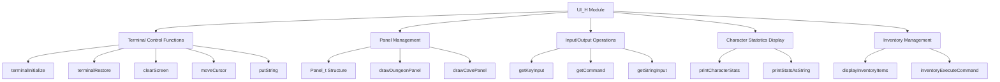

# UI_H Module Documentation

## Brief Introduction

The `ui_h` module provides the core user interface functionality for the application. It defines the fundamental data structures and function interfaces needed for terminal-based user interaction, screen management, and input handling. This module serves as the foundation for all user-facing operations in the system.

## Module Overview

The `ui_h` module contains declarations for panel management structures, terminal control functions, and various UI-related utilities. It provides the essential building blocks for creating interactive terminal applications.

### Key Components

The main component in this module is the `Panel_t` structure which defines panel dimensions and positioning parameters, along with numerous function declarations for terminal I/O operations.

## Architecture and Relationships



## Data Structures

### Panel_t Structure

The `Panel_t` structure defines the properties of a UI panel:

```c
typedef struct {
    int row;
    int col;

    int top;
    int bottom;
    int left;
    int right;

    int col_prt;
    int row_prt;

    int16_t max_rows;
    int16_t max_cols;
} Panel_t;
```

This structure manages panel positioning, boundaries, and printing coordinates for UI elements.

## Core Functionality

### Terminal Control Functions

The module provides functions for terminal initialization and restoration:

- `terminalInitialize()` - Initializes terminal settings
- `terminalRestore()` - Restores original terminal state
- `clearScreen()` - Clears entire terminal screen
- `moveCursor(Coord_t coord)` - Moves cursor to specified position

### Input/Output Operations

Various functions handle string output and character input:

- `putString(const char *out_str, Coord_t coord)` - Outputs string at coordinate
- `putStringClearToEOL(const std::string &str, Coord_t coord)` - Outputs string clearing to end of line
- `getKeyInput()` - Gets single character input from user
- `getCommand(const std::string &prompt, char &command)` - Gets command input with prompt

### Panel Management

Functions for managing UI panels:

- `drawDungeonPanel()` - Draws dungeon view panel
- `drawCavePanel()` - Draws cave view panel
- `coordOutsidePanel(Coord_t coord, bool force)` - Checks if coordinate is outside panel
- `coordInsidePanel(Coord_t coord)` - Checks if coordinate is inside panel

### Character Statistics Display

Functions for displaying character information:

- `printCharacterStats()` - Displays character statistics block
- `printStatsAsString(uint8_t stat, char *stat_string)` - Converts stat to string representation
- `printCharacterInformation()` - Displays comprehensive character information
- `printCharacterLevelExperience()` - Shows level and experience information

### Inventory Management

Functions for inventory operations:

- `displayInventoryItems(int itemIdStart, int itemIdEnd, bool weighted, int column, const char *mask)` - Displays inventory items
- `inventoryExecuteCommand(char command)` - Executes inventory commands
- `displayEquipment(bool showWeights, int column)` - Displays equipped items

## Integration Points

This module integrates with several other system components:

- **[game_core](game_core.md)** - Uses terminal control functions for game interface
- **[character_system](character_system.md)** - Accesses character statistics display functions
- **[inventory_system](inventory_system.md)** - Implements inventory management operations
- **[input_handler](input_handler.md)** - Provides core input processing capabilities

## Dependencies

The module depends on:
- Standard C++ libraries for string operations
- System-specific terminal control functions
- Coordinate type definitions from [core_types](core_types.md)
- Message handling from [message_system](message_system.md)

## Usage Patterns

The typical usage pattern involves:
1. Initializing terminal with `terminalInitialize()`
2. Setting up panels with drawing functions
3. Managing user input through various get functions
4. Displaying information using print functions
5. Cleaning up with `terminalRestore()`

## Constants and Definitions

The module defines several important constants:
- `MSG_LINE` - Message line identifier
- `MESSAGE_HISTORY_SIZE` - Size of message history buffer
- `STAT_COLUMN` - Column for statistics display
- Control key macros for special characters

## Platform Considerations

The module includes platform-specific definitions for Windows compatibility:
- `open` and `fopen` redefinitions for cross-platform support
- `topen` and `tfopen` functions for terminal-aware file operations
- `tilde` function for path expansion

## Error Handling

The module follows standard error handling patterns through boolean return values from functions like:
- `getCommand()` - Returns false on invalid input
- `getStringInput()` - Returns false on input errors
- `checkFilePermissions()` - Returns false on permission issues

## Performance Considerations

All UI functions are designed for efficient terminal operations with minimal overhead. The module avoids unnecessary screen refreshes through the `screen_has_changed` flag and uses buffered operations where appropriate.

## Security Considerations

The module implements proper input validation through:
- Command input validation
- String length checking in input functions
- Permission checking for file operations
- Safe character handling with control key definitions

## Future Extensibility

The modular design allows for easy extension of:
- New panel types
- Additional input methods
- Enhanced display capabilities
- Customizable UI themes
