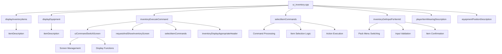
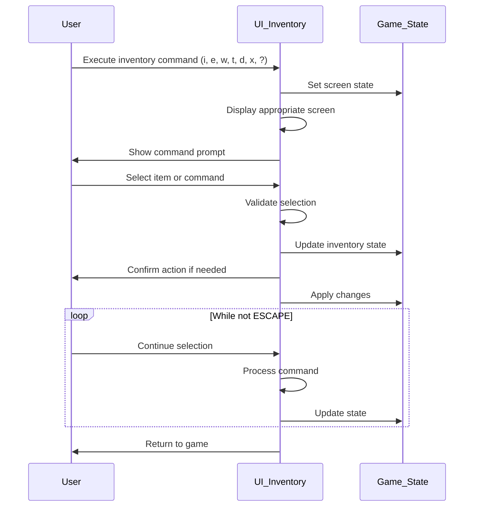
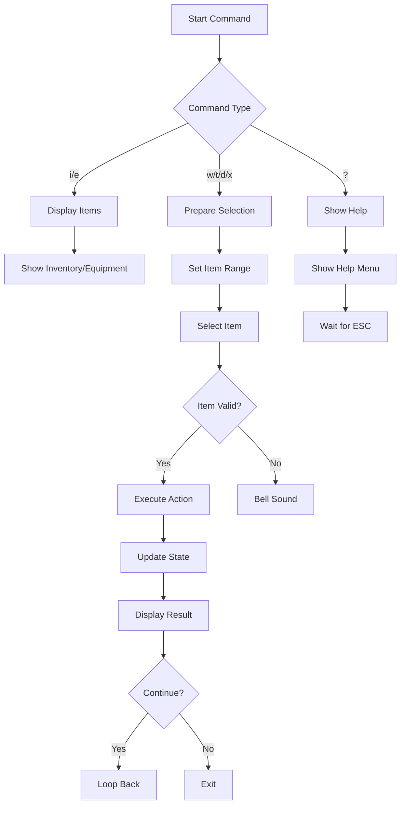

# UI Inventory C++ Module Documentation

## Introduction

The `ui_inventory_cpp` module provides the user interface functionality for managing player inventory and equipment in the Moria game. This module handles the display, selection, and manipulation of items in the player's inventory and equipment slots, including wear/wield operations, dropping items, and equipment management.

## Module Overview

This module implements the core inventory management system through several key functions:

- Display of inventory items with optional weight information
- Equipment display with position descriptions
- Command processing for inventory actions (wear, wield, drop, take off)
- Item selection and confirmation systems
- Screen management for different inventory views

## Architecture and Component Relationships



## Data Flow and Process Flow

### Main Inventory Command Flow



### Item Selection and Command Processing



## Key Components and Functions

### Display Functions

The module contains two primary display functions:

1. **`displayInventoryItems()`** - Displays inventory items with optional weight information
2. **`displayEquipment()`** - Shows currently equipped items with position descriptions

Both functions handle:
- Text formatting and truncation
- Column positioning calculations
- Weight display when enabled
- Masked item filtering

### Command Processing Functions

#### `inventoryExecuteCommand()`
Main entry point for inventory commands that manages:
- Screen state transitions
- Command interpretation
- Item selection loops
- Action execution and validation

#### `selectItemCommands()`
Handles the selection and processing of specific items:
- Command-specific range determination
- Input validation and error handling
- Action execution based on command type
- Screen switching logic

### Equipment Management

#### `playerItemWearingDescription()`
Provides descriptive text for equipment positions:
- Wielding items
- Body wear locations
- Special equipment types

#### `equipmentPositionDescription()`
Returns position descriptions based on equipment category and weight:
- Weight-based descriptions for weapons
- Standard position labels for gear

### Item Selection and Input Handling

#### `inventoryGetInputForItemId()`
Manages item selection with:
- Dual-screen navigation (inventory/equipment)
- Inscription-based item matching
- Confirmation prompts
- Menu switching capabilities

#### `inventoryGetItemMatchingInscription()`
Maps input characters to inventory items:
- Numeric inscription matching
- Upper/lowercase character handling
- Range validation

## Integration Points

This module integrates with several other system components:

- **[game_state.md](game_state.md)** - Accesses player inventory and equipment data
- **[player_stats.md](player_stats.md)** - Uses strength and carrying capacity calculations
- **[item_management.md](item_management.md)** - Interacts with item creation and destruction
- **[screen_management.md](screen_management.md)** - Manages screen states and display updates
- **[input_handling.md](input_handling.md)** - Processes keyboard input for commands

## Dependencies

The module depends on:
- `headers.h` - Core game headers and definitions
- `config::options::show_inventory_weights` - Configuration options
- `py` - Global player state structure
- `dg` - Dungeon grid information
- `game` - Game state management
- Various utility functions like `putString`, `getInputConfirmation`, etc.

## Usage Patterns

### Basic Inventory Display
```cpp
// Display player's inventory
inventoryExecuteCommand('i');

// Display equipment
inventoryExecuteCommand('e');
```

### Item Manipulation Commands
- **'w'** - Wear or wield items
- **'t'** - Take off items  
- **'d'** - Drop items
- **'x'** - Exchange weapons
- **'?'** - Show help menu

### Advanced Selection
The module supports:
- Character-based item selection ('a'-'z')
- Numeric inscription matching (0-9)
- Upper-case confirmation prompts
- Screen switching (/ key)
- Help menu access (? key)

## Error Handling and Validation

The module implements comprehensive error checking:
- Empty inventory/equipment validation
- Item weight and carrying capacity checks
- Curse detection for items
- Equipment slot availability verification
- Input validation and user feedback
- Screen boundary management

## Performance Considerations

The implementation optimizes for:
- Minimal screen redraws
- Efficient item lookup algorithms
- Proper memory usage for temporary strings
- Early termination of invalid selections
- Batch processing of display operations

## Configuration Options

The module respects these configuration settings:
- `show_inventory_weights` - Toggle weight display
- Screen positioning and layout parameters
- Item display limits and formatting rules

This module forms a critical part of the user interface, providing the foundation for all inventory-related interactions in the game.
