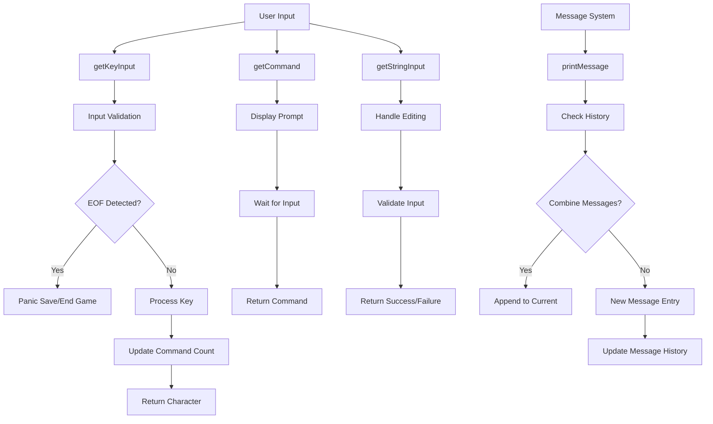

# ui_io_cpp Module Documentation

## Introduction

The `ui_io_cpp` module provides the core user interface input/output functionality for the Moria game. It handles terminal initialization, screen management, character input processing, message display, and various UI-related operations using the curses library. This module serves as the primary interface between the game engine and the user's terminal environment.

## Architecture Overview

```mermaid
graph TD
    A[ui_io_cpp] --> B[Terminal Management]
    A --> C[Input Processing]
    A --> D[Display Management]
    A --> E[Message System]
    A --> F[File Operations]
    
    B --> B1[terminalInitialize]
    B --> B2[terminalRestore]
    B --> B3[terminalSaveScreen]
    B --> B4[terminalRestoreScreen]
    
    C --> C1[getKeyInput]
    C --> C2[getCommand]
    C --> C3[getStringInput]
    C --> C4[getInputConfirmation]
    C --> C5[checkForNonBlockingKeyPress]
    
    D --> D1[clearScreen]
    D --> D2[clearToBottom]
    D --> D3[moveCursor]
    D --> D4[addChar]
    D --> D5[putString]
    D --> D6[eraseLine]
    D --> D7[panelMoveCursor]
    D --> D8[panelPutTile]
    
    E --> E1[printMessage]
    E --> E2[printMessageNoCommandInterrupt]
    E --> E3[messageLinePrintMessage]
    E --> E4[messageLineClear]
    
    F --> F1[getDefaultPlayerName]
    F --> F2[tfopen]
    F --> F3[topen]
    F --> F4[tilde]
    F --> F5[checkFilePermissions]
```



## Component Details

### Terminal Management

The terminal management functions handle the initialization and cleanup of the curses-based terminal interface:

- **`terminalInitialize()`**: Sets up the curses environment with proper terminal settings and validates screen dimensions
- **`terminalRestore()`**: Cleans up curses resources and restores normal terminal state
- **`terminalSaveScreen()`**: Saves the current screen state for later restoration
- **`terminalRestoreScreen()`**: Restores previously saved screen content

### Input Processing

The input processing subsystem handles various types of user input:

- **`getKeyInput()`**: Gets a single character input from the user with special handling for EOF conditions
- **`getCommand()`**: Prompts user for a command with validation
- **`getStringInput()`**: Handles string input with editing capabilities
- **`getInputConfirmation()`**: Gets yes/no confirmation from user
- **`checkForNonBlockingKeyPress()`**: Non-blocking keyboard input checking

### Display Management

Screen rendering and display functions provide the visual interface:

- **`clearScreen()`**: Clears the entire screen
- **`clearToBottom()`**: Clears from specified row to bottom of screen
- **`moveCursor()`**: Moves cursor to specified coordinates
- **`addChar()`**: Adds a character at specified position
- **`putString()`**: Displays a string at specified coordinates
- **`eraseLine()`**: Clears a line of text
- **`panelMoveCursor()`**: Moves cursor within a panel context
- **`panelPutTile()`**: Places a character within a panel context

### Message System

The message handling system manages game messages and user notifications:

- **`printMessage()`**: Displays messages with history management and pagination
- **`printMessageNoCommandInterrupt()`**: Prints messages without interrupting command count
- **`messageLinePrintMessage()`**: Prints messages on the message line
- **`messageLineClear()`**: Clears the message line

### File Operations

Utility functions for file path handling and permissions:

- **`getDefaultPlayerName()`**: Retrieves default player name from system
- **`tfopen()`**: Opens files with tilde expansion support
- **`topen()`**: Opens files with tilde expansion support
- **`tilde()`**: Expands tilde notation in file paths
- **`checkFilePermissions()`**: Verifies proper file access permissions

## Data Flow



## Dependencies

This module depends on several other system components:

- **[headers.h](headers.h.md)**: Provides essential type definitions and global variables
- **[curses.h](curses.h.md)**: Curses library interface for terminal control
- **[config](config.md)**: Configuration options for game behavior
- **[game](game.md)**: Game state management
- **[dg](dg.md)**: Display globals for panel positioning
- **[messages](messages.md)**: Message history and display management

## Integration Points

The `ui_io_cpp` module integrates with the broader system through:

1. **Game State Management**: Interacts with the game object for command counting and state tracking
2. **Display System**: Works with display globals (dg) for panel-based rendering
3. **Configuration**: Uses configuration options for sound and behavior settings
4. **File System**: Provides file operations for save/load functionality
5. **Error Handling**: Implements panic saving and error recovery mechanisms

## Usage Patterns

### Terminal Initialization
```cpp
if (!terminalInitialize()) {
    // Handle terminal setup failure
}
```

### User Input
```cpp
char command;
if (getCommand("Enter command:", command)) {
    // Process valid command
}
```

### Message Display
```cpp
printMessage("Game message here");
```

### Screen Management
```cpp
terminalSaveScreen();
// ... perform operations ...
terminalRestoreScreen();
```

## Error Handling

The module implements robust error handling including:
- Terminal size validation
- Memory allocation checks
- EOF condition detection with panic save capability
- Input validation and sanitization
- Proper resource cleanup on termination

## Performance Considerations

- Uses non-blocking input for responsive UI
- Efficient screen update strategies with `putQIO()`
- Minimal memory allocations during normal operation
- Proper resource management to prevent leaks

## Security Considerations

- Validates file paths and permissions
- Sanitizes user input to prevent buffer overflows
- Implements proper error recovery for critical failures
- Handles terminal escape sequences safely
