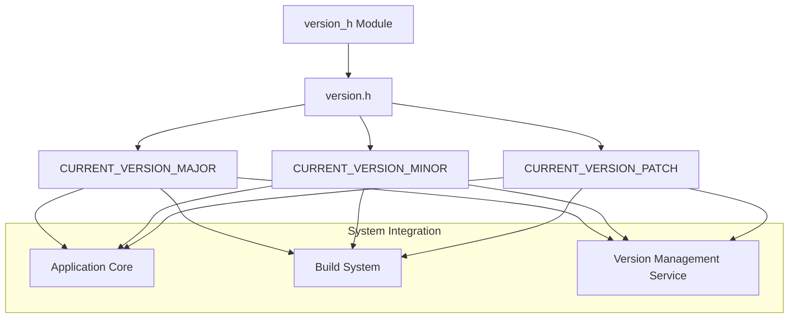
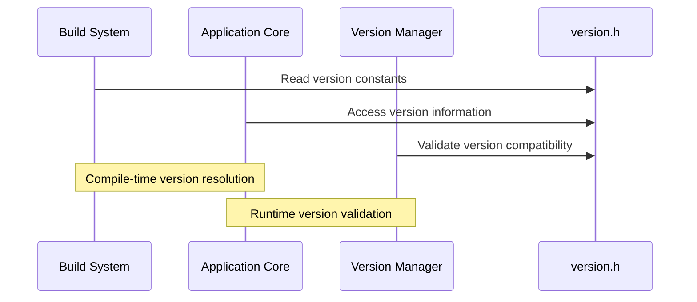

# version_h Module Documentation

## Introduction

The `version_h` module serves as a centralized location for defining and managing version information within the system. This module provides essential version constants that are used throughout the application to track software releases, facilitate compatibility checks, and support version-based feature management.

## Module Overview

The `version_h` module contains a single header file (`version.h`) that defines three constexpr constants representing the semantic versioning components of the current software release:

- **MAJOR** version: Indicates significant changes or breaking modifications
- **MINOR** version: Represents backward-compatible feature additions
- **PATCH** version: Denotes backward-compatible bug fixes

## Core Components

### version.h

This header file contains the fundamental version constants that define the current software version:

```c
constexpr uint8_t CURRENT_VERSION_MAJOR = 5;
constexpr uint8_t CURRENT_VERSION_MINOR = 7;
constexpr uint8_t CURRENT_VERSION_PATCH = 15;
```

These constants are declared as `constexpr` to enable compile-time evaluation and are defined as `uint8_t` to optimize memory usage while providing sufficient range for version numbers.

## Architecture and Dependencies



The `version_h` module acts as a dependency for several other modules in the system architecture:

- **Application Core**: Uses version constants for runtime version checking and feature flag management
- **Build System**: References version information during compilation and packaging processes
- **Version Management Service**: Consumes version data for system monitoring and update notifications

## Data Flow



The version information flows through the system in two primary modes:
1. **Compile-time**: Version constants are resolved during compilation
2. **Runtime**: Version information is accessed by various system components for operational purposes

## Component Interactions

```mermaid
componentDiagram
    component "version.h" as VH {
        "CURRENT_VERSION_MAJOR"
        "CURRENT_VERSION_MINOR" 
        "CURRENT_VERSION_PATCH"
    }
    
    component "Application Core" as AC {
        "Version Checker"
        "Feature Manager"
    }
    
    component "Build System" as BS {
        "Version Resolver"
        "Package Generator"
    }
    
    component "Version Service" as VS {
        "Compatibility Validator"
        "Update Notifier"
    }
    
    VH --> AC
    VH --> BS
    VH --> VS
    
    AC -->|Semantic Versioning| VS
    BS -->|Build Metadata| VS
```

The `version.h` file serves as the central source of truth for version information, with multiple system components depending on its constants for different purposes:

- **Application Core** uses these values for feature management and compatibility checks
- **Build System** incorporates them into build metadata and package identification
- **Version Service** validates compatibility and manages update processes

## Integration Points

The `version_h` module integrates with several other system components:

- [build_system](build_system.md): Provides version information for build artifacts
- [application_core](application_core.md): Utilizes version constants for runtime operations
- [version_management](version_management.md): Depends on these constants for version tracking and validation

## Usage Examples

### In Application Code
```cpp
#include "version.h"

// Usage in conditional compilation
#if CURRENT_VERSION_MAJOR >= 5
    // New feature implementation
#endif

// Runtime version checking
void checkVersion() {
    if (CURRENT_VERSION_MINOR < 8) {
        // Legacy compatibility handling
    }
}
```

### In Build Configuration
```makefile
# Makefile reference
VERSION_MAJOR := $(CURRENT_VERSION_MAJOR)
VERSION_MINOR := $(CURRENT_VERSION_MINOR)
VERSION_PATCH := $(CURRENT_VERSION_PATCH)
```

## Versioning Strategy

This module follows semantic versioning principles where:
- **Major version (5)**: Significant architectural changes or API breakage
- **Minor version (7)**: Backward-compatible feature additions
- **Patch version (15)**: Bug fixes and minor improvements

The current version is **5.7.15**, indicating a stable release with numerous bug fixes and feature enhancements since the initial major version.

## Maintenance Considerations

When updating version information:
1. Modify the constants in `version.h` according to semantic versioning rules
2. Ensure all dependent modules are tested for compatibility
3. Update build configurations to reflect new version numbers
4. Verify that version-dependent features continue to function correctly

This module requires careful coordination during version updates to maintain system integrity across all integrated components.
