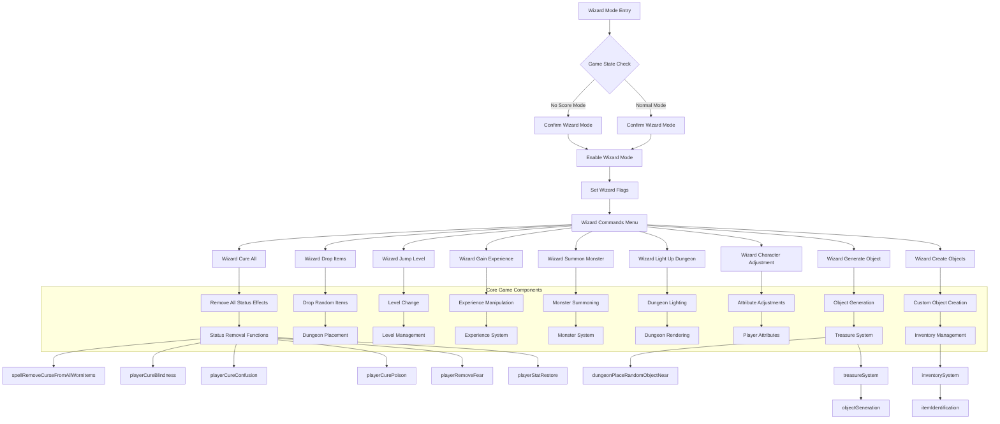
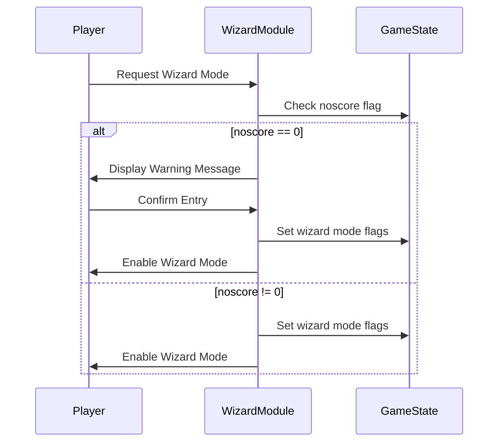
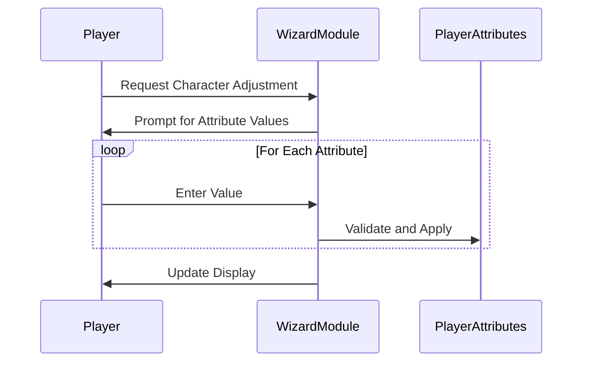

# Wizard C++ Module Documentation

## Introduction

The `wizard_cpp` module provides the implementation for the wizard mode functionality in the Moria game. This module contains various functions that allow players to enter wizard mode and perform powerful debugging and experimentation commands. These commands include character adjustments, object generation, level jumping, and other game state modifications that are typically disabled during normal gameplay.

## Module Overview

The wizard mode functionality is implemented in a single C++ source file (`wizard.cpp`) that provides several key functions:

1. **Mode activation** - Entering wizard mode with safety checks
2. **Character manipulation** - Full character status restoration and attribute adjustments
3. **Game state control** - Level jumping, experience manipulation, and object creation
4. **Debugging tools** - Dungeon lighting, monster summoning, and item dropping

## Architecture and Component Relationships



## Data Flow and Process Flows

### Wizard Mode Entry Process



### Character Adjustment Process



## Key Functions and Their Interactions

### 1. Wizard Mode Activation

The `enterWizardMode()` function serves as the entry point for wizard mode. It performs safety checks to ensure that players understand the implications of entering wizard mode, particularly that the game will not be scored during this mode.

### 2. Character Restoration

The `wizardCureAll()` function removes all negative status effects from the player character and resets certain condition flags. This includes:
- Removing curses from worn items
- Curing blindness, confusion, poison, and fear
- Restoring all player attributes to maximum values
- Resetting slow and image flags

### 3. Object Generation

The `wizardGenerateObject()` function allows players to create specific dungeon or store objects by specifying an object ID within the valid range (0-366). It places these objects near the player's current position.

### 4. Custom Object Creation

The `wizardCreateObjects()` function enables advanced object creation with detailed parameter specification including:
- Item category and subcategory
- Physical properties (weight, damage)
- Combat statistics (to-hit, to-damage, armor class)
- Special flags and cost information
- Depth-first found level

### 5. Game State Manipulation

Functions like `wizardJumpLevel()`, `wizardGainExperience()`, and `wizardDropRandomItems()` provide direct control over game progression and state:
- Level jumping with user input or command count
- Experience manipulation
- Random item dropping at player location

## Integration with Other Modules

The wizard module integrates with several core game systems:

- **[player.md](player.md)** - Directly calls player-related functions for status removal and attribute restoration
- **[dungeon.md](dungeon.md)** - Uses dungeon placement and rendering functions for object creation and lighting
- **[monster.md](monster.md)** - Interfaces with monster summoning functionality
- **[inventory.md](inventory.md)** - Works with inventory management for object creation
- **[treasure.md](treasure.md)** - Utilizes treasure system for object generation and management
- **[game_state.md](game_state.md)** - Modifies game state flags and variables

## Dependencies and External References

This module depends on several core game components defined in other modules:

- **[headers.h](headers.h)** - Contains all necessary game headers and definitions
- **[player.md](player.md)** - Player status and attribute manipulation functions
- **[dungeon.md](dungeon.md)** - Dungeon floor manipulation and rendering
- **[monster.md](monster.md)** - Monster summoning functionality
- **[inventory.md](inventory.md)** - Inventory and item handling
- **[treasure.md](treasure.md)** - Treasure and object generation systems

## Security Considerations

The wizard mode includes several safety mechanisms:
1. Confirmation prompts before entering wizard mode when scoring is enabled
2. Input validation for all numeric parameters
3. Range checking for attribute values and object IDs
4. Error handling for invalid inputs

## Usage Examples

### Entering Wizard Mode
```cpp
if (enterWizardMode()) {
    // Wizard mode activated
    // Player can now use wizard commands
}
```

### Using Character Adjustment
```cpp
wizardCharacterAdjustment();
// Allows modification of all player attributes and stats
```

### Generating Objects
```cpp
wizardGenerateObject();
// Creates a specific object type near player
```

### Summoning Monsters
```cpp
wizardSummonMonster();
// Summons a monster at player's location
```

This module provides essential debugging and experimentation capabilities for developers and advanced players, allowing them to manipulate game state directly without the constraints of normal gameplay rules.
