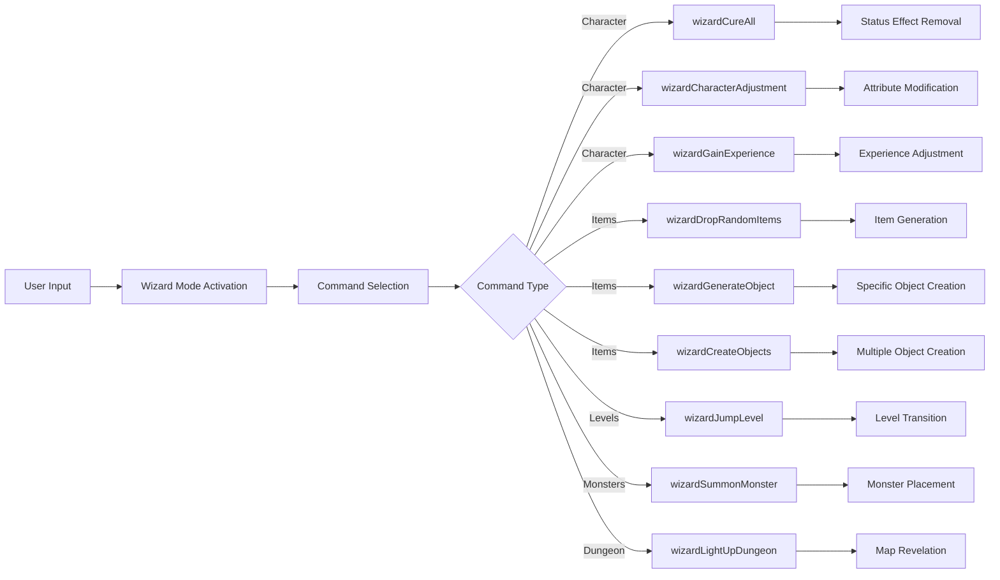

# Wizard Mode Module Documentation

## Brief Introduction

The `wizard_h` module provides a collection of functions that implement various wizard-mode commands for game development. These functions typically offer powerful debugging and testing capabilities that allow developers and advanced users to manipulate game state, characters, and environment directly. This module serves as a foundation for implementing cheat modes or developer tools within the game engine.

## Module Overview

The wizard mode functionality is designed to provide rapid prototyping and debugging capabilities during development. The module exposes a set of utility functions that can be invoked to perform various operations such as character adjustments, item generation, level manipulation, and dungeon exploration.

## Architecture and Component Relationships

```mermaid
graph TD
    A[Game Engine Core] --> B[wizard_h Module]
    B --> C[Wizard Mode Interface]
    B --> D[Debugging Tools]
    B --> E[Development Utilities]
    
    C --> F[enterWizardMode()]
    C --> G[wizardCureAll()]
    C --> H[wizardDropRandomItems()]
    C --> I[wizardJumpLevel()]
    C --> J[wizardGainExperience()]
    C --> K[wizardSummonMonster()]
    C --> L[wizardLightUpDungeon()]
    C --> M[wizardCharacterAdjustment()]
    C --> N[wizardGenerateObject()]
    C --> O[wizardCreateObjects()]
    
    D --> P[Character Management]
    D --> Q[Item Manipulation]
    D --> R[Level Control]
    D --> S[Dungeon Exploration]
    
    E --> T[State Manipulation]
    E --> U[Debug Operations]
```

## Core Functionality

### Main Entry Point
- **`enterWizardMode()`** - Initializes and activates the wizard mode interface, providing access to all wizard commands

### Character Management Functions
- **`wizardCureAll()`** - Removes all negative status effects from characters
- **`wizardCharacterAdjustment()`** - Modifies character attributes and stats
- **`wizardGainExperience()`** - Grants experience points to characters

### Item Manipulation Functions
- **`wizardDropRandomItems()`** - Generates random items at current location
- **`wizardGenerateObject()`** - Creates specific objects based on parameters
- **`wizardCreateObjects()`** - Generates multiple objects simultaneously

### Level and Progression Functions
- **`wizardJumpLevel()`** - Instantly moves characters to a different level
- **`wizardSummonMonster()`** - Places monsters in the current area

### Dungeon Exploration Functions
- **`wizardLightUpDungeon()`** - Reveals entire dungeon map for current level

## Data Flow and Process Flows



## Integration Points

This module integrates with several core systems:

1. **Character Management System** - Through `wizardCureAll()`, `wizardCharacterAdjustment()`, and `wizardGainExperience()`
2. **Inventory System** - Via `wizardDropRandomItems()`, `wizardGenerateObject()`, and `wizardCreateObjects()`
3. **Level/Map System** - Using `wizardJumpLevel()` and `wizardLightUpDungeon()`
4. **Monster Spawning System** - Through `wizardSummonMonster()`

## Dependencies

The wizard mode module depends on:
- [character_system.md](character_system.md) - For character management functions
- [inventory_system.md](inventory_system.md) - For item manipulation capabilities
- [level_system.md](level_system.md) - For level transition and dungeon management
- [monster_system.md](monster_system.md) - For monster summoning functionality

## Usage Considerations

### Development vs Production
This module should only be enabled in development builds or through specific debug flags. The functions provided here are intended for rapid development and testing rather than normal gameplay.

### Security Implications
All wizard mode functions should be protected by appropriate access controls and should not be available in production environments to prevent game balance issues.

### Performance Impact
Some operations like `wizardCreateObjects()` may have performance implications when generating large numbers of items simultaneously.

## Related Modules

For complete implementation details, see:
- [game_engine.md](game_engine.md) - Main game engine integration
- [debug_system.md](debug_system.md) - Debug infrastructure support
- [ui_system.md](ui_system.md) - User interface components for wizard mode

## Implementation Notes

The wizard mode functions are designed to be self-contained and should not require complex initialization beyond the basic module loading. Each function operates independently while maintaining consistency with the overall game state management system.
