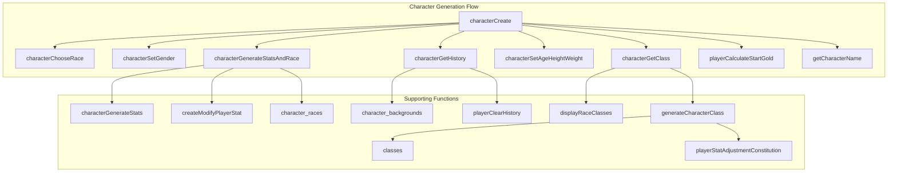
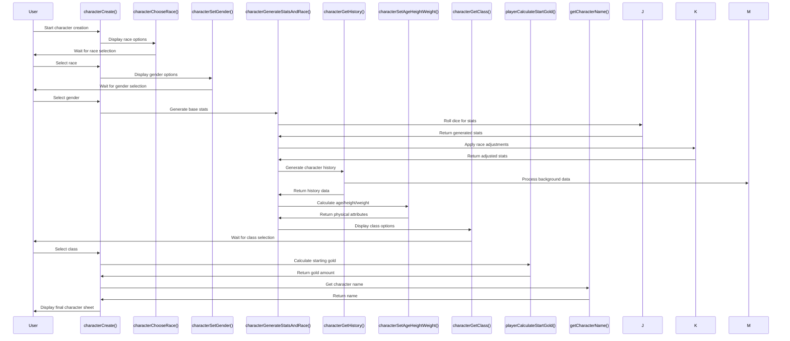
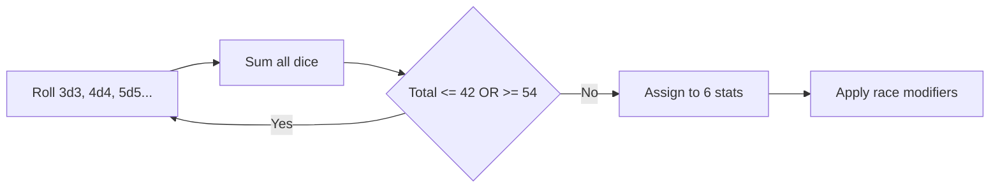
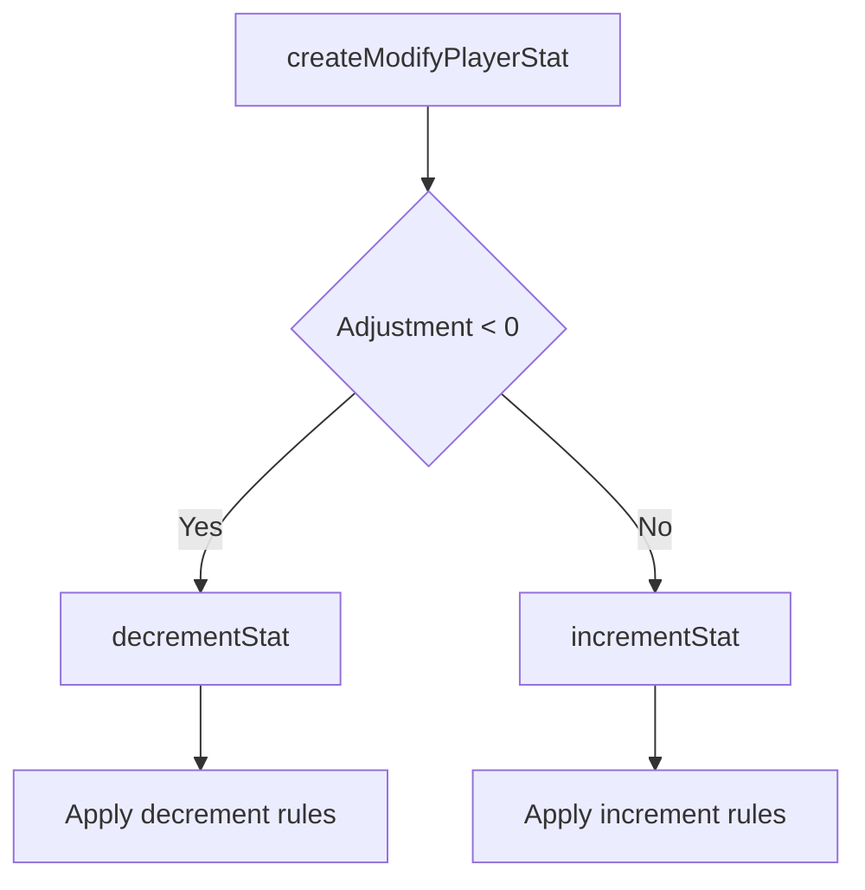
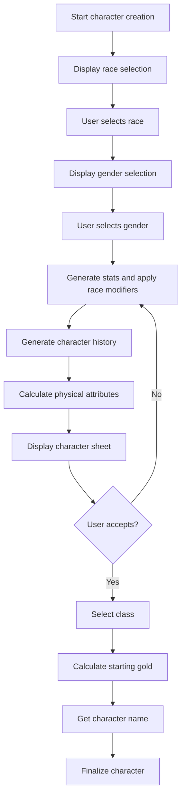
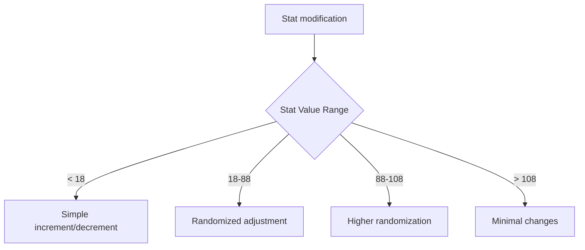

# Character C++ Module Documentation

## Introduction

The `character_cpp` module handles the complete character creation process for players in the game. This module manages all aspects of character generation including stat allocation, race selection, class assignment, history generation, and initial equipment setup. It serves as the primary interface for creating new player characters and ensures proper initialization of all character attributes.

## Module Overview

This module contains the core logic for character creation, including:
- Stat generation using dice rolls
- Race and class selection
- History generation based on racial background
- Age, height, and weight calculation
- Gold distribution based on character attributes
- Character name input

## Architecture and Component Relationships

## Data Flow and Processing

## Core Components

### Character Creation Process

The main entry point `characterCreate()` orchestrates the entire character creation process:

1. **Race Selection**: Players choose from available races using `characterChooseRace()`
2. **Gender Selection**: Players select their character's gender using `characterSetGender()`
3. **Stat Generation**: Base stats are generated and adjusted for race using `characterGenerateStatsAndRace()`
4. **History Generation**: Character background is created using `characterGetHistory()`
5. **Physical Attributes**: Age, height, and weight are calculated using `characterSetAgeHeightWeight()`
6. **Class Selection**: Players choose their character class using `characterGetClass()`
7. **Gold Calculation**: Starting gold is determined based on character attributes using `playerCalculateStartGold()`
8. **Name Input**: Final character name is collected using `getCharacterName()`

### Stat Generation System

The stat generation uses a unique rolling system:

### Race and Class Integration

The module integrates with external data structures:
- `character_races[]`: Contains race-specific attributes and modifiers
- `classes[]`: Contains class-specific bonuses and penalties
- `character_backgrounds[]`: Provides historical context for characters

### Attribute Adjustment Functions

The module includes specialized functions for modifying character attributes:

## External Dependencies

This module depends on several other modules and systems:

- [headers.h](headers.md): Provides global definitions and includes
- [player.h](player.md): Manages player state and attributes
- [config.h](config.md): Configuration settings for game parameters
- [input.h](input.md): Input handling for user interactions
- [display.h](display.md): Screen rendering and text output functions

## Key Functions

### Primary Entry Points
- `characterCreate()`: Main character creation routine
- `characterChooseRace()`: Handles race selection UI
- `characterGetClass()`: Manages class selection process

### Stat Management
- `characterGenerateStats()`: Generates base character stats
- `createModifyPlayerStat()`: Applies race/class adjustments to stats
- `playerCalculateStartGold()`: Calculates starting gold amount

### Character Information
- `characterGetHistory()`: Generates character background story
- `characterSetAgeHeightWeight()`: Calculates physical attributes
- `displayCharacterHistory()`: Displays character background

## Data Structures Used

The module works with several key data structures:

- `Race_t`: Defines race properties and modifiers
- `Class_t`: Defines class bonuses and penalties  
- `Background_t`: Stores historical background information
- `PlayerAttr`: Enum for player attribute types
- `Coord_t`: Coordinate system for screen positioning

## Process Flows

### Character Creation Loop

### Stat Modification Logic

The module implements different stat modification rules based on current stat values:

## Integration Points

This module integrates with:
- Player state management through `py` global structure
- Input/output systems for user interaction
- Configuration systems for game parameters
- Display systems for character information presentation

The character creation process is designed to be modular and extensible, allowing for easy addition of new races, classes, and character features while maintaining consistent behavior across the game system.
