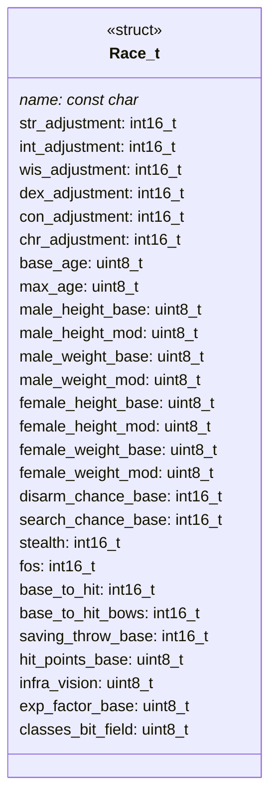
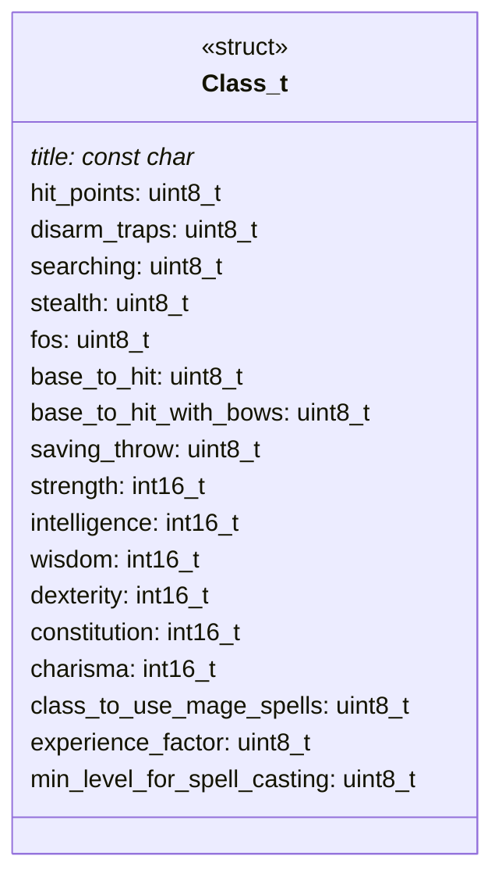
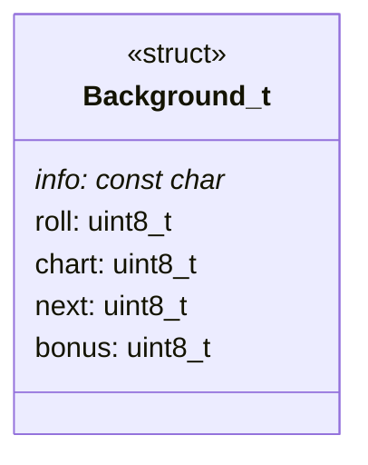

# Character Handling Module Documentation

## Introduction

The `character_h` module provides the foundational data structures and function declarations for creating and managing player characters in the game system. This module defines the core attributes that determine character capabilities, racial traits, class abilities, and background information that collectively shape the player's in-game persona.

## Core Data Structures

### Race Structure (Race_t)
The `Race_t` structure defines the racial characteristics that influence a character's base attributes and abilities:



### Class Structure (Class_t)
The `Class_t` structure defines the class-specific modifiers and abilities that affect gameplay mechanics:



### Background Structure (Background_t)
The `Background_t` structure stores historical information and social class details for character backgrounds:



## Function Declaration

### characterCreate()
The `characterCreate()` function serves as the primary interface for initializing and generating player characters within the game system.

## Module Relationships

This module works in conjunction with several other system components:

- **[character_gen](character_gen.md)**: Handles the actual generation logic for player characters using the defined structures
- **[attributes](attributes.md)**: Manages the attribute calculations and modifications based on race and class data
- **[classes](classes.md)**: Provides class-specific rules and mechanics that interact with the Class_t structure
- **[races](races.md)**: Contains race definitions and management that populate the Race_t structure

## Data Flow

```mermaid
flowchart TD
    A[Character Generation System] --> B[characterCreate()]
    B --> C[Race Selection]
    B --> D[Class Selection]
    B --> E[Background Assignment]
    C --> F[Populate Race_t]
    D --> G[Populate Class_t]
    E --> H[Populate Background_t]
    F --> I[Attributes Calculation]
    G --> I
    H --> I
    I --> J[Final Character Object]
```

## Implementation Details

The module uses standard C data types with specific sizes to ensure portability across different platforms. The use of `int16_t` for adjustments allows for both positive and negative modifiers while maintaining precision. The `const char*` pointers provide string references for descriptive fields without requiring memory allocation during runtime.

## Usage Patterns

1. **Initialization**: The structures are typically populated from configuration files or database entries
2. **Runtime Access**: Game systems reference these structures to apply racial and class bonuses
3. **Character Creation**: The `characterCreate()` function orchestrates the combination of these elements into a complete character profile

## Dependencies

This module depends on:
- Standard C library headers for basic data types
- [attributes](attributes.md) for attribute calculation logic
- [classes](classes.md) for class-specific behavior implementation
- [races](races.md) for race definitions and validation

## Notes

The module intentionally separates character definition from character creation logic, allowing for flexible character generation systems that can utilize the same data structures across different game contexts. The use of bit fields and modifiers enables complex interactions between race, class, and background elements while maintaining performance through simple arithmetic operations.
