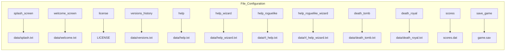
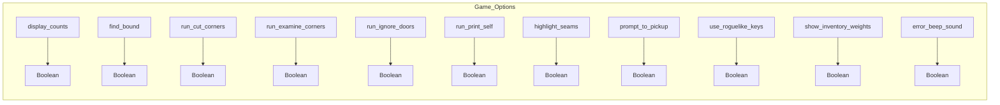
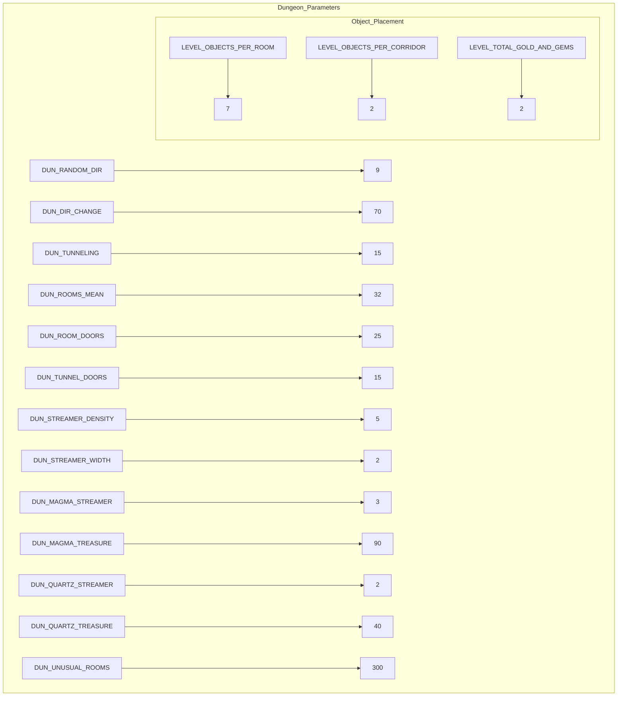
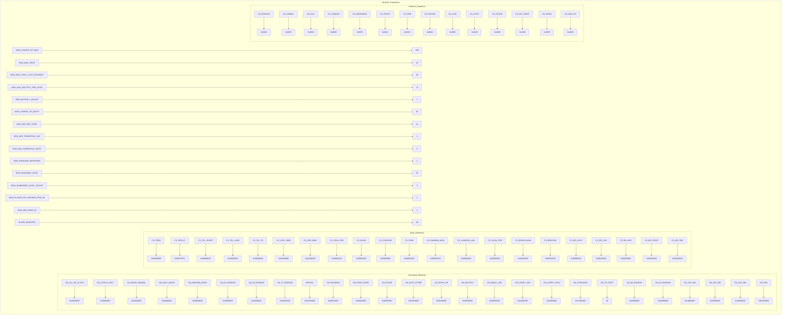
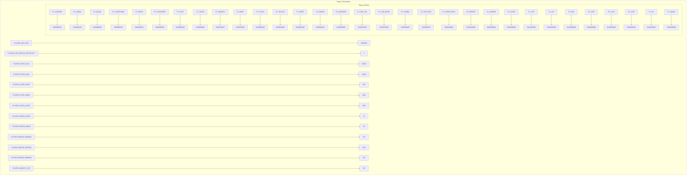
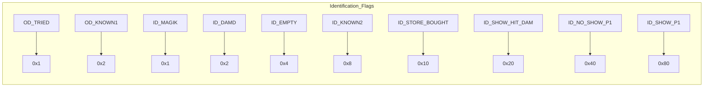
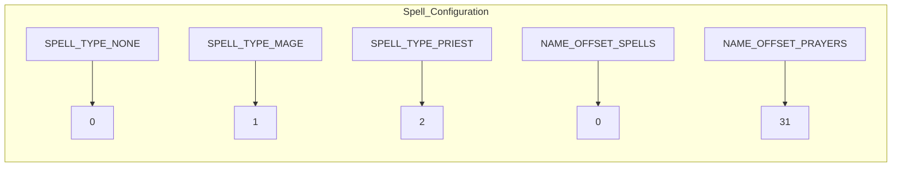
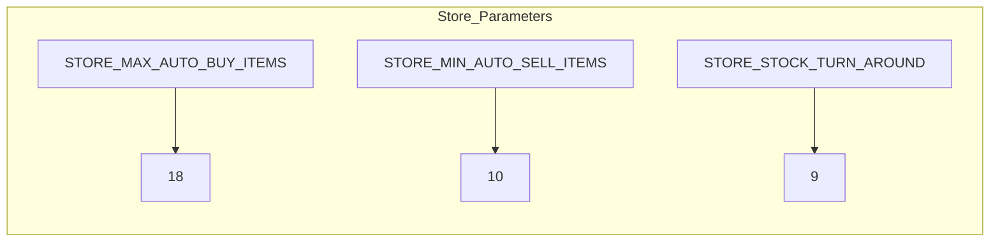

# config_cpp Module Documentation

## Brief Introduction

The `config_cpp` module serves as the central configuration repository for the Umoria game engine. It defines all game constants, settings, and parameters that control gameplay behavior, dungeon generation, monster properties, player characteristics, and other core game mechanics. This module provides a single source of truth for all configurable values, making it easier to tune and modify game behavior without scattered hard-coded values throughout the codebase.

## Architecture Overview

```mermaid
graph TD
    A[config_cpp Module] --> B[Game Files Configuration]
    A --> C[Game Options]
    A --> D[Dungeon Generation]
    A --> E[Treasure System]
    A --> F[Monster Behavior]
    A --> G[Player Characteristics]
    A --> H[Object Identification]
    A --> I[Spell System]
    A --> J[Store Management]

    B --> B1[Data File Paths]
    C --> C1[User Preferences]
    C --> C2[Gameplay Settings]
    D --> D1[Dungeon Parameters]
    D --> D2[Object Placement]
    E --> E1[Treasure Constants]
    E --> E2[Item Flags]
    E --> E3[Chest Properties]
    F --> F1[Monster Spawn Rates]
    F --> F2[Movement Patterns]
    F --> F3[Spell Abilities]
    F --> F4[Defense Properties]
    G --> G1[Experience Limits]
    G --> G2[Hunger System]
    G --> G3[Regeneration Rates]
    G --> G4[Weight Capacity]
    G --> G5[Status Effects]
    H --> H1[Identification Flags]
    I --> I1[Spell Types]
    I --> I2[Spell Names]
    J --> J1[Store Inventory]
```

## Detailed Component Documentation

### Game Files Configuration

The `files` namespace contains all relative file paths used by the game. These paths are relative to the executable binary location and define where various game data files are stored.

### Game Options

The `options` namespace defines user-configurable game settings that can be modified at runtime or during initialization.

### Dungeon Generation Parameters

The `dungeon` namespace controls all aspects of dungeon generation including room placement, tunneling patterns, and object distribution.

### Treasure System Constants

The `treasure` namespace defines treasure generation rules, magic item properties, and object flag definitions.

```mermaid
graph TD
    subgraph Treasure_Constants
        A[MIN_TREASURE_LIST_ID] --> B[1]
        C[TREASURE_CHANCE_OF_GREAT_ITEM] --> D[12]
        E[LEVEL_STD_OBJECT_ADJUST] --> F[125]
        G[LEVEL_MIN_OBJECT_STD] --> H[7]
        I[LEVEL_TOWN_OBJECTS] --> J[7]
        K[OBJECT_BASE_MAGIC] --> L[15]
        M[OBJECT_MAX_BASE_MAGIC] --> N[70]
        O[OBJECT_CHANCE_SPECIAL] --> P[6]
        Q[OBJECT_CHANCE_CURSED] --> R[13]
        S[OBJECT_LAMP_MAX_CAPACITY] --> T[15000]
        U[OBJECT_BOLTS_MAX_RANGE] --> V[18]
        W[OBJECTS_RUNE_PROTECTION] --> X[3000]
        
        subgraph Object_Flags
            Y[TR_STATS] --> Z[0x0000003F]
            AA[TR_STR] --> AB[0x00000001]
            AC[TR_INT] --> AD[0x00000002]
            AE[TR_WIS] --> AF[0x00000004]
            AG[TR_DEX] --> AH[0x00000008]
            AI[TR_CON] --> AJ[0x00000010]
            AK[TR_CHR] --> AL[0x00000020]
            AM[TR_SEARCH] --> AN[0x00000040]
            AO[TR_SLOW_DIGEST] --> AP[0x00000080]
            AQ[TR_STEALTH] --> AR[0x00000100]
            AS[TR_AGGRAVATE] --> AT[0x00000200]
            AU[TR_TELEPORT] --> AV[0x00000400]
            AW[TR_REGEN] --> AX[0x00000800]
            AY[TR_SPEED] --> AZ[0x00001000]
            
            BA[TR_EGO_WEAPON] --> BB[0x0007E000]
            BC[TR_SLAY_DRAGON] --> BD[0x00002000]
            BE[TR_SLAY_ANIMAL] --> BF[0x00004000]
            BG[TR_SLAY_EVIL] --> BH[0x00008000]
            BI[TR_SLAY_UNDEAD] --> BJ[0x00010000]
            BK[TR_FROST_BRAND] --> BL[0x00020000]
            BM[TR_FLAME_TONGUE] --> BN[0x00040000]
            
            BO[TR_RES_FIRE] --> BP[0x00080000]
            BQ[TR_RES_ACID] --> BR[0x00100000]
            BS[TR_RES_COLD] --> BT[0x00200000]
            BU[TR_SUST_STAT] --> BV[0x00400000]
            BW[TR_FREE_ACT] --> BX[0x00800000]
            BY[TR_SEE_INVIS] --> BZ[0x01000000]
            CA[TR_RES_LIGHT] --> CB[0x02000000]
            CC[TR_FFALL] --> CD[0x04000000]
            CE[TR_BLIND] --> CF[0x08000000]
            CG[TR_TIMID] --> CH[0x10000000]
            CI[TR_TUNNEL] --> CJ[0x20000000]
            CK[TR_INFRA] --> CL[0x40000000]
            CM[TR_CURSED] --> CN[0x80000000]
        end
        
        subgraph Chest_Properties
            CO[CH_LOCKED] --> CP[0x00000001]
            CQ[CH_TRAPPED] --> CR[0x000001F0]
            CS[CH_LOSE_STR] --> CT[0x00000010]
            CU[CH_POISON] --> CV[0x00000020]
            CW[CH_PARALYSED] --> CX[0x00000040]
            CY[CH_EXPLODE] --> CZ[0x00000080]
            DA[CH_SUMMON] --> DB[0x00000100]
        end
    end
```

### Monster Behavior Parameters

The `monsters` namespace controls monster spawning rates, behaviors, and combat properties.

### Player Characteristics

The `player` namespace defines player-related constants including experience limits, hunger system, regeneration rates, and status effects.

### Object Identification System

The `identification` namespace manages how objects are identified and tracked within the game.

### Spell System Configuration

The `spells` namespace defines spell types and naming conventions.

### Store Management Parameters

The `stores` namespace controls store inventory management and trading behavior.

## Integration with Other Modules

This module integrates with several other core modules:

- **[game_logic.md](game_logic.md)**: Uses dungeon generation parameters for level creation
- **[monster_system.md](monster_system.md)**: References monster behavior and spell definitions
- **[player_system.md](player_system.md)**: Depends on player characteristics for character stats and status effects
- **[inventory_system.md](inventory_system.md)**: Utilizes treasure system constants for item generation
- **[spell_system.md](spell_system.md)**: Accesses spell type definitions for class-based abilities

## Usage Guidelines

All configuration values should be accessed through their respective namespaces rather than directly accessing individual variables. This ensures consistency and makes future modifications easier to implement. The configuration values are typically read-only after initialization and should not be modified during gameplay unless specifically designed for dynamic adjustment.

## Maintenance Notes

When modifying configuration values:
1. Ensure changes align with intended gameplay balance
2. Test thoroughly with existing game mechanics
3. Update related documentation if applicable
4. Consider impact on save file compatibility
5. Document any significant changes to default values

This module serves as the foundation for all game behavior customization and should be treated as a critical component requiring careful consideration during any modifications.
