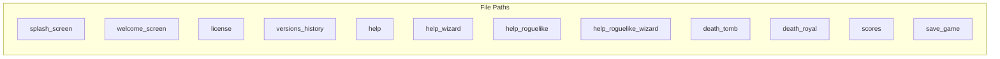
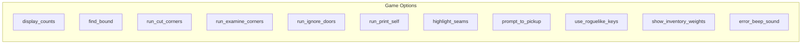
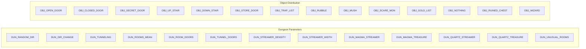
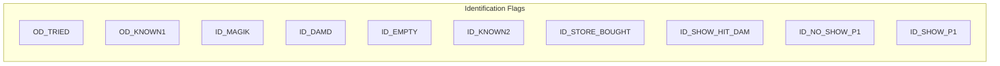
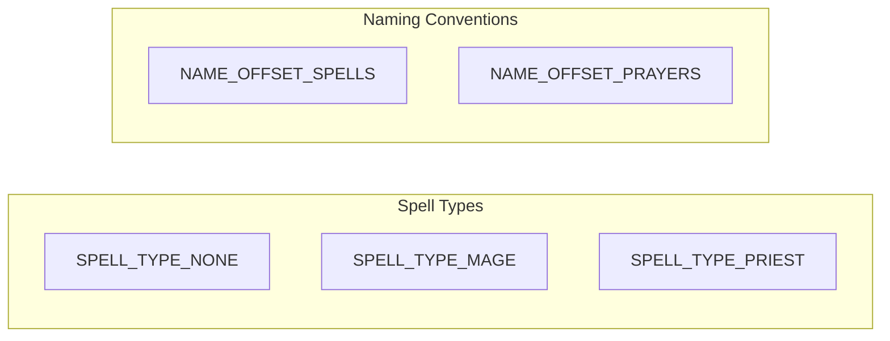
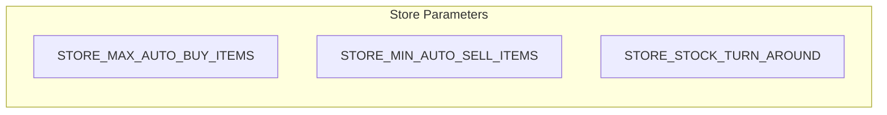

# config_h Module Documentation

## Brief Introduction

The `config_h` module serves as the central configuration hub for the game, defining constants and parameters that control various aspects of gameplay behavior, dungeon generation, monster properties, player characteristics, and item mechanics. This module provides a comprehensive set of compile-time constants that are used throughout the game engine to maintain consistent behavior and balance across different game systems.

## Architecture Overview

```mermaid
graph TD
    A[config_h Module] --> B[Game Constants]
    A --> C[Game Options]
    A --> D[Dungeon Generation]
    A --> E[Treasure System]
    A --> F[Monster Behavior]
    A --> G[Player Statistics]
    A --> H[Item Identification]
    A --> I[Spell Systems]
    A --> J[Store Mechanics]

    B --> B1[File Paths]
    B --> B2[Display Settings]
    
    C --> C1[User Interface Options]
    C --> C2[Gameplay Preferences]
    
    D --> D1[Dungeon Parameters]
    D --> D2[Object Distribution]
    
    E --> E1[Treasure Values]
    E --> E2[Object Flags]
    E --> E3[Chest Properties]
    
    F --> F1[Monster Spawn Rates]
    F --> F2[Movement Patterns]
    F --> F3[Spell Mechanics]
    F --> F4[Defense Properties]
    
    G --> G1[Player Stats]
    G --> G2[Status Effects]
    
    H --> H1[Identification Flags]
    
    I --> I1[Spell Types]
    I --> I2[Spell Names]
    
    J --> J1[Store Limits]
```

## Detailed Component Documentation

### File Structure and Dependencies

The `config.h` file defines a hierarchical namespace structure that organizes game constants by category:

- **files**: Game resource file paths
- **options**: User interface and gameplay preferences
- **dungeon**: Dungeon generation parameters and object distributions
- **treasure**: Treasure system constants and object flags
- **monsters**: Monster behavior and spawning parameters
- **player**: Player statistics and status effects
- **identification**: Item identification system flags
- **spells**: Spell type definitions and naming conventions
- **stores**: Store inventory management parameters

### Core Components Breakdown

#### 1. File Paths Configuration

The `files` namespace contains string constants for various game resource files:

These paths are referenced by the [file_manager](file_manager.md) module when loading game resources.

#### 2. Game Options Configuration

The `options` namespace controls user interface and gameplay behavior:

These options are managed by the [input_handler](input_handler.md) and [ui_renderer](ui_renderer.md) modules.

#### 3. Dungeon Generation Parameters

The `dungeon` namespace contains parameters for dungeon generation algorithms:

These parameters are utilized by the [dungeon_generator](dungeon_generator.md) module during level creation.

#### 4. Treasure System Constants

The `treasure` namespace defines treasure distribution and object properties:

```mermaid
graph LR
    subgraph "Treasure Values"
        A[MIN_TREASURE_LIST_ID]
        B[TREASURE_CHANCE_OF_GREAT_ITEM]
        C[LEVEL_STD_OBJECT_ADJUST]
        D[LEVEL_MIN_OBJECT_STD]
        E[LEVEL_TOWN_OBJECTS]
        F[OBJECT_BASE_MAGIC]
        G[OBJECT_MAX_BASE_MAGIC]
        H[OBJECT_CHANCE_SPECIAL]
        I[OBJECT_CHANCE_CURSED]
        J[OBJECT_LAMP_MAX_CAPACITY]
        K[OBJECT_BOLTS_MAX_RANGE]
        L[OBJECTS_RUNE_PROTECTION]
    end
    
    subgraph "Object Flags"
        M[TR_STATS]
        N[TR_STR]
        O[TR_INT]
        P[TR_WIS]
        Q[TR_DEX]
        R[TR_CON]
        S[TR_CHR]
        T[TR_SEARCH]
        U[TR_SLOW_DIGEST]
        V[TR_STEALTH]
        W[TR_AGGRAVATE]
        X[TR_TELEPORT]
        Y[TR_REGEN]
        Z[TR_SPEED]
        AA[TR_EGO_WEAPON]
        AB[TR_SLAY_DRAGON]
        AC[TR_SLAY_ANIMAL]
        AD[TR_SLAY_EVIL]
        AE[TR_SLAY_UNDEAD]
        AF[TR_FROST_BRAND]
        AG[TR_FLAME_TONGUE]
        AH[TR_RES_FIRE]
        AI[TR_RES_ACID]
        AJ[TR_RES_COLD]
        AK[TR_SUST_STAT]
        AL[TR_FREE_ACT]
        AM[TR_SEE_INVIS]
        AN[TR_RES_LIGHT]
        AO[TR_FFALL]
        AP[TR_BLIND]
        AQ[TR_TIMID]
        AR[TR_TUNNEL]
        AS[TR_INFRA]
        AT[TR_CURSED]
    end
    
    subgraph "Chest Properties"
        AU[CH_LOCKED]
        AV[CH_TRAPPED]
        AW[CH_LOSE_STR]
        AX[CH_POISON]
        AY[CH_PARALYSED]
        AZ[CH_EXPLODE]
        BA[CH_SUMMON]
    end
```

These values are used by the [item_system](item_system.md) and [treasure_generator](treasure_generator.md) modules.

#### 5. Monster Behavior Parameters

The `monsters` namespace controls monster spawning and behavior:

```mermaid
graph LR
    subgraph "Monster Spawning"
        A[MON_CHANCE_OF_NEW]
        B[MON_MAX_SIGHT]
        C[MON_MAX_SPELL_CAST_DISTANCE]
        D[MON_MAX_MULTIPLY_PER_LEVEL]
        E[MON_MULTIPLY_ADJUST]
        F[MON_CHANCE_OF_NASTY]
        G[MON_MIN_PER_LEVEL]
        H[MON_MIN_TOWNSFOLK_DAY]
        I[MON_MIN_TOWNSFOLK_NIGHT]
        J[MON_ENDGAME_MONSTERS]
        K[MON_ENDGAME_LEVEL]
        L[MON_SUMMONED_LEVEL_ADJUST]
        M[MON_PLAYER_EXP_DRAINED_PER_HIT]
        N[MON_MIN_INDEX_ID]
        O[SCARE_MONSTER]
    end
    
    subgraph "Movement Patterns"
        P[CM_ALL_MV_FLAGS]
        Q[CM_ATTACK_ONLY]
        R[CM_MOVE_NORMAL]
        S[CM_ONLY_MAGIC]
        T[CM_RANDOM_MOVE]
        U[CM_20_RANDOM]
        V[CM_40_RANDOM]
        W[CM_75_RANDOM]
        X[CM_SPECIAL]
        Y[CM_INVISIBLE]
        Z[CM_OPEN_DOOR]
        AA[CM_PHASE]
        AB[CM_EATS_OTHER]
        AC[CM_PICKS_UP]
        AD[CM_MULTIPLY]
        AE[CM_SMALL_OBJ]
        AF[CM_CARRY_OBJ]
        AG[CM_CARRY_GOLD]
        AH[CM_TREASURE]
        AI[CM_TR_SHIFT]
        AJ[CM_60_RANDOM]
        AK[CM_90_RANDOM]
        AL[CM_1D2_OBJ]
        AM[CM_2D2_OBJ]
        AN[CM_4D2_OBJ]
        AO[CM_WIN]
    end
    
    subgraph "Spell Mechanics"
        AP[CS_FREQ]
        AQ[CS_SPELLS]
        AR[CS_TEL_SHORT]
        AS[CS_TEL_LONG]
        AT[CS_TEL_TO]
        AU[CS_LGHT_WND]
        AV[CS_SER_WND]
        AW[CS_HOLD_PER]
        AX[CS_BLIND]
        AY[CS_CONFUSE]
        AZ[CS_FEAR]
        BA[CS_SUMMON_MON]
        BB[CS_SUMMON_UND]
        BC[CS_SLOW_PER]
        BD[CS_DRAIN_MANA]
        BE[CS_BREATHE]
        BF[CS_BR_LIGHT]
        BG[CS_BR_GAS]
        BH[CS_BR_ACID]
        BI[CS_BR_FROST]
        BJ[CS_BR_FIRE]
    end
    
    subgraph "Defense Properties"
        BK[CD_DRAGON]
        BL[CD_ANIMAL]
        BM[CD_EVIL]
        BN[CD_UNDEAD]
        BO[CD_WEAKNESS]
        BP[CD_FROST]
        BQ[CD_FIRE]
        BR[CD_POISON]
        BS[CD_ACID]
        BT[CD_LIGHT]
        BU[CD_STONE]
        BV[CD_NO_SLEEP]
        BW[CD_INFRA]
        BX[CD_MAX_HP]
    end
```

These parameters are processed by the [monster_ai](monster_ai.md) and [spawn_manager](spawn_manager.md) modules.

#### 6. Player Statistics Configuration

The `player` namespace defines player character attributes and status effects:

```mermaid
graph LR
    subgraph "Player Stats"
        A[PLAYER_MAX_EXP]
        B[PLAYER_USE_DEVICE_DIFFICULTY]
        C[PLAYER_FOOD_FULL]
        D[PLAYER_FOOD_MAX]
        E[PLAYER_FOOD_FAINT]
        F[PLAYER_FOOD_WEAK]
        G[PLAYER_FOOD_ALERT]
        H[PLAYER_REGEN_FAINT]
        I[PLAYER_REGEN_WEAK]
        J[PLAYER_REGEN_NORMAL]
        K[PLAYER_REGEN_HPBASE]
        L[PLAYER_REGEN_MNBASE]
        M[PLAYER_WEIGHT_CAP]
    end
    
    subgraph "Status Effects"
        N[PY_HUNGRY]
        O[PY_WEAK]
        P[PY_BLIND]
        Q[PY_CONFUSED]
        R[PY_FEAR]
        S[PY_POISONED]
        T[PY_FAST]
        U[PY_SLOW]
        V[PY_SEARCH]
        W[PY_REST]
        X[PY_STUDY]
        Y[PY_INVULN]
        Z[PY_HERO]
        AA[PY_SHERO]
        AB[PY_BLESSED]
        AC[PY_DET_INV]
        AD[PY_TIM_INFRA]
        AE[PY_SPEED]
        AF[PY_STR_WGT]
        AG[PY_PARALYSED]
        AH[PY_REPEAT]
        AI[PY_ARMOR]
        AJ[PY_STATS]
        AK[PY_STR]
        AL[PY_INT]
        AM[PY_WIS]
        AN[PY_DEX]
        AO[PY_CON]
        AP[PY_CHR]
        AQ[PY_HP]
        AR[PY_MANA]
    end
```

These values are managed by the [player_controller](player_controller.md) and [status_effect_manager](status_effect_manager.md) modules.

#### 7. Item Identification System

The `identification` namespace handles item identification flags:

This system interfaces with the [inventory_system](inventory_system.md) and [item_identification](item_identification.md) modules.

#### 8. Spell System Definitions

The `spells` namespace defines spell types and naming conventions:

These definitions are used by the [spell_system](spell_system.md) and [magic_manager](magic_manager.md) modules.

#### 9. Store Mechanics

The `stores` namespace manages store inventory parameters:

These values are processed by the [shop_system](shop_system.md) and [inventory_manager](inventory_manager.md) modules.

## Integration Points

The `config_h` module serves as a foundational dependency for multiple core systems:

1. **Game Engine Core**: Provides essential constants for game logic
2. **Dungeon Generation**: Supplies parameters for procedural level creation
3. **Combat System**: Defines monster and player attributes
4. **Item Management**: Controls treasure distribution and object properties
5. **User Interface**: Manages display options and preferences
6. **Save/Load System**: Uses file path constants for resource management

## Usage Guidelines

All constants defined in this module should be treated as immutable compile-time values. Modifications to these values will require recompilation of the entire project. The hierarchical namespace organization allows for easy access to related constants while maintaining clean separation of concerns.

For detailed implementation of any specific subsystem that uses these configurations, please refer to the corresponding module documentation:
- [dungeon_generator](dungeon_generator.md)
- [monster_ai](monster_ai.md)
- [item_system](item_system.md)
- [player_controller](player_controller.md)
- [spell_system](spell_system.md)
- [shop_system](shop_system.md)
