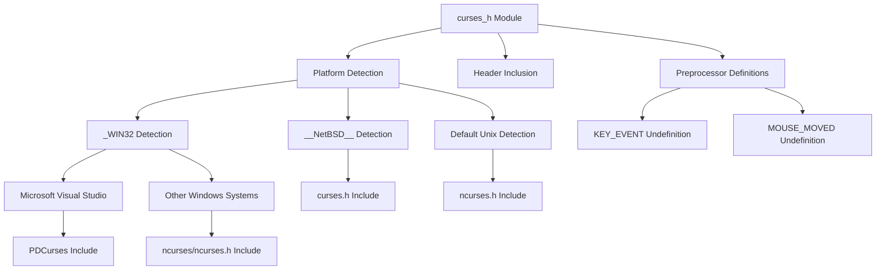
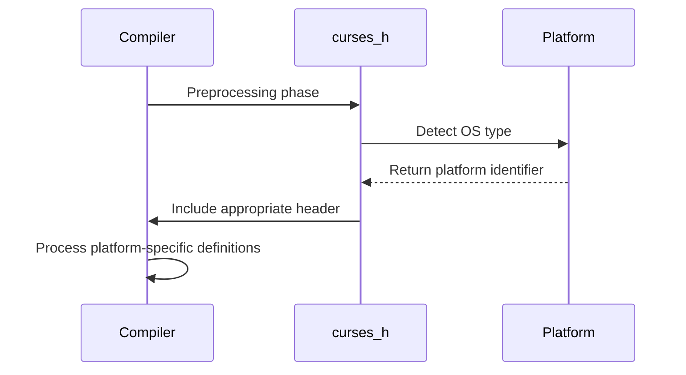

# curses_h Module Documentation

## Introduction

The `curses_h` module serves as a cross-platform header inclusion wrapper for terminal-based user interfaces. It provides the necessary system-specific includes and definitions required for curses library functionality across different operating systems. This module handles the complexity of including the correct curses header files based on the target platform, ensuring consistent behavior regardless of whether the application is running on Windows, NetBSD, or other Unix-like systems.

## Purpose and Functionality

The primary purpose of this module is to abstract away platform-specific differences in curses library implementations. The module detects the target operating system at compile time and includes the appropriate header files while handling platform-specific preprocessor definitions that might conflict between different curses implementations.

Key features include:
- Platform detection for Windows (including MSVC-specific handling)
- Support for NetBSD systems
- Fallback to standard ncurses implementation for other Unix-like systems
- Handling of conflicting macro definitions between different curses implementations

## Architecture and Component Relationships

## System Integration

This module acts as a foundational component that other UI-related modules depend on. It provides the basic curses functionality needed by higher-level terminal interface components such as:

- [ui_components](ui_components.md) - Terminal-based user interface elements
- [input_handler](input_handler.md) - Keyboard and mouse input processing
- [screen_manager](screen_manager.md) - Screen rendering and management

## Data Flow

## Implementation Details

### Platform-Specific Handling

The module implements conditional compilation based on predefined macros:

1. **Windows Systems (_WIN32)**:
   - Handles Microsoft Visual Studio compiler compatibility
   - Includes PDCurses for MSVC environments
   - Uses standard ncurses headers for other Windows builds

2. **NetBSD Systems (__NetBSD__)**:
   - Directly includes standard curses header

3. **Other Unix-like Systems**:
   - Uses standard ncurses implementation

### Preprocessor Definition Management

The module carefully manages conflicting macro definitions:
- `KEY_EVENT` is undefined on Windows platforms to prevent conflicts
- `MOUSE_MOVED` is undefined on Microsoft Visual Studio builds to ensure compatibility

## Dependencies

This module depends on:
- System-specific curses libraries (PDCurses, ncurses, or system curses)
- Preprocessor capabilities for conditional compilation
- Standard C library headers for system detection

## Usage Considerations

When using this module, developers should be aware that:
1. The module must be included before any other curses-related headers
2. Platform-specific behaviors are handled transparently
3. No additional configuration is typically required beyond standard build setup
4. The module assumes the target system has appropriate curses libraries installed

## Related Modules

For a complete terminal interface solution, this module works in conjunction with:
- [input_handler](input_handler.md) - For processing user input
- [screen_manager](screen_manager.md) - For screen rendering operations
- [ui_components](ui_components.md) - For building user interface elements

## Build Requirements

The module requires:
- A C compiler with preprocessor support
- Appropriate curses library installation for the target platform
- Platform-specific build tools when targeting Windows or specialized systems

This module ensures that curses-based applications can be built consistently across different platforms without requiring manual platform-specific modifications to the application code.
