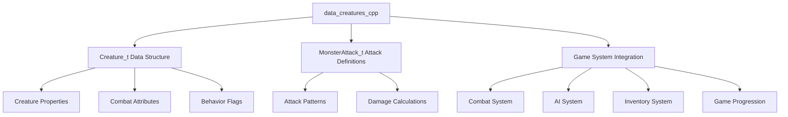
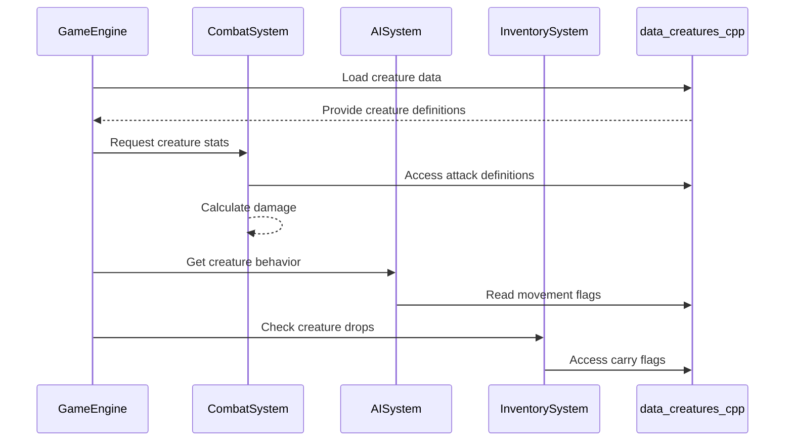

# data_creatures_cpp Module Documentation

## Introduction

The `data_creatures_cpp` module serves as the primary data repository for creature definitions within the game system. This module contains the complete creature database that defines all monsters, NPCs, and other living entities that populate the game world. It provides the foundational data structures and initial creature configurations that drive gameplay mechanics, combat systems, and world generation.

This module is essential for the game's core functionality, providing the creature data that is referenced throughout the system. It interfaces with various subsystems including combat, AI behavior, inventory management, and game progression mechanics.

## Architecture Overview



## Core Components

### Creature Data Structure (`Creature_t`)

The main data structure that defines each creature in the game system:

```cpp
struct Creature_t {
    char name[32];              // Creature name
    uint32_t cmove;             // Movement flags
    uint32_t csleep;            // Sleep behavior
    uint16_t cdefense;          // Defense flags
    int8_t level;               // Creature level
    int16_t hp;                 // Hit points
    int8_t ac;                  // Armor class
    int8_t damage;              // Damage rating
    int8_t speed;               // Speed factor
    char symbol;                // Display character
    int16_t hit_dice[2];        // Hit point dice (number, sides)
    int16_t attacks[4];         // Attack definitions
    int8_t rarity;              // Rarity value
};
```

### Monster Attack Structure (`MonsterAttack_t`)

Defines the attack patterns and damage calculations for creatures:

```cpp
struct MonsterAttack_t {
    int8_t frequency;           // Attack frequency (1 in X chance)
    int8_t type;                // Attack type identifier
    int16_t damage[2];          // Damage dice (number, sides)
};
```

## Data Organization

### Creature List Structure

The `creatures_list` array contains all creature definitions in order of increasing difficulty levels. Each entry represents a unique creature with specific properties:

- **Name**: Descriptive name of the creature
- **CMOVE Flags**: Movement behavior and special abilities
- **CSLEEP**: Sleep behavior characteristics
- **CDEFENSE Flags**: Defensive properties and resistances
- **Level**: Difficulty level of the creature
- **HP**: Hit point configuration
- **AC**: Armor class value
- **Damage**: Base damage output
- **Speed**: Movement speed factor
- **Symbol**: Character representation on screen
- **Hit Dice**: HP calculation formula
- **Attacks**: Attack pattern definitions
- **Rarity**: Spawn probability

### Attack Types Reference

The module includes detailed documentation of attack types with their meanings:

| Type | Description |
|------|-------------|
| 1 | Normal attack |
| 2 | Poison Strength |
| 3 | Confusion attack |
| 4 | Fear attack |
| 5 | Fire attack |
| 6 | Acid attack |
| 7 | Cold attack |
| 8 | Lightning attack |
| 9 | Corrosion attack |
| 10 | Blindness attack |
| 11 | Paralysis attack |
| 12 | Steal Money |
| 13 | Steal Object |
| 14 | Poison |
| 15 | Lose dexterity |
| 16 | Lose constitution |
| 17 | Lose intelligence |
| 18 | Lose wisdom |
| 19 | Lose experience |
| 20 | Aggravation |
| 21 | Disenchants |
| 22 | Eats food |
| 23 | Eats light |
| 24 | Eats charges |
| 99 | Blank |

## Component Interactions

### Data Flow Diagram



### Integration Points

1. **Combat System**: Uses creature attack definitions and damage calculations
2. **AI System**: Relies on movement flags and behavior characteristics
3. **Inventory System**: Accesses carrying flags and drop probabilities
4. **Game Progression**: Utilizes creature rarity and level values
5. **Display System**: Uses symbol representations and names

## Key Features

### Movement Flags (CMOVE)

The CMOVE flags define creature movement behaviors:

- **Movement Control**: 00000001 (Move only to attack), 00000002 (Move, attack normal)
- **Random Movement**: 00000008 (20%), 00000010 (40%), 00000020 (75%)
- **Special Movement**: Invisible (00010000), Through doors (00020000), Through walls (00040000)
- **Object Interaction**: Pick up objects (00100000), Multiply (00200000)
- **Carrying**: Objects (01000000), Gold (02000000)
- **Winning Creatures**: Special flag (80000000)

### Defense Flags (CDEFENSE)

CDEFENSE flags control creature vulnerabilities and resistances:

- **Elemental Damage**: Frost (0010), Fire (0020), Poison (0040), Acid (0080)
- **Special Resistances**: Light-wand (0100), Stone-to-mud (0200)
- **Status Immunities**: Charmed/slept (1000), Infra-vision (2000)
- **Max HP**: Flag (4000)

### Attack Definitions

The `monster_attacks` array provides complete attack pattern specifications:

- **Frequency**: Chance of attack activation
- **Type**: Attack method identifier
- **Damage**: Damage calculation parameters
- **Complexity**: Supports multiple attack combinations per creature

## Usage Examples

### Creature Access Pattern

```cpp
// Accessing creature data
Creature_t& creature = creatures_list[creature_id];
// Use creature.name, creature.hp, creature.attacks, etc.
```

### Attack Processing

```cpp
// Using attack definitions
MonsterAttack_t attack = monster_attacks[attack_type];
// Process attack.frequency, attack.damage[0], attack.damage[1]
```

## Dependencies

This module depends on:
- [headers.h](headers.h.md): Core system headers and type definitions
- [types.h](types.h.md): Basic data type declarations
- [combat_system](combat_system.md): Combat mechanics implementation
- [ai_system](ai_system.md): Artificial intelligence behavior

## Related Modules

- [data_items_cpp](data_items_cpp.md): Item definitions that complement creature drops
- [data_levels_cpp](data_levels_cpp.md): Level generation data that affects creature placement
- [game_logic](game_logic.md): Core game state management that uses creature data

## Notes

1. The creature list is ordered by increasing difficulty levels, with higher-level creatures appearing later in the array
2. Winning creatures are marked with the highest CMOVE flag (0x80000000)
3. Attack #35 is documented as no longer used in the current implementation
4. All creature data is static and loaded at application startup
5. The module supports both standard and special creature behaviors through flag combinations

This module forms the backbone of creature-based gameplay elements and provides the essential data needed for all creature-related systems to function properly.
