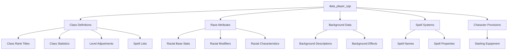
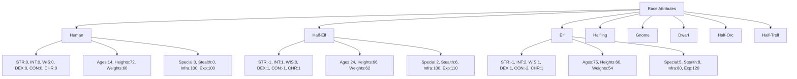
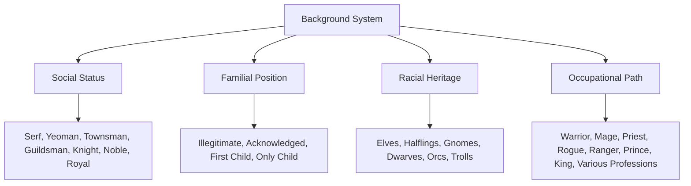
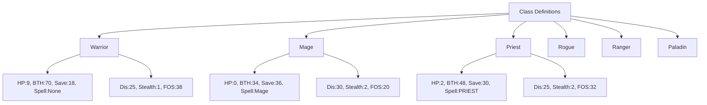
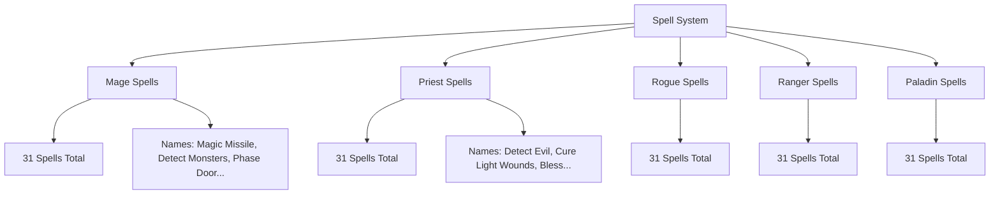
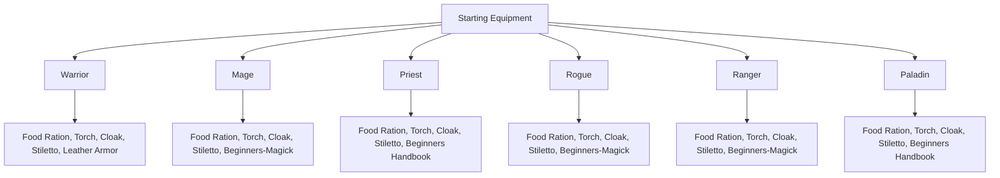
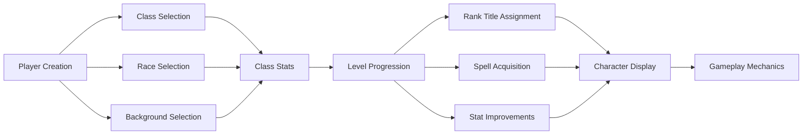

# data_player_cpp Module Documentation

## Introduction

The `data_player_cpp` module serves as the central repository for all player character-related data structures and constants used throughout the game system. This module defines the fundamental characteristics, abilities, and progression systems for player characters including class definitions, racial attributes, background information, and spell systems.

This module provides the foundational data that drives character creation, advancement, and gameplay mechanics. It contains arrays and structures that define how players progress through different classes, races, and skill levels within the game world.

## Architecture Overview



## Core Data Structures

### Class Rank Titles System

The module implements a comprehensive class ranking system that defines titles earned at various levels across different character classes:

```mermaid
graph LR
    subgraph Class_Rank_Titles
        A[Warrior Titles]
        B[Mage Titles]
        C[Priest Titles]
        D[Rogue Titles]
        E[Ranger Titles]
        F[Paladin Titles]
        
        A --> A1["Rookie"-"Lord Noble"]
        B --> B1["Novice"-"Wizard Lord"]
        C --> C1["Believer"-"Noble Priest"]
        D --> D1["Vagabond"-"Guildsmaster"]
        E --> E1["Runner (1st)"-"Ranger Lord"]
        F --> F1["Gallant"-"High Lord"]
    end
```

Each class has its own progression path with specific titles that reflect character development and achievement within that class system.

### Race Attribute System

The race system defines the fundamental physical and statistical characteristics of different character races:



Each race includes:
- **Base statistics** (Strength, Intelligence, Wisdom, Dexterity, Constitution, Charisma)
- **Age ranges** and **physical characteristics** (heights and weights)
- **Special abilities** and **combat modifiers**
- **Infravision** capabilities and **experience multipliers**

### Background Information System

The background system provides detailed character origin stories and social positioning:



Background data includes:
- **Social class descriptions**
- **Family position indicators**
- **Heritage information**
- **Occupational influences**

### Class Definition System

The core class definitions establish the fundamental characteristics and abilities of each playable class:



Each class definition includes:
- **Hit points per level**
- **Combat statistics** (base to hit, saving throws)
- **Skill modifiers** (disarm, stealth, find traps)
- **Spellcasting capabilities**
- **Experience requirements**

### Spell System Integration

The spell system provides magical capabilities organized by class:



### Character Provision System

The starting equipment system ensures new characters begin with appropriate gear:



## Component Interactions



## Data Flow and Usage

The data in `data_player_cpp` flows through the system as follows:

1. **Initialization**: During game startup, all character data is loaded into memory
2. **Character Creation**: Players select race, class, and background which determines initial stats
3. **Progression**: As players level up, rank titles and abilities are updated from the defined arrays
4. **Combat**: Class-specific combat modifiers and spell systems are accessed during gameplay
5. **Display**: Character information is rendered using the stored titles and attributes

## Integration Points

This module integrates with several other system components:

- **[game_character.md](game_character.md)**: Provides character management interfaces that utilize these data structures
- **[player_stats.md](player_stats.md)**: Uses race and class data for stat calculations
- **[spell_system.md](spell_system.md)**: Accesses spell lists and spell properties
- **[character_progression.md](character_progression.md)**: Implements level advancement using class rank titles

## Constants and Limits

The module defines several important constants that govern character behavior:

- `PLAYER_MAX_CLASSES`: Maximum number of playable classes (6)
- `PLAYER_MAX_LEVEL`: Maximum character level (40)
- `PLAYER_MAX_RACES`: Number of available races (8)
- `PLAYER_MAX_BACKGROUNDS`: Number of background options (100+)
- `CLASS_MAX_LEVEL_ADJUST`: Maximum level adjustments per class

## Future Considerations

When extending this module, consider:
1. Adding new classes or races while maintaining compatibility
2. Implementing dynamic title generation for custom classes
3. Supporting modded content through extensible data structures
4. Optimizing memory usage for large datasets
5. Providing clear documentation for external modders

This module forms the foundation for all player character interactions in the game system and requires careful maintenance to ensure consistent gameplay balance.
