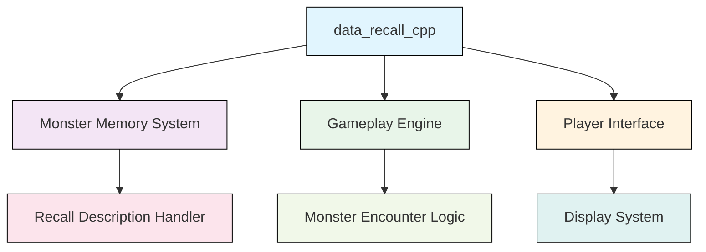
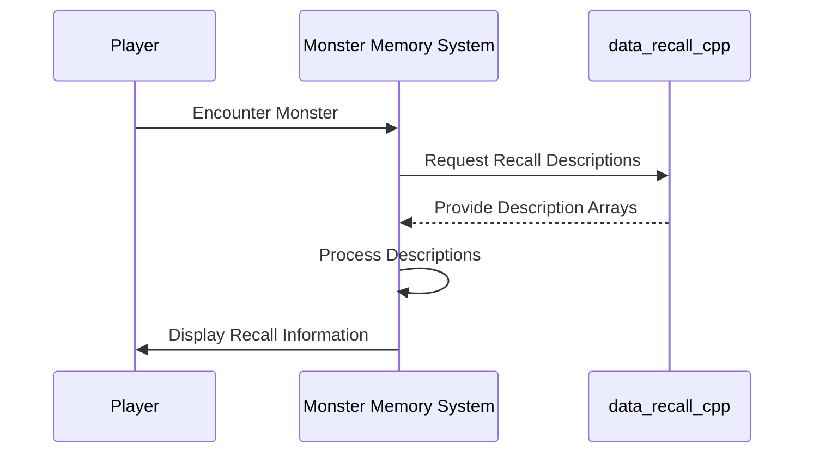
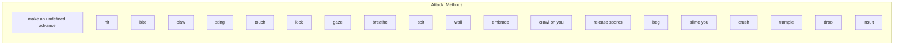
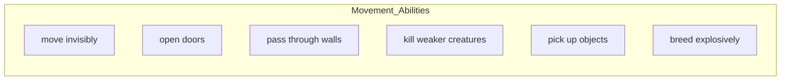
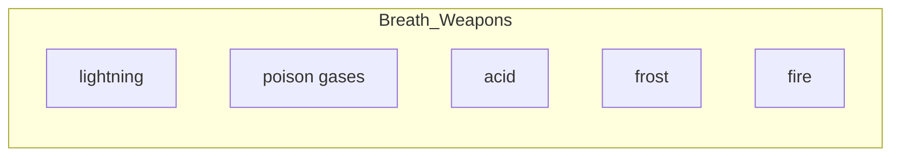
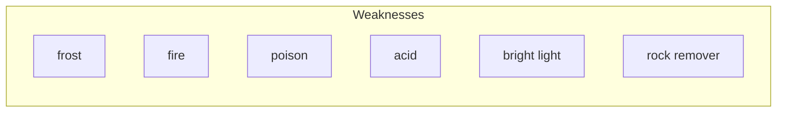

# data_recall_cpp Module Documentation

## Brief Introduction

The `data_recall_cpp` module serves as a data repository for monster recall descriptions in the game. It provides arrays of descriptive strings that are used to generate detailed monster memory entries when players encounter monsters during gameplay. This module contains no executable logic but rather holds constant string data that enhances the game's narrative and player experience by providing rich descriptive information about monster behaviors and abilities.

## Module Overview

This module contains several constant arrays that store descriptive text for different aspects of monster behavior and characteristics. These arrays are designed to be referenced by other game systems that handle monster memory and recall functionality.

### Key Components

The module consists of six distinct arrays of constant character pointers:

1. **Attack Types** - Describes how monsters attack
2. **Attack Methods** - Describes the physical methods of attacks
3. **How Much** - Describes the intensity or extent of effects
4. **Movement Abilities** - Describes special movement capabilities
5. **Spells** - Describes magical abilities
6. **Breath Weapons** - Describes breath attack types
7. **Weaknesses** - Describes elemental weaknesses

## Architecture and Relationships



The `data_recall_cpp` module acts as a data provider for the broader monster memory system. It interfaces with:

- **Monster Memory System**: Processes and formats the recall data for player consumption
- **Gameplay Engine**: Uses these descriptions during monster encounters
- **Player Interface**: Displays the formatted recall information to players

## Data Flow



When a player encounters a monster, the system requests recall descriptions from this module. The data is then processed and formatted for display to the player.

## Component Details

### Attack Type Descriptions

```mermaid
graph LR
    subgraph Attack_Types
        A["do something undefined"]
        B["attack"]
        C["weaken"]
        D["confuse"]
        E["terrify"]
        F["shoot flames"]
        G["shoot acid"]
        H["freeze"]
        I["shoot lightning"]
        J["corrode"]
        K["blind"]
        L["paralyse"]
        M["steal money"]
        N["steal things"]
        O["poison"]
        P["reduce dexterity"]
        Q["reduce constitution"]
        R["drain intelligence"]
        S["drain wisdom"]
        T["lower experience"]
        U["call for help"]
        V["disenchant"]
        W["eat your food"]
        X["absorb light"]
        Y["absorb charges"]
    end
```



### Attack Method Descriptions



### Intensity Descriptions

```mermaid
graph LR
    subgraph How_Much
        A[" not at all"]
        B[" a bit"]
        C[""]
        D[" quite"]
        E[" very"]
        F[" most"]
        G[" highly"]
        H[" extremely"]
    end
```

### Movement Descriptions



### Spell Descriptions

```mermaid
graph LR
    subgraph Spells
        A["teleport short distances"]
        B["teleport long distances"]
        C["teleport its prey"]
        D["cause light wounds"]
        E["cause serious wounds"]
        F["paralyse its prey"]
        G["induce blindness"]
        H["confuse"]
        I["terrify"]
        J["summon a monster"]
        K["summon the undead"]
        L["slow its prey"]
        M["drain mana"]
        N["unknown 1"]
        O["unknown 2"]
    end
```



### Breath Weapon Descriptions



### Weakness Descriptions



## Integration Points

This module integrates with several other systems in the game architecture:

- **Memory Management System**: Provides the raw data for monster memories
- **Display Engine**: Formats and presents the recall information to players
- **Combat System**: Uses attack type and method descriptions during combat encounters
- **Magic System**: Supplies spell and breath weapon descriptions for magical creatures

## Usage Examples

The arrays in this module are typically accessed by other components when generating monster recall information. For example, when a player recalls a monster's memory, the system might combine elements from multiple arrays to create a complete description like:

"An ancient dragon breathes fire and casts spells to terrify its prey."

## Dependencies

This module has no external dependencies beyond standard C++ libraries. It is designed to be included directly by any component that needs access to monster recall descriptions.

## Related Modules

For a complete understanding of how this module fits into the game system, see:
- [memory_system](memory_system.md)
- [monster_encounter](monster_encounter.md)
- [player_interface](player_interface.md)
