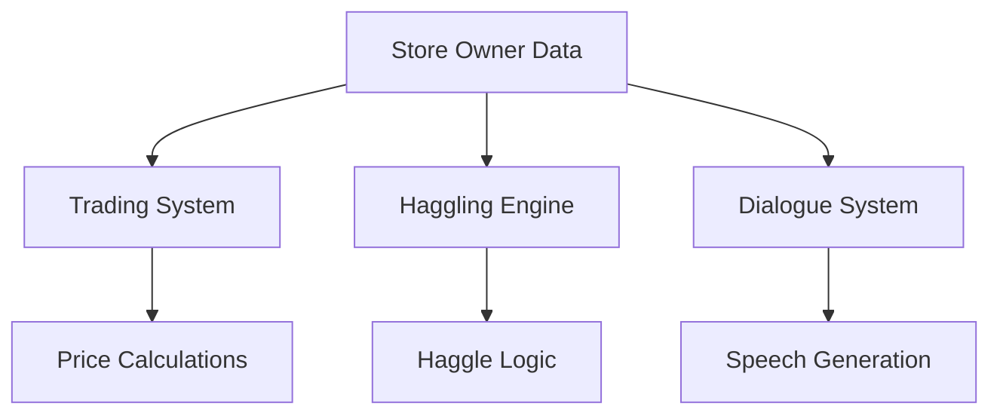
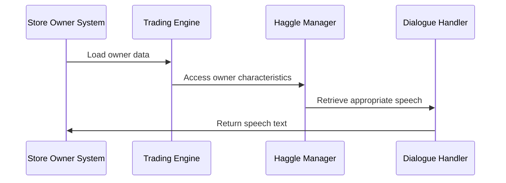

# Data Store Owners C++ Module Documentation

## Brief Introduction

The `data_store_owners_cpp` module serves as the central repository for storing and managing data related to store owners within the game. This module contains essential information about various store owners including their names, characteristics, speech patterns, and pricing behaviors. It provides the foundational data structure that enables the game's trading and haggling mechanics to function properly.

## Module Overview

This module implements the core data structures and constants needed for managing store owners in the game. It defines the `Owner_t` structure that holds detailed information about each store owner's attributes, along with arrays of speech strings that provide contextual dialogue during trading interactions.

## Architecture and Component Relationships

### Core Data Structures

The module primarily consists of:

1. **Owner_t Array**: Contains detailed information about each store owner
2. **Speech String Arrays**: Various collections of dialogue strings for different trading scenarios

### Data Flow

### Component Interactions

## Detailed Component Documentation

### Store Owners Data Structure

The `store_owners` array contains `MAX_OWNERS` entries of type `Owner_t`, each representing a unique store owner with the following characteristics:

- **Name**: Complete name including race and store type
- **Base Price**: Starting price for items
- **Min Price**: Minimum acceptable price
- **Max Price**: Maximum acceptable price
- **Haggle Skill**: Level of haggling ability
- **Insult Threshold**: Number of insults before ending conversation
- **Patience Level**: How many haggling attempts allowed

### Speech Collections

The module includes several speech arrays that provide contextual dialogue for different trading situations:

#### Sale Acceptance Dialogues
- `speech_sale_accepted`: Responses when a sale is accepted
- **Count**: 14 entries

#### Selling Haggle Dialogues
- `speech_selling_haggle_final`: Final offers during selling haggling
- `speech_selling_haggle`: Progressive haggling responses during selling

#### Buying Haggle Dialogues
- `speech_buying_haggle_final`: Final offers during buying haggling
- `speech_buying_haggle`: Progressive haggling responses during buying

#### Emotional Responses
- `speech_insulted_haggling_done`: Responses when haggling ends due to insults
- `speech_get_out_of_my_store`: Responses when player is asked to leave
- `speech_haggling_try_again`: Responses to inadequate haggling attempts
- `speech_sorry`: Responses to misunderstood speech

## Integration with Other Modules

This module works closely with several other systems:

- **[trading_system.md](trading_system.md)**: Uses owner data for price calculations and trading behavior
- **[haggling_engine.md](haggling_engine.md)**: Accesses speech arrays for contextual dialogue
- **[dialogue_system.md](dialogue_system.md)**: Provides speech content for NPC interactions
- **[game_state_manager.md](game_state_manager.md)**: Manages owner data persistence across game sessions

## Usage Patterns

The data stored in this module is accessed through:

1. **Direct Array Access**: Using index-based access to specific owner entries
2. **Characteristics Lookup**: Retrieving owner-specific traits for gameplay logic
3. **Speech Selection**: Random or conditional selection from speech arrays based on context
4. **Behavior Determination**: Using owner attributes to influence trading outcomes

## Implementation Notes

- All data is defined as `const` to prevent modification during runtime
- Speech arrays are organized by category to support different game states
- Owner characteristics are carefully balanced to create varied trading experiences
- The module follows a consistent naming convention for easy identification

## Dependencies

This module depends on:
- `headers.h`: Required for standard library includes and definitions
- Game-wide constants and types defined in global headers

## Related Documentation

For complete understanding of how this module functions within the larger system, see:
- [trading_system.md](trading_system.md)
- [haggling_engine.md](haggling_engine.md)
- [dialogue_system.md](dialogue_system.md)
