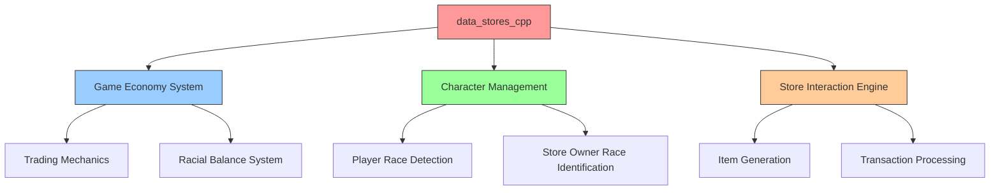
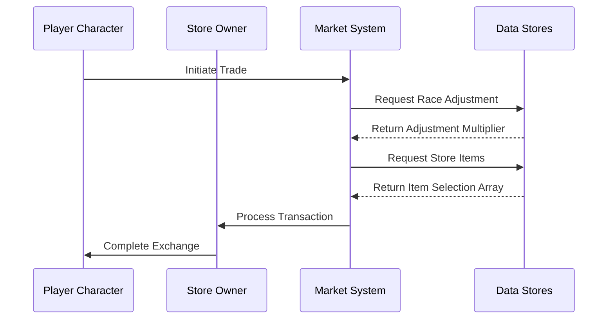

# Data Stores C++ Module Documentation

## Brief Introduction

The `data_stores_cpp` module serves as a critical data storage component that maintains essential configuration arrays for game store operations. This module contains predefined lookup tables that govern racial gold adjustments and item selection probabilities for various store types within the game world. These data structures are fundamental to maintaining game balance and providing realistic economic interactions between characters and store owners.

## Comprehensive Documentation

This module provides two primary data structures that support the game's commerce system:

### Race Gold Adjustments Table

The `race_gold_adjustments` array defines how gold transactions are adjusted based on the racial relationship between players and store owners. This creates a nuanced economic system where different races have varying levels of trust or prejudice toward each other.

### Store Item Selection Arrays

The `store_choices` array maps specific store types to their available inventory items, with each entry containing weighted probabilities for item selection. This system ensures stores maintain appropriate inventories while allowing for dynamic item generation.

## Architecture and Component Relationships

## Data Flow and Usage Patterns

## Dependencies and Integration Points

This module directly supports several other core systems:

- **[game_objects.md](game_objects.md)**: Provides the actual object IDs used in store selections
- **[character_system.md](character_system.md)**: Utilizes race adjustment data for character interactions
- **[economy_system.md](economy_system.md)**: Forms the foundation for all market-based transactions

## Implementation Details

### Race Gold Adjustments Structure

The `race_gold_adjustments` table uses a 2D array where:
- Rows represent player races (indexed by `PLAYER_MAX_RACES`)
- Columns represent store owner races
- Values are percentage multipliers for gold transactions

### Store Choices Structure

The `store_choices` array organizes data by:
- First dimension: Store type indices (0-5 for General, Armory, Weaponsmith, Temple, Alchemy, Magic-User)
- Second dimension: Item selection probabilities (26 items per store type)
- Each value references a `game_objects[]` index for actual item identification

## System Integration

This module integrates with the broader game architecture through:

1. **Economic Balance**: Maintains fair trading relationships between different races
2. **Inventory Management**: Provides systematic item selection for stores
3. **Dynamic Content**: Enables varied store experiences based on location and type

## Related Modules

For complete understanding of how this data is utilized, see:
- [game_objects.md](game_objects.md) - For detailed object definitions
- [character_system.md](character_system.md) - For race-related mechanics
- [economy_system.md](economy_system.md) - For transaction processing logic

## Performance Considerations

The data structures in this module are static and loaded at startup, ensuring minimal runtime overhead. The fixed-size arrays provide O(1) access times for all lookups, making them highly efficient for real-time game operations.
