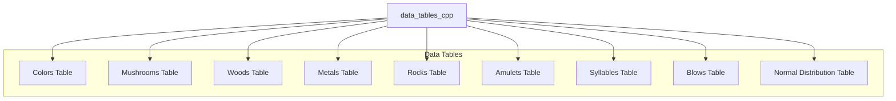

# data_tables_cpp Module Documentation

## Overview

The `data_tables_cpp` module provides essential data tables for various game elements including colors, mushrooms, woods, metals, rocks, amulets, syllables, combat blows calculations, and normal distribution generation. This module serves as a foundational data repository that supports multiple gameplay systems and randomization functions throughout the application.

## Module Architecture



## Core Components

### Data Tables

#### Colors Array
```cpp
const char *colors[MAX_COLORS] = {
    "Icky Green", "Light Brown", "Clear", 
    "Azure", "Blue", "Blue Speckled", "Black", "Brown", "Brown Speckled", "Bubbling",
    // ... additional color entries
    "White", "Yellow"
};
```
This array contains descriptive color names used throughout the game for item identification and visual descriptions.

#### Mushrooms Array
```cpp
const char *mushrooms[MAX_MUSHROOMS] = {
    "Blue", "Black", "Black Spotted", "Brown", "Dark Blue", "Dark Green", "Dark Red",
    // ... additional mushroom entries
    "Yellow"
};
```
Contains various mushroom types used for game items, potions, or environmental elements.

#### Woods Array
```cpp
const char *woods[MAX_WOODS] = {
    "Aspen", "Balsa", "Banyan", "Birch", "Cedar", "Cottonwood", "Cypress", "Dogwood",
    // ... additional wood entries
    "Walnut"
};
```
Provides different wood types for crafting, building, or item creation mechanics.

#### Metals Array
```cpp
const char *metals[MAX_METALS] = {
    "Aluminum", "Cast Iron", "Chromium", "Copper", "Gold", "Iron", "Magnesium",
    // ... additional metal entries
    "Zinc-Plated"
};
```
Contains various metallic materials for equipment, weapons, and construction purposes.

#### Rocks Array
```cpp
const char *rocks[MAX_ROCKS] = {
    "Alexandrite", "Amethyst", "Aquamarine", "Azurite", "Beryl", "Bloodstone",
    // ... additional rock entries
    "Zircon"
};
```
Provides mineral and gemstone types for jewelry, magical items, or resource gathering.

#### Amulets Array
```cpp
const char *amulets[MAX_AMULETS] = {
    "Amber", "Driftwood", "Coral", "Agate", "Ivory", "Obsidian",
    "Bone", "Brass", "Bronze", "Pewter", "Tortoise Shell"
};
```
Contains amulet types used for character equipment or special abilities.

#### Syllables Array
```cpp
const char *syllables[MAX_SYLLABLES] = {
    "a", "ab", "ag", "aks", "ala", "an", "ankh", "app", "arg",
    // ... additional syllable entries
    "zun"
};
```
Used for generating random names or magical incantations through concatenation.

### Combat Tables

#### Blows Table
```cpp
uint8_t blows_table[7][6] = {
    // STR/W:   9  18  67  107 117 118  : DEX
    { 1,  1,  1,  1,  1,  1 }, // <2
    { 1,  1,  1,  1,  2,  2 }, // <3
    { 1,  1,  1,  2,  2,  3 }, // <4
    { 1,  1,  2,  2,  3,  3 }, // <5
    { 1,  2,  2,  3,  3,  4 }, // <7
    { 1,  2,  2,  3,  4,  4 }, // <9
    { 2,  2,  3,  3,  4,  4 }, // >9
};
```
Calculates the number of blows a player gets in combat based on strength and dexterity attributes.

#### Normal Distribution Table
```cpp
uint16_t normal_table[NORMAL_TABLE_SIZE] = {
    206, 613, 1022, 1430, 1838, 2245, 2652, 3058,
    // ... additional values
    32766, 32766, 32766, 32766, 32766, 32766, 32766, 32766, 32766, 32766, 32766, 32766, 32766, 32766, 32766, 32766, 32766, 32766, 32766, 32766, 32766, 32766, 32766, 32766, 32766, 32766, 32766, 32766, 32766, 32766, 32766, 32766, 32766, 32766, 32766, 32766, 32766, 32766, 32766, 32766, 32766, 32766, 32766, 32766, 32766, 32766, 32766, 32766, 32766, 32766, 32766, 32766, 32766, 32766, 32766, 32766, 32766, 32766, 32766, 32766, 32766, 32766, 32766, 32766, 32766, 32766, 32766, 32766, 32766, 32766, 32766, 32766, ......
};
```
Provides pre-calculated values for generating pseudo-normal distributions, improving performance over mathematical calculations.

## Integration Points

This module integrates with several other system components:

- **Combat System**: Uses `blows_table` for calculating player attack frequency
- **Random Generation**: Leverages `syllables` for name generation and `normal_table` for probability distributions
- **Item Creation**: Provides data for equipment, consumables, and resource management through color, material, and type arrays
- **Game World Building**: Supplies descriptive elements for environment and item naming

## Dependencies

This module depends on:
- [headers.h](headers.md) - Contains necessary includes and definitions
- [misc1.c](misc1.c.md) - Uses `randomNumberNormalDistribution()` function that references `normal_table`

## Usage Notes

The data tables in this module are designed to be read-only constants that provide consistent data across the application. The arrays are organized for efficient access patterns and support various game mechanics including:

1. Item identification and description
2. Random name generation
3. Combat calculation
4. Resource management
5. Probability distribution generation

All tables are defined as `const` to prevent modification during runtime, ensuring data integrity across the application.
