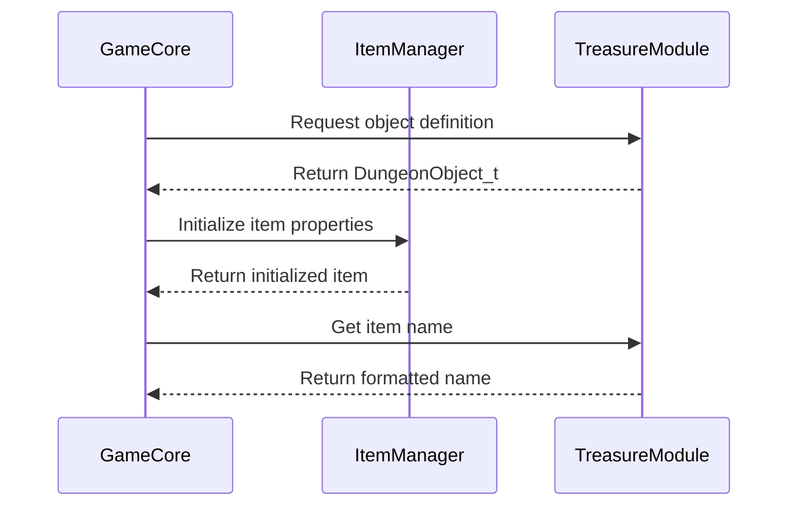

# data_treasure_cpp Module Documentation

## Introduction

The `data_treasure_cpp` module serves as the central repository for all game object definitions in the treasure system. This module contains the complete database of items, weapons, armor, scrolls, potions, and other game treasures that players can encounter in the dungeon. It provides the foundational data structures and initialization for all treasure-related objects in the game world.

This module is essential for the game's item system and works closely with other modules like [game_core](game_core.md) and [item_management](item_management.md) to provide the actual game mechanics for item handling, generation, and interaction.

## Architecture Overview

```mermaid
graph TD
    A[data_treasure_cpp] --> B[Game Object Definitions]
    A --> C[Item Database Initialization]
    A --> D[Special Item Names]
    
    B --> E[Dungeon Objects]
    B --> F[Store Items]
    B --> G[Doors and Stairs]
    B --> H[Traps and Rubble]
    B --> I[Gold and Gems]
    
    C --> J[magicInitializeItemNames()]
    C --> K[Item Attribute Setup]
    
    D --> L[SpecialNameIds Enum]
    D --> M[CNIL Constants]
```

## Core Components

### DungeonObject_t Structure

The primary data structure used throughout this module is `DungeonObject_t`, which defines all properties of game objects:

```cpp
struct DungeonObject_t {
    const char *name;           // Description of the object
    long flags;                 // Ability flags for the object
    int type;                   // Category/type of object
    char character;             // Display character
    int weight;                 // Relative weight
    int number;                 // Number of items in a group
    int sub_category_id;        // Sub-category identifier
    int damage_dice;            // Dice for damage calculation
    int damage_sides;           // Sides on damage dice
    int to_hit;                 // Magical bonus to hit
    int to_damage;              // Magical bonus to damage
    int ac;                     // Armor class
    int to_ac;                  // Magical bonus to AC
    int misc_use;               // Special ability usage
    int level;                  // Minimum level to find
    int cost;                   // Relative cost
};
```

### Game Objects Array

The main data structure is the `game_objects` array containing all 420+ game objects:

```cpp
DungeonObject_t game_objects[MAX_OBJECTS_IN_GAME] = {
    // ... 420+ object definitions
};
```

### Object Categories

Objects are categorized using the following type values:

- **TV_FOOD** (0): Food items
- **TV_SWORD** (1): Sword weapons
- **TV_HAFTED** (2): Hafted weapons
- **TV_POLEARM** (3): Polearm weapons
- **TV_BOW** (4): Bow weapons
- **TV_ARROW** (5): Arrow ammunition
- **TV_BOLT** (6): Bolt ammunition
- **TV_SLING_AMMO** (7): Sling ammunition
- **TV_SPIKE** (8): Spike ammunition
- **TV_LIGHT** (9): Light sources
- **TV_DIGGING** (10): Digging tools
- **TV_BOOTS** (11): Footwear
- **TV_HELM** (12): Headgear
- **TV_SOFT_ARMOR** (13): Soft armor
- **TV_HARD_ARMOR** (14): Hard armor
- **TV_CLOAK** (15): Cloaks
- **TV_GLOVES** (16): Gloves
- **TV_SHIELD** (17): Shields
- **TV_RING** (18): Rings
- **TV_AMULET** (19): Amulets
- **TV_SCROLL1** (20): Scroll types 1
- **TV_SCROLL2** (21): Scroll types 2
- **TV_POTION1** (22): Potion types 1
- **TV_POTION2** (23): Potion types 2
- **TV_FLASK** (24): Flasks
- **TV_WAND** (25): Wands
- **TV_STAFF** (26): Staves
- **TV_MAGIC_BOOK** (27): Magic books
- **TV_PRAYER_BOOK** (28): Prayer books
- **TV_CHEST** (29): Chests
- **TV_MISC** (30): Miscellaneous items
- **TV_OPEN_DOOR** (31): Open doors
- **TV_CLOSED_DOOR** (32): Closed doors
- **TV_SECRET_DOOR** (33): Secret doors
- **TV_UP_STAIR** (34): Up staircases
- **TV_DOWN_STAIR** (35): Down staircases
- **TV_STORE_DOOR** (36): Store doors
- **TV_VIS_TRAP** (37): Visible traps
- **TV_INVIS_TRAP** (38): Invisible traps
- **TV_RUBBLE** (39): Rubble
- **TV_GOLD** (40): Gold and gems
- **TV_NOTHING** (41): Placeholder items

### Stackable Object System

The module implements a sophisticated stackable object system using the `sub_category_id` field:

- **0-63**: Objects that cannot stack
- **64-127**: Dungeon objects that can stack with others of the same type
- **128-191**: Previously used for store items (unused now)
- **192**: Stack with other if they have the same `misc_use` value
- **193-255**: Objects that can stack if they have the same `misc_use` value

### Special Item Names

The module includes a special names array for enhanced item descriptions:

```cpp
const char *special_item_names[SpecialNameIds::SN_ARRAY_SIZE] = {
    CNIL,                "(R)",              "(RA)",
    // ... additional special names
};
```

## Data Flow and Relationships



## Integration Points

This module integrates with several other system components:

1. **[game_core](game_core.md)**: Uses object definitions for dungeon generation and item placement
2. **[item_management](item_management.md)**: Relies on object definitions for item creation and handling
3. **[magic_system](magic_system.md)**: Accesses object flags for magical properties
4. **[inventory_system](inventory_system.md)**: Uses object properties for inventory management

## Key Features

### Comprehensive Object Database
The module maintains a complete database of over 400 different game objects including:
- Weapons (swords, axes, bows, etc.)
- Armor (leather, chainmail, plate, etc.)
- Consumables (potions, scrolls, food)
- Equipment (rings, amulets, boots)
- Containers (chests, flasks)
- Magical items (wands, staves, books)
- Environmental elements (doors, stairs, traps)

### Flexible Stack System
Objects support various stacking behaviors based on their `sub_category_id` values, allowing for efficient memory usage and realistic item interactions.

### Extensible Design
The modular structure allows for easy addition of new object types while maintaining compatibility with existing systems through consistent data structures and naming conventions.

## Usage Patterns

### Object Retrieval
```cpp
// Retrieve object definition by index
DungeonObject_t obj = game_objects[item_index];

// Access object properties
const char* name = obj.name;
int type = obj.type;
int weight = obj.weight;
```

### Item Generation
The module provides the foundation for random item generation during dungeon exploration and combat encounters.

### Special Item Handling
Special item names are used to enhance item descriptions and provide additional context for player interactions.

## Dependencies

This module depends on:
- [headers.h](headers.md) for standard definitions and includes
- [misc.c](misc.md) for `magicInitializeItemNames()` function
- [game_core](game_core.md) for dungeon generation logic
- [item_management](item_management.md) for item instantiation

## Notes

1. All object definitions are stored in a single global array for fast access
2. The `sub_category_id` system enables complex stacking rules for different object types
3. Object flags are used extensively for magical properties and special abilities
4. The module supports both dungeon items and store items with appropriate categorization
5. Special item names provide enhanced descriptions for magical and unique items
