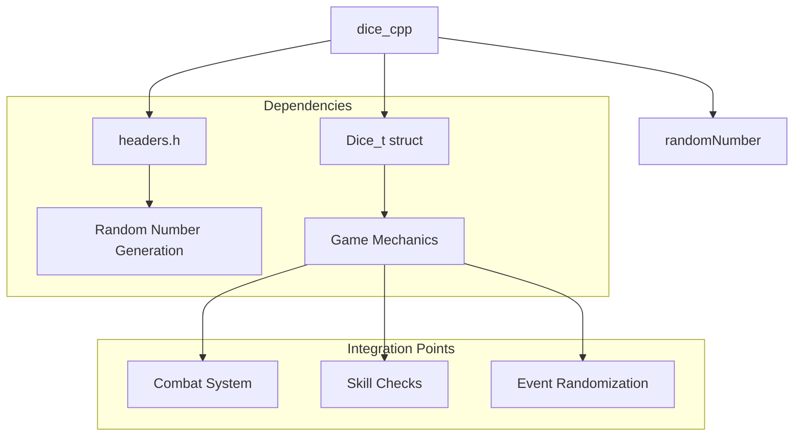
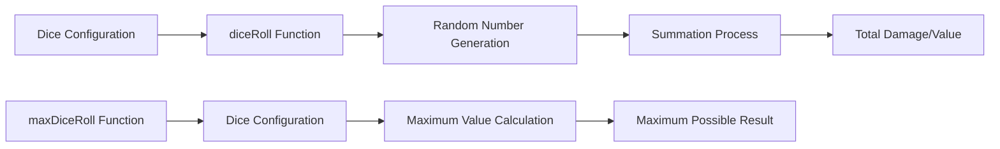

# dice_cpp Module Documentation

## Brief Introduction

The `dice_cpp` module provides core functionality for generating random dice rolls in a 2d6-style format. This module is essential for implementing game mechanics that require random number generation based on dice configurations. It serves as a fundamental building block for various game systems that depend on probabilistic outcomes.

## Core Functionality

The module exposes two primary functions for dice roll calculations:

1. **`diceRoll`** - Generates a random dice roll based on specified dice configuration
2. **`maxDiceRoll`** - Calculates the maximum possible value for a given dice configuration

## Architecture and Component Relationships



## Data Flow and Processing



## Component Interaction

### Dice Roll Generation Process

The `diceRoll` function operates by:
1. Taking a `Dice_t` structure containing dice count and sides
2. Iterating through each die in the configuration
3. Generating a random number for each die using `randomNumber`
4. Summing all generated values to produce the final result

### Maximum Roll Calculation

The `maxDiceRoll` function simply multiplies the number of dice by the maximum value per die, providing a quick calculation for the upper bound of possible outcomes.

## Integration with Other Modules

This module integrates with several key system components:

- **[random_number](random_number.md)** - Provides the underlying random number generation functionality
- **[game_mechanics](game_mechanics.md)** - Utilizes dice rolls for combat damage calculations
- **[combat_system](combat_system.md)** - Depends on dice rolls for attack and defense calculations

## Usage Examples

```cpp
// Example usage for damage calculation
Dice_t swordDamage = {2, 6}; // 2d6 damage
int damage = diceRoll(swordDamage);

// Example usage for maximum damage calculation
int maxDamage = maxDiceRoll(swordDamage); // Returns 12
```

## Design Considerations

The module maintains a simple, focused interface that allows for easy integration with game systems requiring dice-based randomness. The design follows the principle of separation of concerns, keeping dice roll logic distinct from other game mechanics while providing clear interfaces for both standard and maximum roll calculations.

## Performance Characteristics

The implementation is lightweight and efficient, with O(n) time complexity where n represents the number of dice being rolled. Memory usage is minimal, relying only on stack variables for processing.

## Future Extensibility

The current design supports extension for different dice configurations and could be enhanced to support:
- Custom probability distributions
- Modifier application to rolls
- Critical hit detection systems
- Special dice types (d100, d20, etc.)
