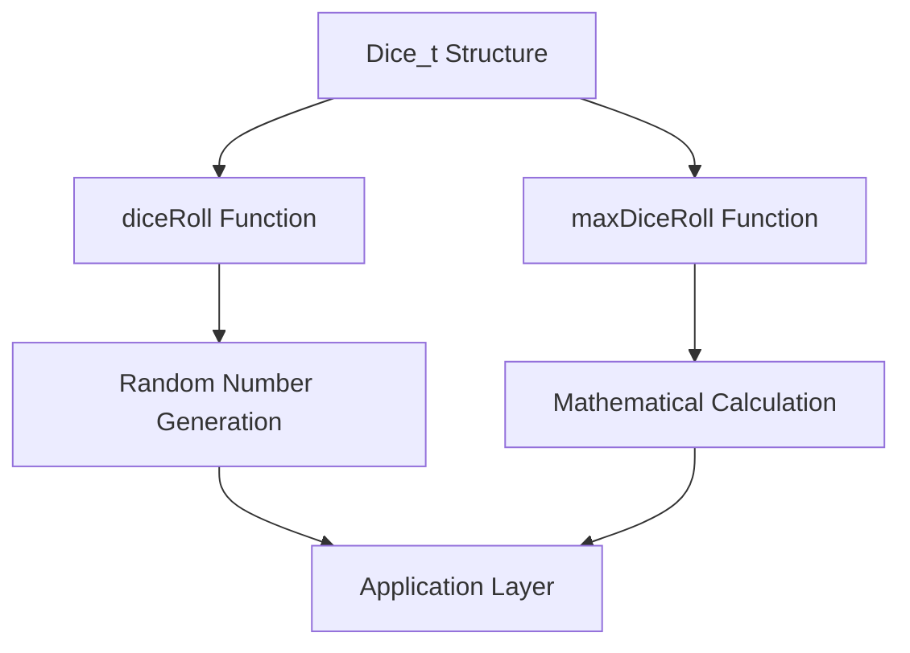
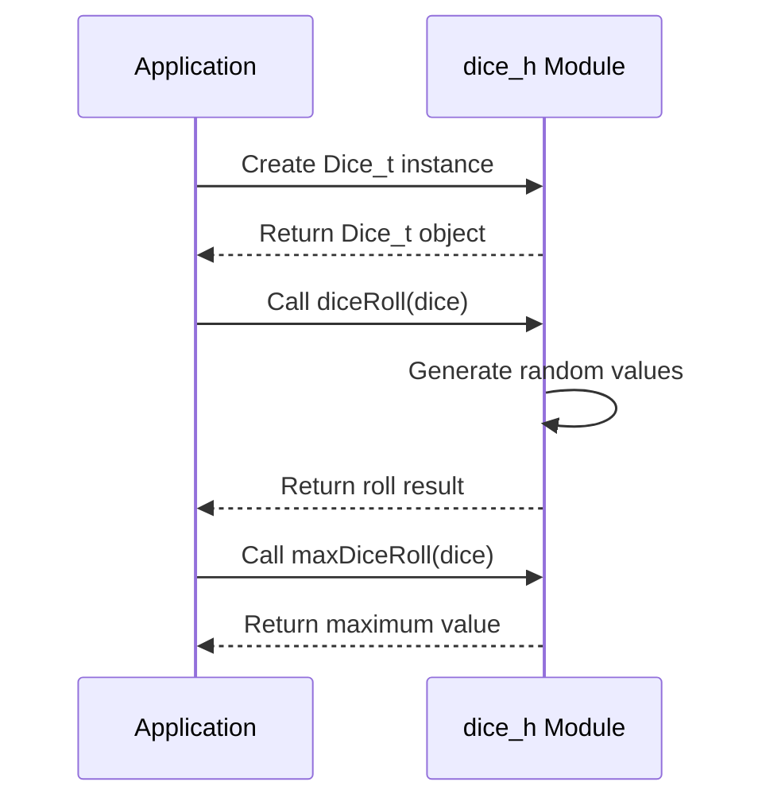

# dice_h Module Documentation

## Brief Introduction

The `dice_h` module provides a simple interface for working with dice in gaming applications. It defines a basic data structure for representing dice and includes functions for rolling dice and calculating maximum possible rolls. This module serves as a foundational component for any application requiring dice-based randomization.

## Core Components

### Data Structure: Dice_t

The `Dice_t` structure represents a single die with two fields:
- `dice`: Number of dice to roll
- `sides`: Number of sides on each die

This structure allows for flexible dice configurations, supporting multiple dice with varying numbers of sides.

### Function: diceRoll

```c
int diceRoll(Dice_t const &dice);
```

The `diceRoll` function generates a random roll result for the specified dice configuration. It returns an integer representing the sum of all dice rolled.

### Function: maxDiceRoll

```c
int maxDiceRoll(Dice_t const &dice);
```

The `maxDiceRoll` function calculates the maximum possible roll value for the given dice configuration without generating randomness. It returns the highest possible sum (all dice showing maximum value).

## Module Architecture



## Component Interactions



## Integration Points

This module works closely with:
- [random](random.md) - For generating random numbers during dice rolls
- [game_logic](game_logic.md) - For incorporating dice mechanics into game rules
- [ui_components](ui_components.md) - For displaying dice results to users

## Usage Examples

```c
// Create a standard six-sided die
Dice_t d6 = {1, 6};

// Roll the die
int result = diceRoll(d6);

// Calculate maximum possible roll
int max = maxDiceRoll(d6);

// Create a pair of dice
Dice_t twoD6 = {2, 6};
int total = diceRoll(twoD6);
```

## Implementation Details

The module uses `uint8_t` for dice parameters to optimize memory usage while maintaining sufficient range for typical dice configurations. The functions are designed to be lightweight and efficient, making them suitable for real-time applications.

## Dependencies

This module depends on:
- Standard C++ types (`uint8_t`)
- Random number generation capabilities (via [random](random.md) module)
- Basic mathematical operations

## System Integration

The `dice_h` module integrates into larger systems by providing a standardized interface for dice operations. It can be used in various contexts including board games, tabletop RPGs, card games, and simulation applications where probabilistic outcomes are needed.

## Performance Considerations

- Memory usage is minimal due to small data structure size
- Functions execute quickly, making them suitable for frequent calls
- No dynamic memory allocation required
- Thread-safe when used with appropriate synchronization mechanisms

## Future Extensibility

The current design supports extension through:
- Additional dice types (custom distributions)
- Weighted dice implementations
- Statistical analysis functions
- Serialization capabilities for saving dice configurations
