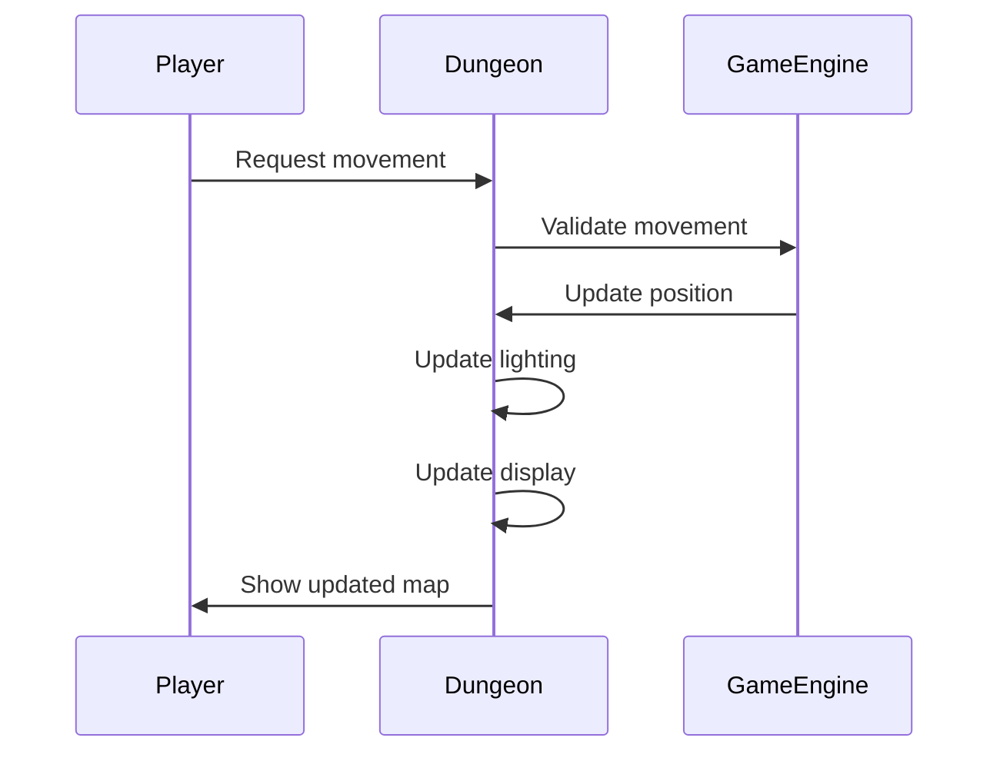
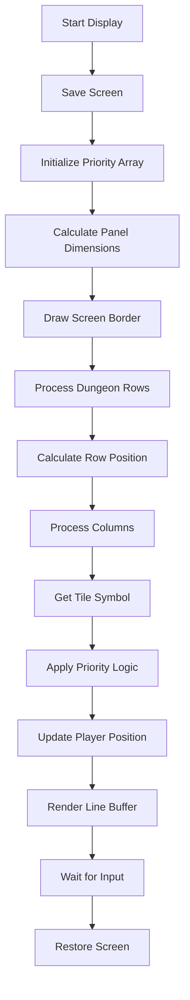
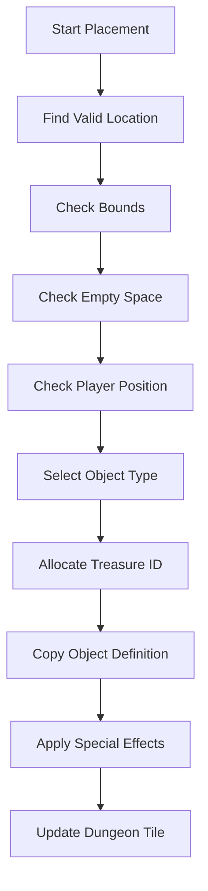

# dungeon_cpp Module Documentation

## Introduction

The `dungeon_cpp` module serves as the core dungeon management system for the game, handling dungeon generation, display, object placement, creature movement, and lighting mechanics. This module provides essential functions for managing the dungeon environment, including coordinate validation, distance calculations, tile symbol determination, and various dungeon-related operations such as trap placement, object distribution, and monster management.

## Architecture Overview

```mermaid
graph TD
    A[dungeon_cpp] --> B[Dungeon Management]
    A --> C[Display System]
    A --> D[Coordinate Operations]
    A --> E[Object Placement]
    A --> F[Monster Management]
    A --> G[Lighting System]
    
    B --> H[Dungeon Global Instance]
    B --> I[Dungeon Initialization]
    B --> J[Dungeon State Management]
    
    C --> K[Map Display]
    C --> L[Screen Management]
    
    D --> M[Boundary Checking]
    D --> N[Distance Calculations]
    D --> O[Wall Detection]
    
    E --> P[Trap Placement]
    E --> Q[Rubble Placement]
    E --> R[Gold Distribution]
    E --> S[Object Allocation]
    
    F --> T[Monster Deletion]
    F --> U[Monster Removal]
    F --> V[Monster Record Management]
    
    G --> W[Lighting Updates]
    G --> X[Room Lighting]
    G --> Y[Character Light Movement]
```

## Core Components and Functionality

### Dungeon Management

The dungeon management system maintains the primary dungeon state through the global `Dungeon_t` instance `dg`. This structure holds critical dungeon information including dimensions, floor layout, current level, and game state flags.

### Display System

The `dungeonDisplayMap()` function implements the dungeon map display functionality, creating a scaled-down view of the dungeon for player navigation. It handles:

- Screen saving and restoration
- Map scaling using the RATIO constant
- Priority-based symbol rendering
- Player position tracking
- Border drawing and UI elements

### Coordinate Operations

The module provides several utility functions for coordinate manipulation and validation:

- **`coordInBounds()`**: Validates whether a coordinate is within dungeon boundaries
- **`coordDistanceBetween()`**: Calculates Manhattan distance between two points
- **`coordWallsNextTo()`**: Counts walls adjacent to a coordinate
- **`coordCorridorWallsNextTo()`**: Identifies corridor walls in adjacent spaces

### Object Placement Functions

Multiple functions handle different types of object placement within the dungeon:

- **`dungeonSetTrap()`**: Places traps at specified locations
- **`dungeonPlaceRubble()`**: Places rubble blocks
- **`dungeonPlaceGold()`**: Distributes gold treasures
- **`dungeonPlaceRandomObjectAt()`**: Places random items
- **`dungeonAllocateAndPlaceObject()`**: Allocates and places objects based on type
- **`dungeonPlaceRandomObjectNear()`**: Places objects near specified coordinates

### Monster Management

The monster management system handles creature lifecycle operations:

- **`dungeonDeleteMonster()`**: Complete monster removal process
- **`dungeonRemoveMonsterFromLevel()`**: Removes monster from dungeon level
- **`dungeonDeleteMonsterRecord()`**: Deletes monster record from memory

### Lighting System

The lighting system manages dungeon illumination and visibility:

- **`dungeonLightRoom()`**: Lights up rooms based on player position
- **`dungeonLiteSpot()`**: Lights individual dungeon spots
- **`dungeonMoveCharacterLight()`**: Manages character lighting during movement
- **`sub1MoveLight()`**: Handles normal movement lighting
- **`sub3MoveLight()`**: Handles blind/no-light movement scenarios

## Data Flow and Interactions

## Component Relationships

The `dungeon_cpp` module interacts with several other system components:

- **[headers.h](headers.md)**: Provides necessary declarations and includes
- **[game_objects](game_objects.md)**: Accesses object definitions for placement
- **[monsters](monsters.md)**: Manages monster records and behavior
- **[inventory](inventory.md)**: Handles treasure and object copying
- **[terminal](terminal.md)**: Manages screen display and input handling

## Key Constants and Configuration

The module relies on several configuration constants:

- `RATIO`: Controls map scaling factor
- `MAX_WIDTH`, `MAX_HEIGHT`: Dungeon dimension limits
- `MIN_CAVE_WALL`, `MAX_CAVE_FLOOR`: Feature ID ranges
- `TILE_*` constants: Various dungeon tile types
- `TV_*` constants: Treasure category identifiers

## Process Flows

### Dungeon Display Process

### Object Placement Process

## Dependencies

This module depends on:
- [headers.h](headers.md) for core declarations
- [game_objects](game_objects.md) for object definitions
- [monsters](monsters.md) for monster data structures
- [inventory](inventory.md) for treasure management
- [terminal](terminal.md) for display operations

## Usage Patterns

The dungeon module follows these usage patterns:
1. Coordinate validation before operations
2. Priority-based rendering for display optimization
3. Two-phase monster deletion for safety
4. Context-aware lighting updates
5. Boundary checking for all spatial operations

This module forms the foundation for dungeon exploration and provides the essential infrastructure for all player interactions with the game world.
