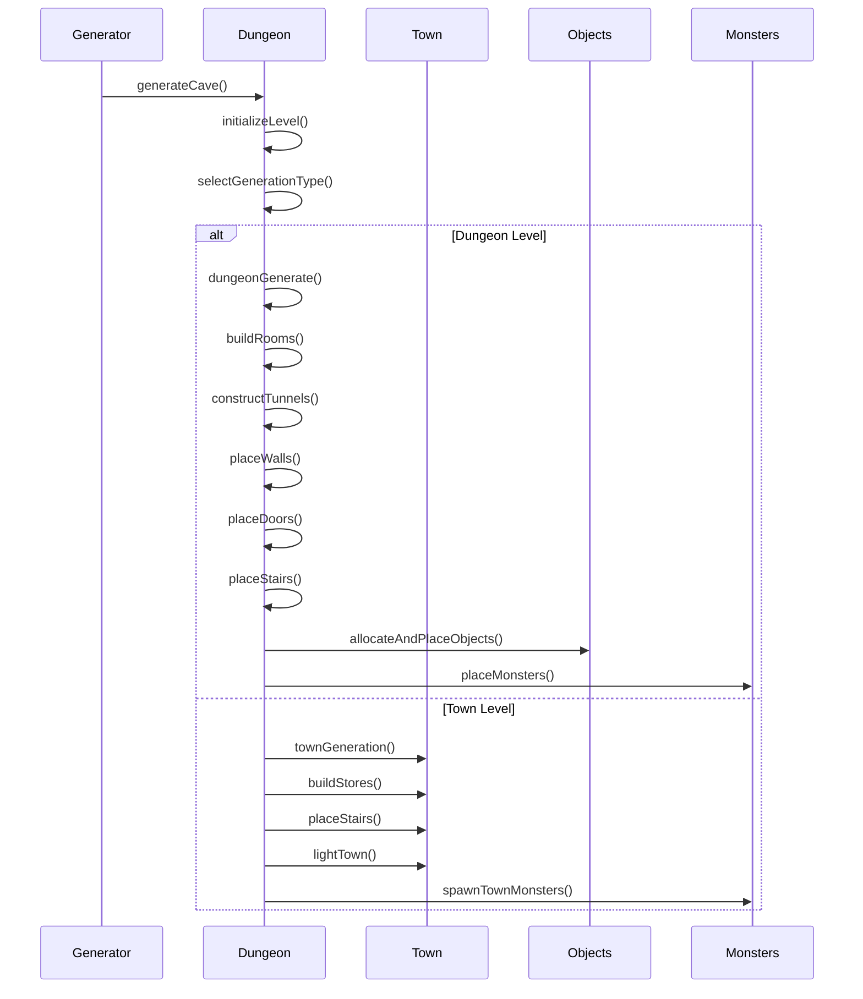
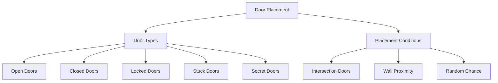

# dungeon_generate_cpp Module Documentation

## Introduction

The `dungeon_generate_cpp` module is responsible for generating dungeon and town levels in the game. It handles the procedural generation of cave systems, room layouts, corridors, doors, stairs, traps, monsters, and objects within the dungeon environment. This module provides the core functionality for creating varied and challenging gameplay experiences through randomized level generation.

## Architecture Overview

```mermaid
graph TD
    A[dungeon_generate.cpp] --> B[Dungeon Generation]
    A --> C[Town Generation]
    A --> D[Level Initialization]
    A --> E[Room Building]
    A --> F[Corridor Construction]
    A --> G[Object Placement]
    A --> H[Monster Placement]
    
    B --> B1[Dungeon Cave Generation]
    B --> B2[Streamers and Walls]
    B --> B3[Door Placement]
    B --> B4[Staircase Placement]
    B --> B5[Object Allocation]
    
    C --> C1[Store Building]
    C --> C2[Lighting System]
    C --> C3[Monster Spawning]
    
    D --> D1[Memory Initialization]
    D --> D2[Size Configuration]
    D --> D3[Seed Management]
    
    E --> E1[Basic Rooms]
    E --> E2[Overlapping Rectangles]
    E --> E3[Inner Room Variations]
    E --> E4[Cross-Shaped Rooms]
    
    F --> F1[Tunnel Building]
    F --> F2[Direction Logic]
    F --> F3[Wall Handling]
    
    G --> G1[Object Allocation]
    G --> G2[Gold and Gems]
    G --> G3[Trap Placement]
    G --> G4[Monster Spawning]
    
    H --> H1[Monster Allocation]
    H --> H2[Winning Monster]
```



## Component Relationships

### Core Generation Flow



## Detailed Component Analysis

### Dungeon Generation Process

The main dungeon generation function `generateCave()` orchestrates the entire level creation process:

1. **Initialization**: Sets up panel dimensions, initializes memory structures, and manages seeds
2. **Level Selection**: Determines whether to generate a dungeon or town level based on current level
3. **Town Generation**: For level 0, builds stores and town-specific elements
4. **Dungeon Generation**: For dungeon levels, creates complex cave systems with rooms and corridors

### Room Building System

The module implements multiple room types through specialized functions:

```mermaid
graph LR
    A[Room Types] --> B[Basic Rooms]
    A --> C[Overlapping Rectangles]
    A --> D[Inner Room Variations]
    A --> E[Cross-Shaped Rooms]
    
    B --> B1[dungeonBuildRoom()]
    C --> C1[dungeonBuildRoomOverlappingRectangles()]
    D --> D1[dungeonBuildRoomWithInnerRooms()]
    E --> E1[dungeonBuildRoomCrossShaped()]
```

### Door Placement Logic

Doors are strategically placed throughout the dungeon with various types:



### Object and Monster Distribution

The system distributes game objects and monsters according to level difficulty:

```mermaid
graph TD
    A[Object Distribution] --> B[Room Objects]
    A --> C[Corridor Objects]
    A --> D[Gold and Gems]
    A --> E[Traps]
    A --> F[Monsters]
    
    B --> B1[setRooms()]
    C --> C1[setCorridors()]
    D --> D1[setFloors()]
    F --> F1[monsterPlaceNewWithinDistance()]
    F --> F2[monsterPlaceWinning()]
```

## Data Flow and Dependencies

### Key Data Structures

The module relies on several global data structures:

- `dg.floor[][]`: 2D array representing the dungeon grid
- `doors_tk[]`: Array storing door positions during tunnel construction
- `game.treasure.list[]`: Treasure object management
- `monsters[]`: Monster placement and management

### Configuration Dependencies

The module depends on configuration constants defined in the `config` namespace:

- `config::dungeon::DUN_*` parameters control generation probabilities
- `config::dungeon::objects::OBJ_*` defines object types
- `config::monsters::MON_*` controls monster spawning

### External Module References

This module interacts with several other modules:

- [inventory](inventory.md): For treasure object management
- [monster](monster.md): For monster placement and spawning
- [trap](trap.md): For trap placement within vaults
- [store](store.md): For town store building

## Process Flows

### Main Generation Loop

```mermaid
flowchart TD
    A[generateCave()] --> B[Initialize Panel]
    B --> C[Set Position Defaults]
    C --> D[Initialize Memory]
    D --> E[Set Dimensions]
    E --> F[Select Level Type]
    F -->|Town| G[townGeneration()]
    F -->|Dungeon| H[dungeonGenerate()]
    G --> I[Build Stores]
    G --> J[Place Stairs]
    G --> K[Light Town]
    G --> L[Spawn Town Monsters]
    H --> M[Build Rooms]
    H --> N[Construct Tunnels]
    H --> O[Place Walls]
    H --> P[Place Doors]
    H --> Q[Place Stairs]
    H --> R[Allocate Objects]
    H --> S[Place Monsters]
```

### Room Building Process

```mermaid
flowchart TD
    A[dungeonBuildRoom()] --> B[Calculate Dimensions]
    B --> C[Draw Floor]
    C --> D[Add Walls]
    D --> E[Return]
    
    A1[dungeonBuildRoomOverlappingRectangles()] --> A2[Loop for Multiple Rooms]
    A2 --> A3[Calculate Room Dimensions]
    A3 --> A4[Draw Floor]
    A4 --> A5[Add Walls]
    A5 --> A6[Continue Loop]
    
    A7[dungeonBuildRoomWithInnerRooms()] --> A8[Build Outer Room]
    A8 --> A9[Build Inner Room]
    A9 --> A10[Apply Inner Room Variation]
    A10 --> A11[Place Special Features]
```

### Door Placement Algorithm

```mermaid
flowchart TD
    A[dungeonPlaceDoor()] --> B[Roll Door Type]
    B --> C{Type 1}
    C -->|Open/Broken| D[dungeonPlaceOpenDoor()]
    C -->|Closed/Locked/Stuck| E[dungeonPlaceClosedDoor()]
    C -->|Secret| F[dungeonPlaceSecretDoor()]
    
    G[dungeonPlaceDoorIfNextToTwoWalls()] --> H[Check Wall Count]
    H --> I{Valid Position}
    I -->|Yes| J[Place Door]
    I -->|No| K[Skip]
```

## Implementation Details

### Random Number Usage

The module extensively uses random number generation for:
- Room placement and sizing
- Door types and placement
- Monster and object distribution
- Level-specific variations

### Coordinate Systems

All coordinates use the `Coord_t` structure with `y` (row) and `x` (column) members, following standard grid conventions where:
- Y increases downward from top
- X increases rightward from left
- Coordinates are validated against bounds using `coordInBounds()`

### Memory Management

The module manages memory through:
- `treasureLinker()`: Initializes treasure list
- `monsterLinker()`: Initializes monster list
- `dungeonBlankEntireCave()`: Clears dungeon grid

## Integration Points

This module integrates with the broader game system through:

1. **Game State Management**: Updates global dungeon state variables
2. **Player Positioning**: Sets initial player coordinates
3. **Object System**: Interfaces with treasure and inventory management
4. **Monster System**: Coordinates monster placement and spawning
5. **Rendering System**: Provides dungeon layout for display

The `dungeon_generate_cpp` module serves as the foundation for all procedurally generated content in the game, ensuring each playthrough offers unique challenges and experiences through its sophisticated level generation algorithms.
