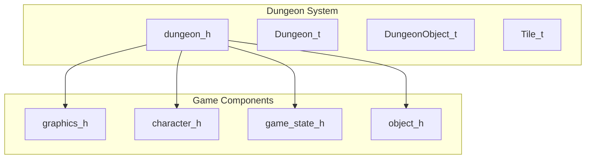
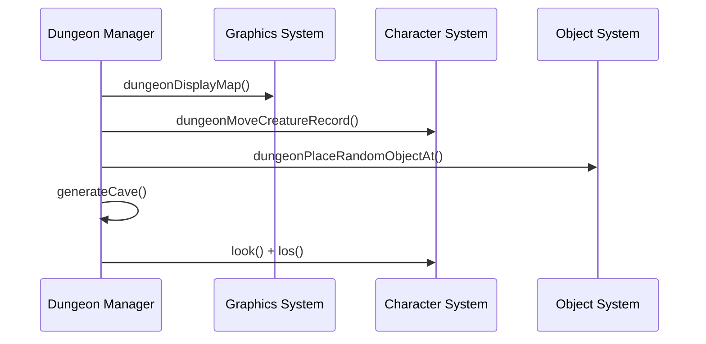

# dungeon_h Module Documentation

## Introduction

The `dungeon_h` module defines the core data structures and function declarations for the dungeon management system in the game. It provides the foundation for dungeon generation, object placement, creature movement, and visibility calculations. This module interfaces with the graphics system through [graphics_h](graphics_h.md) and integrates with character management via [character_h](character_h.md).

## Architecture Overview



## Core Data Structures

### DungeonObject_t

The `DungeonObject_t` structure represents any non-living object in the game world:

```c
typedef struct {
    const char *name;          // Object name
    uint32_t flags;            // Special flags
    uint8_t category_id;       // Category number (tval)
    uint8_t sprite;            // Character representation - ASCII symbol (tchar)
    int16_t misc_use;          // Misc. use variable (p1)
    int32_t cost;              // Cost of item
    uint8_t sub_category_id;   // Sub-category number (subval)
    uint8_t items_count;       // Number of items
    uint16_t weight;           // Weight
    int16_t to_hit;            // Plusses to hit
    int16_t to_damage;         // Plusses to damage
    int16_t ac;                // Normal AC
    int16_t to_ac;             // Plusses to AC
    Dice_t damage;             // Damage when hits
    uint8_t depth_first_found; // Dungeon level item first found
} DungeonObject_t;
```

This structure contains all metadata about game objects including their visual representation, properties, and game mechanics.

### Dungeon_t

The main dungeon structure manages the entire dungeon state:

```c
typedef struct {
    // Dungeon size is either just big enough for town level, or the whole dungeon itself
    int16_t height;
    int16_t width;

    Panel_t panel;

    // Current turn of the game
    int32_t game_turn;

    // The current dungeon level
    int16_t current_level;

    // A `true` value means a new level will be generated on next loop iteration
    bool generate_new_level;

    // Floor definitions
    Tile_t floor[MAX_HEIGHT][MAX_WIDTH];
} Dungeon_t;
```

## Constants

The module defines several important dungeon size parameters:

- `RATIO`: Size ratio of the Map screen (3)
- `MAX_HEIGHT`: Maximum dungeon height (66) - multiple of 11, >= 22
- `MAX_WIDTH`: Maximum dungeon width (198) - multiple of 33, >= 66
- `SCREEN_HEIGHT`: Screen height (22)
- `SCREEN_WIDTH`: Screen width (66)
- `QUART_HEIGHT`: Quarter of screen height (5)
- `QUART_WIDTH`: Quarter of screen width (16)

## Function Declarations

### Dungeon Management Functions

```c
void dungeonDisplayMap();
void generateCave();
```

These functions handle dungeon visualization and generation processes.

### Coordinate and Visibility Functions

```c
bool coordInBounds(Coord_t const &coord);
int coordDistanceBetween(Coord_t const &from, Coord_t const &to);
int coordWallsNextTo(Coord_t const &coord);
int coordCorridorWallsNextTo(Coord_t const &coord);
char caveGetTileSymbol(Coord_t const &coord);
bool caveTileVisible(Coord_t const &coord);
bool los(Coord_t from, Coord_t to);
void look();
```

Coordinate-based utility functions for dungeon navigation, visibility calculations, and line-of-sight determination.

### Object Placement Functions

```c
void dungeonSetTrap(Coord_t const &coord, int sub_type_id);
void trapChangeVisibility(Coord_t const &coord);

void dungeonPlaceRubble(Coord_t const &coord);
void dungeonPlaceGold(Coord_t const &coord);

void dungeonPlaceRandomObjectAt(Coord_t const &coord, bool must_be_small);
void dungeonAllocateAndPlaceObject(bool (*set_function)(int), int object_type, int number);
void dungeonPlaceRandomObjectNear(Coord_t coord, int tries);
```

Functions for placing various dungeon objects including traps, rubble, gold, and random items.

### Creature Management Functions

```c
void dungeonMoveCreatureRecord(Coord_t const &from, Coord_t const &to);
void dungeonLightRoom(Coord_t const &coord);
void dungeonLiteSpot(Coord_t const &coord);
void dungeonMoveCharacterLight(Coord_t const &from, Coord_t const &to);

void dungeonDeleteMonster(int id);
void dungeonRemoveMonsterFromLevel(int id);
void dungeonDeleteMonsterRecord(int id);
int dungeonSummonObject(Coord_t coord, int amount, int object_type);
bool dungeonDeleteObject(Coord_t const &coord);
```

Functions for managing monster positions, lighting effects, and object removal.

## Component Interactions



## Dependencies

This module depends on:
- [graphics_h](graphics_h.md) for display functionality
- [character_h](character_h.md) for creature management
- [object_h](object_h.md) for object handling
- [game_state_h](game_state_h.md) for game state management

## Integration Points

The dungeon system integrates with the broader game architecture through:
1. **Graphics Rendering**: Using [graphics_h](graphics_h.md) to display dungeon maps
2. **Character Movement**: Through [character_h](character_h.md) for player and monster positioning
3. **Item Management**: Via [object_h](object_h.md) for object placement and manipulation
4. **Game State**: Working with [game_state_h](game_state_h.md) for turn management and level progression

## Usage Patterns

The dungeon system follows these primary usage patterns:
1. **Initialization**: Setting up dungeon dimensions and generating initial layout
2. **Runtime Updates**: Managing creature movement and object interactions
3. **Rendering**: Displaying visible portions of the dungeon to players
4. **Visibility Calculations**: Determining what parts of the dungeon are visible to characters

This module forms the backbone of the game's exploration mechanics and provides the fundamental infrastructure for dungeon-based gameplay.
