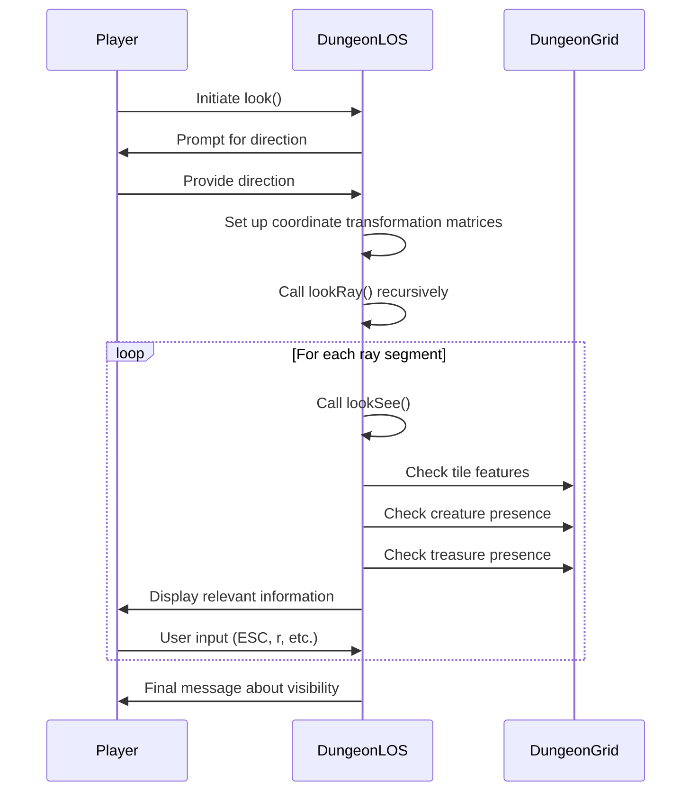

# dungeon_los_cpp Module Documentation

## Introduction

The `dungeon_los_cpp` module implements line-of-sight (LOS) algorithms and viewing mechanics for the dungeon environment. This module provides core functionality for determining visibility between points in the dungeon grid and enabling character vision capabilities including peripheral sight analysis.

## Core Functionality

### Line-of-Sight Algorithm (`los` function)

The primary function `los()` implements a fast, integer-based line-of-sight algorithm originally developed by Joseph Hall. This algorithm determines whether a direct line can be traced between two points in the dungeon grid, considering transparency of tiles.

Key features:
- Uses integer arithmetic for performance optimization
- Handles edge cases including adjacent tiles and axis-aligned lines
- Considers dungeon tile features to determine opacity
- Excludes starting and ending tiles from opacity checks
- Implements Bresenham-like algorithm for diagonal movement

### Vision System (`look` function)

The `look()` function provides enhanced vision capabilities with peripheral sight analysis. It allows players to examine their surroundings in specific directions, handling both straight and diagonal viewing angles.

## Architecture and Component Relationships

```mermaid
graph TD
    A[dungeon_los.cpp] --> B[los()]
    A --> C[look()]
    A --> D[lookRay()]
    A --> E[lookSee()]
    
    B --> F[dg.floor access]
    B --> G[MIN_CLOSED_SPACE check]
    
    C --> H[Direction input handling]
    C --> I[lookRay recursion]
    C --> J[los_dir_set arrays]
    
    D --> K[Recursive ray scanning]
    D --> L[Gradient calculations]
    D --> M[Window visibility detection]
    
    E --> N[Tile feature checking]
    E --> O[Creature/monster display]
    E --> P[Object/treasure display]
    E --> Q[Wall type descriptions]

    style A fill:#f9f,stroke:#333
    style B fill:#bbf,stroke:#333
    style C fill:#bfb,stroke:#333
    style D fill:#fbb,stroke:#333
    style E fill:#ff9,stroke:#333
    style F fill:#9ff,stroke:#333
    style G fill:#9ff,stroke:#333
    style H fill:#9ff,stroke:#333
    style I fill:#9ff,stroke:#333
    style J fill:#9ff,stroke:#333
    style K fill:#9ff,stroke:#333
    style L fill:#9ff,stroke:#333
    style M fill:#9ff,stroke:#333
    style N fill:#9ff,stroke:#333
    style O fill:#9ff,stroke:#333
    style P fill:#9ff,stroke:#333
    style Q fill:#9ff,stroke:#333
```

## Data Flow and Processing



## Dependencies and Integration

This module depends on several other system components:

- **[headers.h](headers.md)**: Provides necessary includes and definitions
- **[dg.floor](dungeon_grid.md)**: Accesses dungeon tile information
- **[py.flags](player_status.md)**: Checks player blindness and image status
- **[monsters](monsters.md)**: Interacts with monster information
- **[game.treasure](treasure.md)**: Accesses treasure information
- **[config::options](config_options.md)**: Uses highlight_seams configuration
- **[config::monsters::MON_MAX_SIGHT](monster_config.md)**: Respects maximum sight range

## Key Constants and Variables

### Global Variables
- `los_fxx`, `los_fxy`, `los_fyx`, `los_fyy`: Coordinate transformation matrices
- `los_num_places_seen`: Counter for visible locations
- `los_hack_no_query`: Flag to prevent duplicate line-of-sight checks
- `los_rocks_and_objects`: Toggle for rock/object viewing modes

### Static Arrays
- `los_dir_set_fxy`, `los_dir_set_fxx`, `los_dir_set_fyy`, `los_dir_set_fyx`: Direction mapping tables
- `los_map_diagonals1`, `los_map_diagonals2`: Diagonal direction mappings

### Constants
- `GRADF`: Gradient scaling factor (10000)
- `MIN_CLOSED_SPACE`: Minimum feature ID for closed spaces
- `MAX_OPEN_SPACE`: Maximum feature ID for open spaces

## Process Flows

### LOS Calculation Process
```mermaid
flowchart TD
    A[Start los()] --> B[Calculate deltas]
    B --> C[Check adjacent tiles]
    C --> D{Delta X = 0?}
    D -->|Yes| E[Vertical line check]
    D -->|No| F{Delta Y = 0?}
    F -->|Yes| G[Horizontal line check]
    F -->|No| H[General case processing]
    H --> I[Set up scale factors]
    H --> J[Determine major axis]
    J --> K[Initialize coordinates]
    K --> L[Loop through positions]
    L --> M{Feature opaque?}
    M -->|Yes| N[Return false]
    M -->|No| O[Continue]
    O --> P[Update fractional position]
    P --> Q[Check termination]
    Q -->|Done| R[Return true]
```

### Look Command Process
```mermaid
flowchart TD
    A[Start look()] --> B[Check blindness/image status]
    B --> C[Get direction input]
    C --> D[Initialize counters]
    D --> E[Call lookSee()]
    E --> F{Direction = 5?}
    F -->|Yes| G[Process all 4 directions]
    F -->|No| H[Process single direction]
    H --> I[Handle straight/diagonal]
    I --> J[Call lookRay()]
    J --> K[Process ray segments]
    K --> L{Highlight seams?}
    L -->|Yes| M[Process rocks/objects]
    L -->|No| N[End]
```

## Implementation Details

### Integer-Based Line Algorithm
The LOS implementation uses integer arithmetic to avoid floating-point operations, making it faster for real-time applications. The algorithm scales calculations by multiplying by `delta_x * delta_y * 2` to maintain precision while working with integers.

### Peripheral Vision System
The `look()` function implements a sophisticated peripheral vision system that:
- Handles 8-directional viewing
- Uses recursive ray tracing for cone-shaped vision areas
- Manages gradient calculations for proper angular coverage
- Supports both direct and indirect line-of-sight detection

### Coordinate Transformation
The vision system uses matrix transformations to map ray coordinates to dungeon coordinates:
```
dungeon_y = py.pos.y + los_fyx * (ray x) + los_fyy * (ray y)
dungeon_x = py.pos.x + los_fxx * (ray x) + los_fxy * (ray y)
```

## Error Handling and Edge Cases

The module handles several important edge cases:
- Overflow prevention when deltas exceed 90 units
- Special handling for adjacent tiles
- Proper coordinate boundary checking
- Invalid coordinate validation in `lookSee()`
- Graceful handling of blind/invisible player states

## Performance Considerations

- Uses integer arithmetic exclusively for speed
- Minimizes memory allocations
- Implements early termination when visibility is blocked
- Optimized loops for common cases (adjacent tiles, axis-aligned lines)
- Recursive approach that limits depth based on maximum sight range

This module forms a critical part of the game's perception system, enabling realistic dungeon exploration and tactical gameplay mechanics.
