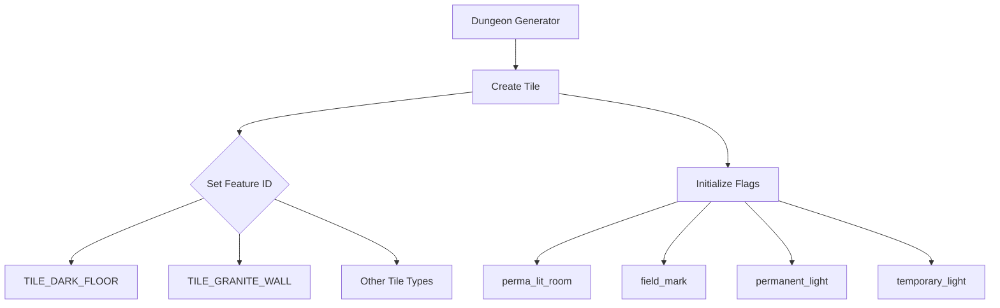
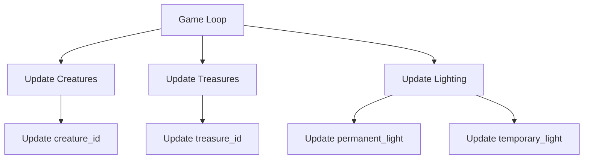

# Dungeon Tile Header Documentation

## Introduction

The `dungeon_tile.h` module defines the fundamental data structures and constants used to represent individual tiles within the dungeon grid system. This header file provides the core building blocks for dungeon representation, storing information about creatures, treasures, features, and lighting states for each tile position.

## Module Overview

This module serves as a foundational component for the dungeon management system, defining how individual dungeon tiles are structured and what properties they can possess. It contains the primary `Tile_t` structure that represents a single tile in the dungeon grid, along with various constants that define different tile types and their characteristics.

## Data Structures

### Tile_t Structure

The `Tile_t` structure represents a single tile in the dungeon grid and contains the following fields:

```c
typedef struct {
    uint8_t creature_id;     // ID for any creature occupying the tile
    uint8_t treasure_id;     // ID for any treasure item occupying the tile
    uint8_t feature_id;      // ID of cave feature; walls, floors, open space, etc.

    bool perma_lit_room : 1;  // Room should be lit with perm light, walls with this set should be perm lit after tunneled out.
    bool field_mark : 1;      // Field mark, used for traps/doors/stairs, object is hidden if fm is false.
    bool permanent_light : 1; // Permanent light, used for walls and lighted rooms.
    bool temporary_light : 1; // Temporary light, used for player's lamp light, etc.
} Tile_t;
```

The structure uses bit-fields to efficiently store boolean flags within a single byte, optimizing memory usage while maintaining clear semantic meaning for each flag.

## Constants and Definitions

### Tile Type Constants

The module defines several constants that categorize different types of dungeon tiles:

- **Wall Types**: Tiles with values from `MIN_CAVE_WALL` (12) onwards represent various wall types
- **Floor Types**: Values 0-4 represent different floor types including dark floors, light floors, corridors, and blocked floors
- **Special Wall Types**: `TMP1_WALL` (8) and `TMP2_WALL` (9) represent temporary wall states

### Specific Tile Type Definitions

```c
constexpr uint8_t TILE_NULL_WALL = 0;        // Null wall type
constexpr uint8_t TILE_DARK_FLOOR = 1;       // Dark floor tile
constexpr uint8_t TILE_LIGHT_FLOOR = 2;      // Lighted floor tile
constexpr uint8_t MAX_CAVE_ROOM = 2;         // Maximum cave room value
constexpr uint8_t TILE_CORR_FLOOR = 3;       // Corridor floor tile
constexpr uint8_t TILE_BLOCKED_FLOOR = 4;    // Blocked floor (door/rubble)
constexpr uint8_t MAX_CAVE_FLOOR = 4;        // Maximum cave floor value

constexpr uint8_t MAX_OPEN_SPACE = 3;        // Maximum open space value
constexpr uint8_t MIN_CLOSED_SPACE = 4;      // Minimum closed space value

constexpr uint8_t TMP1_WALL = 8;             // Temporary wall type 1
constexpr uint8_t TMP2_WALL = 9;             // Temporary wall type 2

constexpr uint8_t MIN_CAVE_WALL = 12;        // Minimum cave wall value
constexpr uint8_t TILE_GRANITE_WALL = 12;    // Granite wall type
constexpr uint8_t TILE_MAGMA_WALL = 13;      // Magma wall type
constexpr uint8_t TILE_QUARTZ_WALL = 14;     // Quartz wall type
constexpr uint8_t TILE_BOUNDARY_WALL = 15;   // Boundary wall type
```

## Component Relationships

The `Tile_t` structure integrates with several other system components:

- **Creature Management**: Uses `creature_id` to reference creatures occupying tiles
- **Treasure System**: Utilizes `treasure_id` to track items on tiles
- **Feature System**: Relies on `feature_id` to identify cave features like walls and floors
- **Lighting System**: Manages both permanent and temporary lighting through boolean flags

## Architecture Integration

This module forms part of the core dungeon generation and management system. It works in conjunction with:

- [dungeon_generator](dungeon_generator.md) - For generating dungeon layouts
- [creature_system](creature_system.md) - For managing creature positions
- [treasure_system](treasure_system.md) - For handling item placement
- [lighting_system](lighting_system.md) - For managing illumination states

## Data Flow

The tile data flows through the system as follows:

1. **Generation Phase**: Dungeon generator creates tiles with appropriate feature IDs
2. **Runtime Phase**: Creature and treasure systems update creature_id and treasure_id fields
3. **Rendering Phase**: Lighting system uses boolean flags to determine visibility
4. **Save/Load Phase**: All tile data is serialized for persistent storage

## Process Flows

### Tile Initialization Process



### Tile Update Process



## Memory Usage Considerations

The `Tile_t` structure is designed for minimal memory footprint:
- Total size: 5 bytes (1 byte for IDs + 4 bits for flags)
- Bit-field optimization reduces memory overhead
- Efficient use of uint8_t for all ID fields

## Future Extensibility

The current design allows for future expansion:
- Additional tile types can be added within existing ranges
- New boolean flags can be added to the bit-field structure
- The system can accommodate larger dungeon sizes through proper indexing

This module provides the essential foundation for dungeon tile representation and will be referenced by all systems that need to interact with dungeon grid data.
