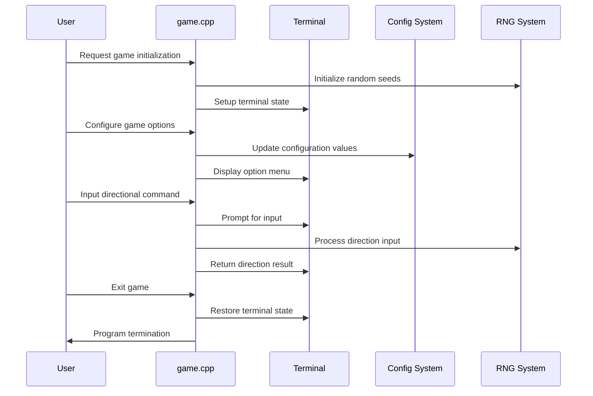

# game_cpp Module Documentation

## Brief Introduction

The `game_cpp` module serves as the central hub for game initialization, random number generation, configuration management, and user input handling in the Moria game system. This module provides essential functionality for maintaining game state, managing randomization, and processing user commands. It interfaces with core game systems through header files and maintains compatibility with various game versions.

## Module Architecture

```mermaid
graph TD
    A[game.cpp] --> B[Game Initialization]
    A --> C[Random Number Generation]
    A --> D[Configuration Management]
    A --> E[User Input Handling]
    A --> F[Version Compatibility]
    
    B --> B1[seedsInitialize]
    B --> B2[seedSet]
    B --> B3[seedResetToOldSeed]
    
    C --> C1[randomNumber]
    C --> C2[randomNumberNormalDistribution]
    C --> C3[getRandomDirection]
    
    D --> D1[setGameOptions]
    D --> D2[Game Options Array]
    
    E --> E1[getDirectionWithMemory]
    E --> E2[getAllDirections]
    E --> E3[getCommand]
    
    F --> F1[validGameVersion]
    F --> F2[isCurrentGameVersion]

    subgraph Core Dependencies
        G[headers.h]
        H[version.h]
        I[config::options]
        J[terminal functions]
        K[game state variables]
    end
    
    A --> G
    A --> H
    A --> I
    A --> J
    A --> K
```

## Core Components and Functionality

### Game Initialization and Random Seed Management

The module handles game initialization through several key functions:

- **`seedsInitialize(uint32_t seed)`**: Initializes random seeds using either a provided seed or current Unix time, setting up magic and town seeds while establishing the base random number generator state.

- **`seedSet(uint32_t seed)`**: Temporarily switches to a different random number generator state for reproducible gameplay scenarios.

- **`seedResetToOldSeed()`**: Restores the previous random number generator state after temporary changes.

### Random Number Generation

The module implements sophisticated random number generation with multiple distributions:

- **`randomNumber(int const max)`**: Generates a random integer between 1 and MAXVAL, providing basic uniform distribution.

- **`randomNumberNormalDistribution(int mean, int standard)`**: Implements normal distribution using a lookup table approach for performance, allowing for realistic statistical variations in game mechanics.

- **`getRandomDirection()`**: Returns a random valid direction (1-9 excluding 5) for movement operations.

### Configuration Management

The module manages game options through:

- **`setGameOptions()`**: Provides an interactive interface for users to modify various game settings including running behaviors, display preferences, and command configurations.

- **Game Options Array**: Maintains a mapping of configuration options to their respective boolean variables in the `config::options` namespace.

### User Input Processing

The module handles directional input with memory capabilities:

- **`getDirectionWithMemory(char *prompt, int &direction)`**: Processes directional input with memory support for repeated commands, supporting both standard and roguelike key mappings.

- **`getAllDirections(const char *prompt, int &direction)`**: Similar to above but allows for null direction input.

### Version Compatibility

Maintains backward compatibility with older game versions:

- **`validGameVersion(uint8_t major, uint8_t minor, uint8_t patch)`**: Validates whether a given version is compatible with the current implementation.

- **`isCurrentGameVersion(uint8_t major, uint8_t minor, uint8_t patch)`**: Checks if a version matches the current game version.

### Utility Functions

- **`exitProgram()`**: Safely restores terminal state and exits the program.

- **`abortProgram(const char *msg)`**: Displays an error message and exits the program gracefully.

## Data Flow and Interactions

## Component Relationships

The `game.cpp` module interacts with several other system components:

- **[headers.h](headers.h.md)**: Provides necessary declarations and includes for game functionality
- **[version.h](version.h.md)**: Contains version information and compatibility checks
- **[config::options](config_options.md)**: Configuration management system for game settings
- **Terminal Interface**: Functions for terminal manipulation and user interaction
- **Game State Variables**: Access to global game state through `game` variable
- **Player State**: Integration with player-specific data through `py` structure

## External Dependencies

The module depends on several external systems:

1. **Random Number Generator**: Requires proper implementation of `rnd()`, `setRandomSeed()`, and `getRandomSeed()` functions
2. **Terminal Management**: Depends on terminal restoration and input handling functions
3. **Configuration System**: Integrates with the `config::options` namespace for game settings
4. **Input Processing**: Uses `getCommand()` function for user input handling
5. **Game State Management**: Accesses global `game` and `py` structures for game state

## Implementation Details

### Random Number Distribution

The normal distribution implementation uses a binary search approach against a precomputed lookup table (`normal_table`) for efficiency. The algorithm scales the table indices appropriately based on standard deviation differences.

### Direction Handling

Direction input supports both standard numeric keypad input (1-9) and roguelike key mappings (h,j,k,l,y,u,n,b). The system maintains direction memory for repeated command functionality.

### Game Options System

The configuration system uses a static array of option descriptors that map human-readable prompts to boolean configuration variables, enabling dynamic modification of game behavior at runtime.

## Error Handling and Safety

The module implements proper error handling through:

- Input validation for all user interactions
- Safe terminal state restoration before program exit
- Graceful handling of invalid input with bell sounds
- Memory management for temporary random seed states

This module forms a critical foundation for the entire game system, ensuring consistent initialization, proper randomization, and reliable user interaction throughout the game lifecycle.
