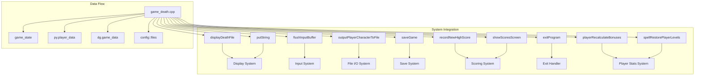
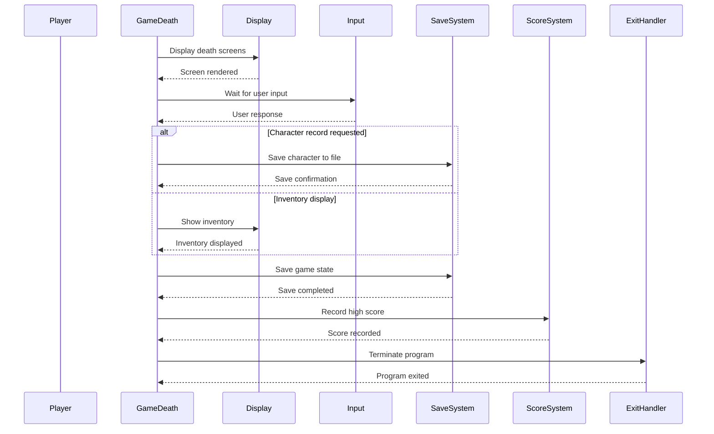
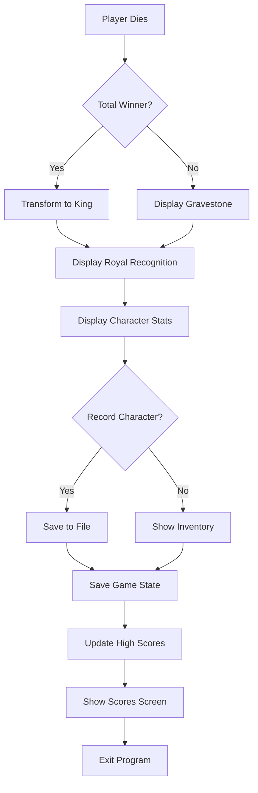
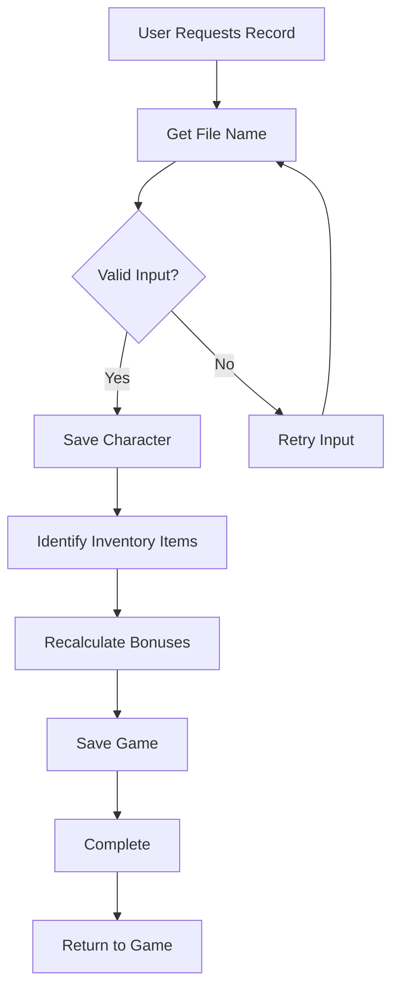

# Game Death C++ Module Documentation

## Brief Introduction

The `game_death_cpp` module handles the game's death sequence and related functionality. This module manages what occurs when a player character dies, including displaying death messages, creating gravestones, handling character records, and managing game state transitions. It interfaces with various system components to ensure proper cleanup and scoring.

## Module Overview

This module contains the core logic for handling player death scenarios in the game. It manages the display of death-related information such as gravestones, character statistics, and royal recognition for total winners. The module also handles saving character data, updating high scores, and managing the final game state transition.

### Key Responsibilities

- Display death-related screens (gravestones, royal recognition)
- Handle character record creation and output
- Manage game state during death sequences
- Interface with scoring and save systems
- Coordinate with input/output systems for user interaction

## Architecture and Component Relationships

## Detailed Component Analysis

### Core Functions

#### `printTomb()` - Gravestone Display
Displays the character's gravestone with key statistics including:
- Character name
- Rank title
- Class information
- Level, experience, and gold
- Current dungeon level
- Cause of death
- Date of death

This function also handles user input for character record creation or inventory display.

#### `printCrown()` - Royal Recognition
Displays a royal recognition screen for total winners, showing "King!" or "Queen!" based on character gender.

#### `kingly()` - Total Winner Transformation
Transforms a total winner into a "King" character with enhanced stats:
- Resets current level to 0
- Sets cause of death to "Ripe Old Age"
- Restores player levels
- Increases level by maximum possible amount
- Adds substantial gold and experience points

#### `endGame()` - Main Death Handler
The primary entry point for death processing that coordinates all death-related activities:
1. Displays appropriate death screens based on game state
2. Handles character saving
3. Manages high score recording and display
4. Finalizes game exit

### Data Flow and Dependencies

## Integration Points

### External Dependencies

The `game_death_cpp` module depends on several other system components:

- **Display System** ([display.md](display.md)): For rendering death screens and messages
- **Input System** ([input.md](input.md)): For handling user interactions during death sequences
- **Save System** ([save.md](save.md)): For saving character data and game state
- **Scoring System** ([score.md](score.md)): For high score management
- **Player Stats System** ([player_stats.md](player_stats.md)): For character attribute manipulation
- **File I/O System** ([file_io.md](file_io.md)): For character record file operations

### Data Structures Used

The module interacts with several global data structures:

- `game`: Global game state information
- `py`: Player character data
- `dg`: Dungeon/game data
- `classes[]`: Class definitions and titles
- `config::files`: Configuration for death-related files

## Process Flows

### Death Sequence Flow

### Character Record Creation Flow

## Error Handling and Edge Cases

The module implements several error handling mechanisms:

1. **File I/O Errors**: Retry mechanism for character record saving failures
2. **Input Validation**: Proper handling of empty or invalid user inputs
3. **State Management**: Prevention of recursive death sequences through `game.character_saved` flag
4. **Resource Cleanup**: Ensures proper game state preservation before exit

## Performance Considerations

The death sequence is designed to be lightweight while providing comprehensive information. Key performance considerations include:

- Efficient string operations for display formatting
- Minimal memory allocation during critical sections
- Proper resource cleanup to prevent memory leaks
- Optimized file I/O operations for character records

## Security Considerations

The module handles sensitive data including:
- Character information and statistics
- High score data
- File system operations for character records

Security measures include proper input validation and secure file handling practices.

## Related Modules

For complete understanding of the death system, see:
- [display.md](display.md): Display system integration
- [input.md](input.md): Input handling during death sequences
- [save.md](save.md): Game state saving functionality
- [score.md](score.md): High score management
- [player_stats.md](player_stats.md): Player attribute manipulation

## Implementation Notes

The death system uses several static helper functions to maintain clean separation of concerns:
- `printTomb()`: Handles gravestone display logic
- `printCrown()`: Manages royal recognition display
- `kingly()`: Implements total winner transformation
- `endGame()`: Coordinates the entire death sequence

All functions use consistent coordinate systems and display conventions established by the core display system.
