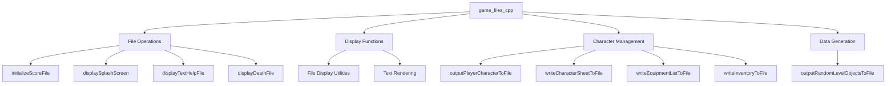
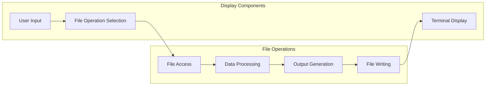

# game_files_cpp Module Documentation

## Introduction

The `game_files_cpp` module provides essential file I/O operations for the Moria game system. It handles various file-related tasks including score file initialization, displaying splash screens and help files, managing death messages, generating random object lists, and outputting character sheets to files. This module serves as a bridge between the game's core logic and persistent storage mechanisms.

## Architecture Overview

## Component Details

### File Operations

The module implements several core file operations:

- **initializeScoreFile**: Opens the high score file with appropriate permissions for score management
- **displaySplashScreen**: Shows the introductory splash screen from a text file
- **displayTextHelpFile**: Displays help files with pagination support
- **displayDeathFile**: Shows death message files

### Display Functions

These functions handle various text-based displays:

- **displaySplashScreen**: Renders splash screen content to the terminal
- **displayTextHelpFile**: Implements paginated help file viewing
- **displayDeathFile**: Displays death-related messages

### Character Management

The character management functions provide detailed character information export:

- **outputPlayerCharacterToFile**: Main function for exporting character data to files
- **writeCharacterSheetToFile**: Writes detailed character statistics and attributes
- **writeEquipmentListToFile**: Lists all equipped items with descriptions
- **writeInventoryToFile**: Lists all inventory items

### Data Generation

The module includes functionality for generating random object data:

- **outputRandomLevelObjectsToFile**: Creates lists of randomly generated objects for specific levels

## Data Flow

## Dependencies

This module depends on several other system components:

- [headers.h](headers.md): Provides necessary includes and definitions
- [config](config.md): Configuration settings for file paths
- [terminal](terminal.md): Terminal display functions
- [player](player.md): Player data structures and functions
- [items](items.md): Item handling and description functions
- [game](game.md): Game state management

## Integration Points

The `game_files_cpp` module integrates with:

1. **Game State Management**: Accesses player data through global `py` structure
2. **Configuration System**: Uses configuration paths for file locations
3. **Terminal Interface**: Relies on terminal display functions for user feedback
4. **File System**: Directly uses standard C library file operations

## Usage Patterns

### Character Export
When a player requests to save their character, the system calls `outputPlayerCharacterToFile()` which orchestrates the writing of:
1. Character statistics and attributes
2. Equipment list with descriptions
3. Inventory contents

### Help File Display
The `displayTextHelpFile()` function implements a simple pagination system that:
1. Opens help files
2. Displays 23 lines at a time
3. Waits for user input before continuing
4. Restores the original screen state

### Random Object Generation
The `outputRandomLevelObjectsToFile()` function allows players to:
1. Specify level and quantity parameters
2. Generate random objects for that level
3. Save them to a specified file
4. Apply appropriate magical properties

## Error Handling

The module implements robust error handling for file operations:

1. **File Opening Failures**: Gracefully handles cases where files cannot be opened
2. **Permission Issues**: Manages file permission errors appropriately
3. **User Confirmation**: Requests confirmation for overwriting existing files
4. **Input Validation**: Validates user inputs for parameters like level numbers and counts

## Security Considerations

The module maintains security by:
1. Using proper file permissions during score file initialization
2. Validating file paths and names before operations
3. Implementing safe string handling to prevent buffer overflows
4. Using appropriate file access modes to prevent unauthorized modifications

## Performance Notes

- File operations are optimized for minimal overhead
- Memory usage is kept low through stack-based buffers
- Text rendering is batched for efficient terminal updates
- Large file operations are handled with appropriate buffering

## Related Modules

For complete system understanding, see:
- [config](config.md): File path configurations
- [terminal](terminal.md): Display and input handling
- [player](player.md): Player data structures
- [items](items.md): Item handling and descriptions
- [game](game.md): Overall game state management
