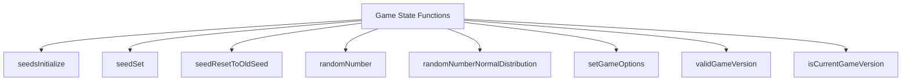
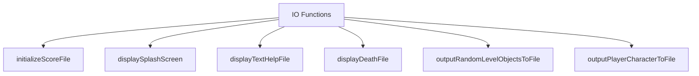
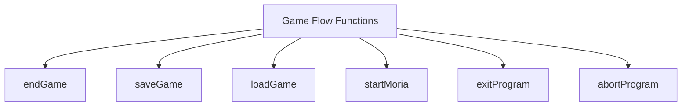
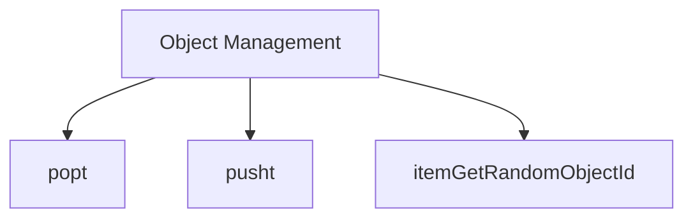
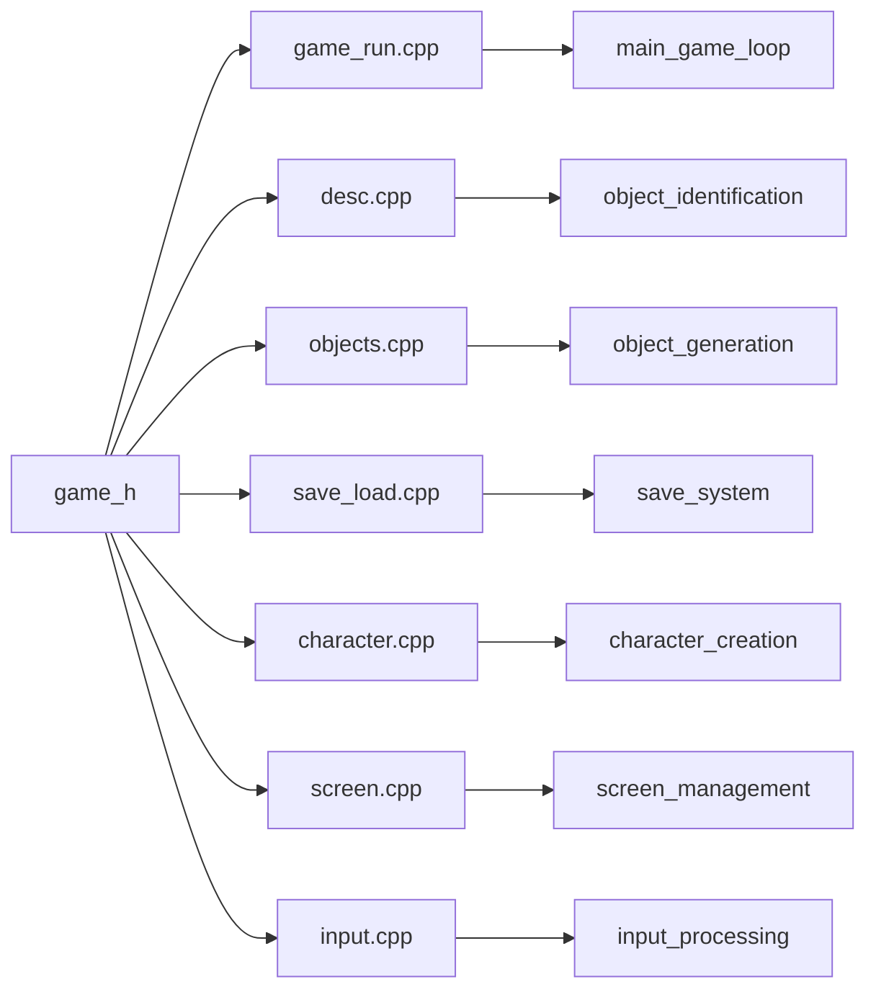
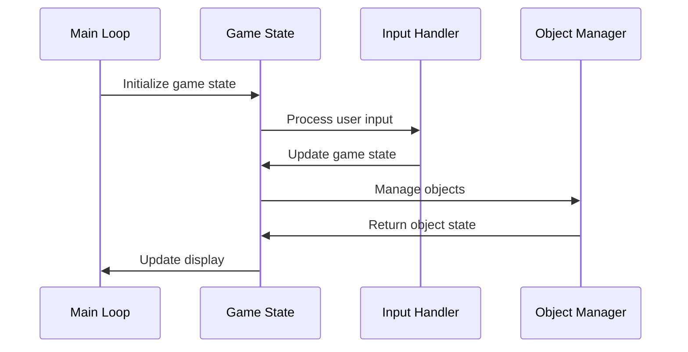

# game_h Module Documentation

## Brief Introduction

The `game_h` module serves as the central header file for the game's core data structures and function declarations. It defines essential game constants, the primary game state structure, and declares all public functions needed for game initialization, management, and execution. This module acts as the interface between various game subsystems and provides the foundation for game state management.

## Comprehensive Documentation

### Core Data Structures

The module defines the fundamental game state through the `Game_t` structure, which encapsulates all critical game variables and state information.

```mermaid
classDiagram
    class Game_t {
        <<struct>>
        magic_seed: uint32_t
        town_seed: uint32_t
        character_generated: bool
        character_saved: bool
        character_is_dead: bool
        total_winner: bool
        teleport_player: bool
        player_free_turn: bool
        to_be_wizard: bool
        wizard_mode: bool
        noscore: int16_t
        use_last_direction: bool
        doing_inventory_command: char
        last_command: char
        command_count: unsigned int
        character_died_from: vtype_t
        treasure: struct { current_id: int16_t; list: Inventory_t[] }
        screen: struct { current_screen_id: Screen; screen_left_pos: int; screen_bottom_pos: int; wear_low_id: int; wear_high_id: int }
    }

    class Screen {
        <<enum>>
        Blank
        Equipment
        Inventory
        Wear
        Help
        Wrong
    }

    Game_t --> Screen : uses
```

### Constants and Configuration

The module contains several important constants that define game limits and behaviors:

- **Object Management Constants**: 
  - `TREASURE_MAX_LEVELS`: Maximum magic level in dungeon (50)
  - `MAX_OBJECTS_IN_GAME`: Total objects in universe (420)
  - `MAX_DUNGEON_OBJECTS`: Dungeon-specific objects (344)
  - `OBJECT_IDENT_SIZE`: Object identification size (448)
  - `LEVEL_MAX_OBJECTS`: Maximum objects per level (175)

- **Random Generation Constants**:
  - `NORMAL_TABLE_SIZE`: Size of normal distribution table (256)
  - `NORMAL_TABLE_SD`: Standard deviation for table (64)

### Function Declarations

The module exposes numerous functions for game management, including:

#### Game State Management


#### Input/Output Operations


#### Game Flow Control


#### Object Management


### Component Relationships

The `game_h` module integrates with several other modules in the system:



### Data Flow

The game state flows through these key pathways:



### Usage Patterns

The `game_h` module follows these usage patterns:

1. **Initialization Phase**: `seedsInitialize()` and `setGameOptions()` are called at startup
2. **Game Loop**: `startMoria()` initiates the main game execution
3. **State Management**: Various functions update and query the `Game_t` structure
4. **Persistence**: `saveGame()` and `loadGame()` handle game state persistence
5. **Cleanup**: `endGame()` and `exitProgram()` manage game termination

### Integration Points

This module interfaces with:
- [objects](objects.md) for object management operations
- [save_load](save_load.md) for game persistence
- [character](character.md) for character creation and management
- [screen](screen.md) for UI state handling
- [input](input.md) for user interaction processing

The `game_h` module is essential for maintaining consistent game state across all subsystems and provides the foundation upon which the entire game operates.
