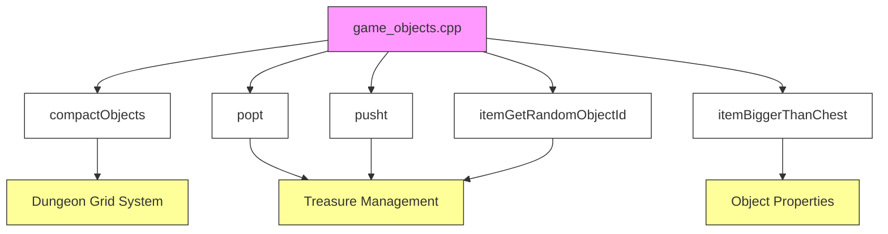
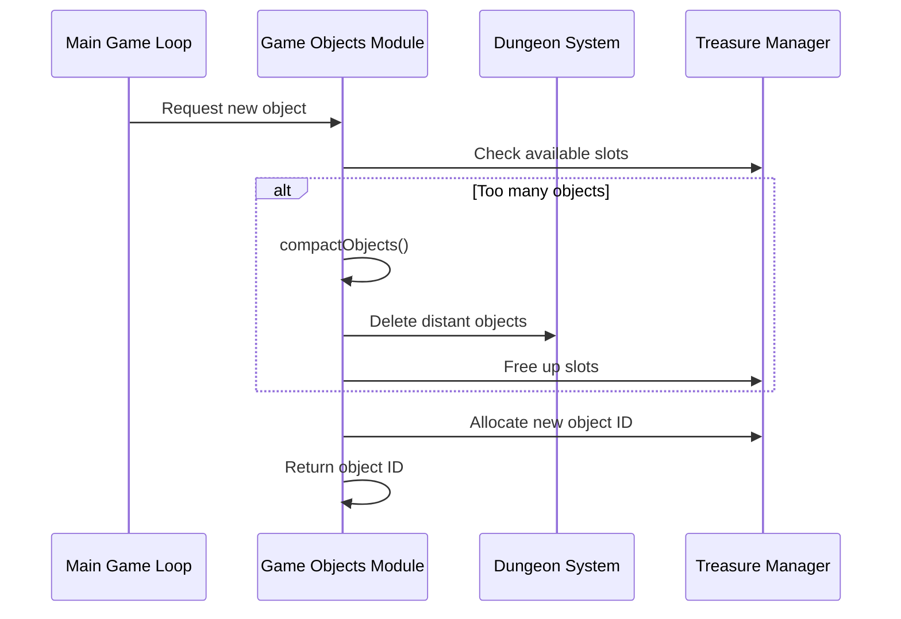

# Game Objects C++ Module Documentation

## Introduction

The `game_objects_cpp` module handles the management and manipulation of game objects within the dungeon environment. This module provides core functionality for object creation, deletion, compaction, and random selection, forming a critical part of the game's object system. It interfaces with the dungeon grid system and treasure management components to maintain proper object placement and distribution throughout the game world.

## Module Overview

This module contains the primary implementation for managing game objects in the dungeon environment. Key responsibilities include:

- Object compaction when dungeon limits are reached
- Random object selection based on dungeon levels
- Object size validation for container compatibility
- Memory management for object storage

## Architecture and Component Relationships

### Core Components

### Data Flow

## Detailed Function Documentation

### compactObjects()

This function manages object density in the dungeon by removing distant objects when the maximum limit is approached. It implements a two-phase approach:

1. **Initial Cleanup Phase**: Iterates through dungeon tiles to identify objects that are far from the player character
2. **Distance Reduction**: If no objects are removed, reduces the distance threshold and retries
3. **Visual Update**: Redraws the dungeon panel if any objects were removed

The function applies different deletion probabilities based on object categories:
- Traps (VIS_TRAP): 15% chance
- Invis traps, rubble, doors: 5% chance  
- Stairs and shop doors: 0% chance (preserved)
- Secret doors: 3% chance
- Other objects: 10% chance

### popt()

Returns the next available object ID for allocation. When the maximum object limit is reached, it triggers the `compactObjects()` function to free up space before returning the new ID.

### pusht()

Returns an object ID to the free pool. This function maintains object integrity by:
1. Moving the last object to the freed position
2. Updating all references to maintain consistency
3. Clearing the moved object's data

### itemBiggerThanChest()

Determines whether an object is too large to fit inside a chest container. This function evaluates object categories and weight thresholds to ensure proper inventory management.

### itemGetRandomObjectId()

Provides random object selection based on dungeon level with weighted probability distribution. The algorithm includes:

1. **Level-based Selection**: Chooses objects appropriate to the current dungeon level
2. **Special Item Chance**: Occasionally selects higher-level items using a configurable chance
3. **Weighted Distribution**: Implements a non-uniform distribution favoring higher-level objects
4. **Size Filtering**: Optionally filters out objects that are too large for containers

## Integration Points

This module integrates with several other core systems:

- **Dungeon System** ([dungeon.md](dungeon.md)): Directly manipulates dungeon grid objects and coordinates
- **Treasure Management** ([treasure.md](treasure.md)): Manages object allocation and deallocation
- **Player Character** ([player.md](player.md)): Uses object distances for compaction decisions
- **Inventory System** ([inventory.md](inventory.md)): Validates object sizes for container compatibility

## Dependencies

The module depends on:
- `headers.h`: Provides necessary type definitions and global variables
- Dungeon grid structures for object placement
- Treasure management system for object ID allocation
- Player position data for distance calculations
- Configuration constants for treasure probabilities

## Performance Considerations

The module implements several optimizations:
- Early termination in compaction when sufficient objects are removed
- Efficient object ID management avoiding unnecessary memory operations
- Weighted random selection reducing computation overhead
- Conditional checks to minimize redundant processing

## Error Handling

The module assumes proper initialization of global variables and does not implement explicit error handling for invalid states. All functions operate under the assumption that:
- Dungeon dimensions are valid
- Object IDs are properly managed
- Global treasure structures are initialized correctly

## Usage Patterns

Common usage patterns include:
1. **Object Creation**: Call `popt()` to allocate new objects
2. **Object Deletion**: Use `pusht()` to return objects to the free pool
3. **Object Selection**: Use `itemGetRandomObjectId()` for loot generation
4. **Space Management**: Automatic compaction occurs when limits are approached

This module forms the foundation for all object-related operations in the game, ensuring efficient memory management and proper object distribution throughout the dungeon environment.
