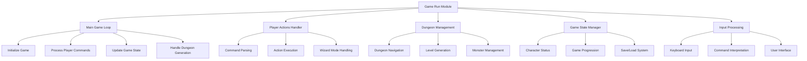
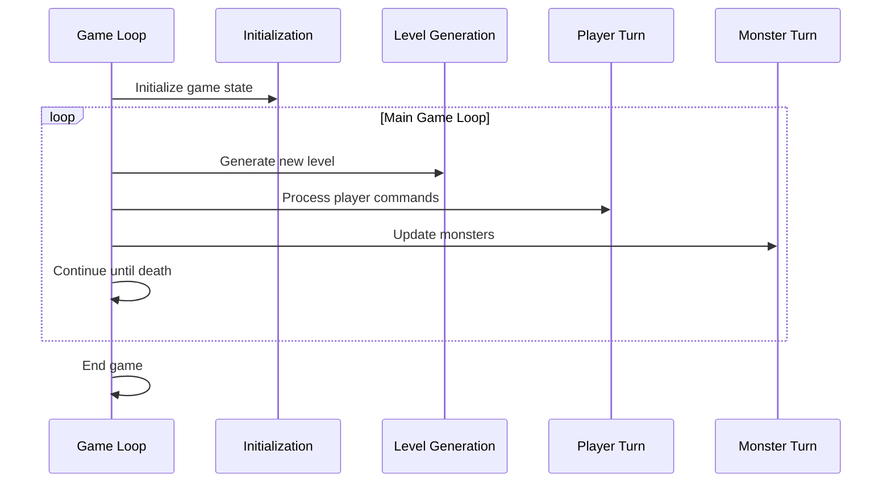
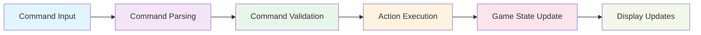
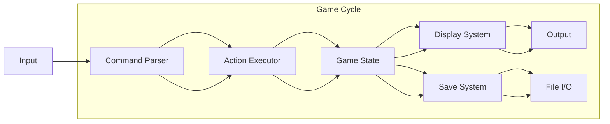

# Game Run C++ Module Documentation

## Introduction

The `game_run_cpp` module serves as the core game loop and main execution engine for the Moria roguelike game. This module orchestrates the entire gameplay experience, managing the main game loop, player actions, dungeon navigation, combat systems, and game state management. It coordinates with various subsystems including player character management, monster behavior, inventory systems, and dungeon generation.

## Architecture Overview



## Core Components and Functionality

### Main Game Entry Point

The `startMoria` function serves as the primary entry point for the game, handling initialization and the main game loop:

```cpp
void startMoria(uint32_t seed, bool start_new_game, bool roguelike_keys)
```

This function manages:
- Game configuration and initialization
- Save file loading and character restoration
- Character creation and setup
- Main game loop execution
- Game state transitions and termination

### Game Loop Architecture

The main game loop follows this structure:



### Player Action Processing

The module handles player commands through several key functions:



### Dungeon Management System

The dungeon management system handles:
- Level generation and navigation
- Staircase movement (up/down)
- Door manipulation (closing/jamming)
- Light source management
- Map viewing and location tracking

### Game State Management

The module maintains critical game state information including:
- Player attributes and status flags
- Inventory and equipment management
- Monster and treasure level initialization
- Game progression tracking
- Save/load functionality

## Component Interactions

```mermaid
graph TB
    A[Game Run] --> B[Player System]
    A --> C[Monster System]
    A --> D[Inventory System]
    A --> E[Dungeon System]
    A --> F[Store System]
    A --> G[Spell System]
    
    B --> B1[Character Creation]
    B --> B2[Status Updates]
    B --> B3[Attribute Management]
    
    C --> C1[Monster Placement]
    C --> C2[Monster Behavior]
    C --> C3[Combat System]
    
    D --> D1[Item Management]
    D --> D2[Equipment Handling]
    D --> D3[Inventory Operations]
    
    E --> E1[Dungeon Generation]
    E --> E2[Level Navigation]
    E --> E3[Map Display]
    
    F --> F1[Store Initialization]
    F --> F2[Price Adjustment]
    F --> F3[Shopping System]
    
    G --> G1[Spell Casting]
    G --> G2[Spell Management]
    G --> G3[Magical Effects]
```



## Data Flow



## Key Functions and Their Responsibilities

### Initialization Functions
- `initializeCharacterInventory()`: Sets up initial player equipment
- `initializeMonsterLevels()`: Prepares monster level distribution tables
- `initializeTreasureLevels()`: Sets up treasure level distribution
- `priceAdjust()`: Adjusts object prices based on game settings

### Player Action Handlers
- `doCommand()`: Main command dispatcher
- `executeInputCommands()`: Processes user input and executes commands
- `playerMove()`: Handles player movement
- `playerRestOn()`: Manages player resting states

### Game State Updates
- `playDungeon()`: Main dungeon processing loop
- `playerUpdateStatusFlags()`: Updates player status effects
- `updateMonsters()`: Manages monster behavior and AI
- `playerRegenerateHitPoints()`: Handles health regeneration

### Dungeon Navigation
- `dungeonGoUpLevel()`: Handles movement to higher levels
- `dungeonGoDownLevel()`: Handles movement to lower levels
- `dungeonJamDoor()`: Manages door jamming mechanics
- `commandLocateOnMap()`: Provides map location functionality

## Integration Points

This module integrates with several other core systems:

- **[player_system](player_system.md)**: Manages player character attributes, status, and abilities
- **[monster_system](monster_system.md)**: Controls monster placement, behavior, and combat
- **[inventory_system](inventory_system.md)**: Handles item management and equipment
- **[dungeon_system](dungeon_system.md)**: Manages dungeon generation and navigation
- **[store_system](store_system.md)**: Controls shop interactions and pricing
- **[spell_system](spell_system.md)**: Manages magical abilities and spell casting

## Game Flow Control

The module implements a sophisticated game flow control system that manages:

1. **Turn-based processing**: Each game cycle processes player actions and monster behaviors
2. **State transitions**: Smooth transitions between different game states (playing, resting, combat)
3. **Event handling**: Proper handling of game events like level changes, combat, and status effects
4. **Input buffering**: Efficient handling of user input and command repetition

## Performance Considerations

The module is designed with performance in mind, featuring:
- Efficient command processing loops
- Minimal redundant calculations
- Optimized state updates
- Proper resource management during game cycles

## Error Handling and Safety

The module includes robust error handling for:
- Invalid command inputs
- Game state inconsistencies
- Resource management issues
- Input/output operations
- Signal handling for graceful exits

This comprehensive documentation provides a foundation for understanding how the game run module orchestrates the entire Moria gaming experience, coordinating with all other subsystems to create a cohesive and engaging roguelike adventure.
