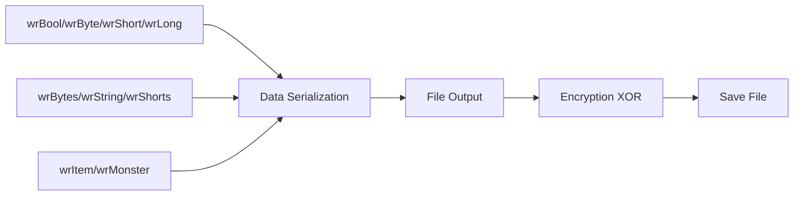
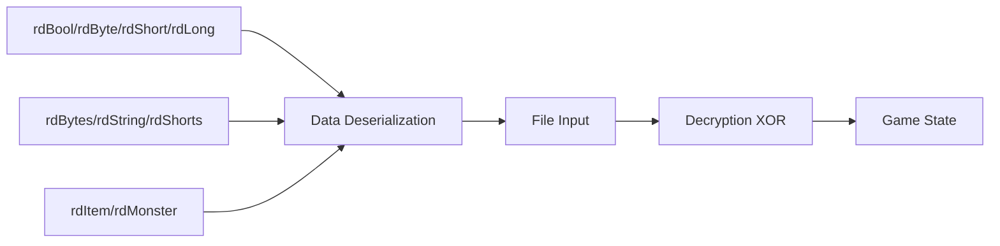
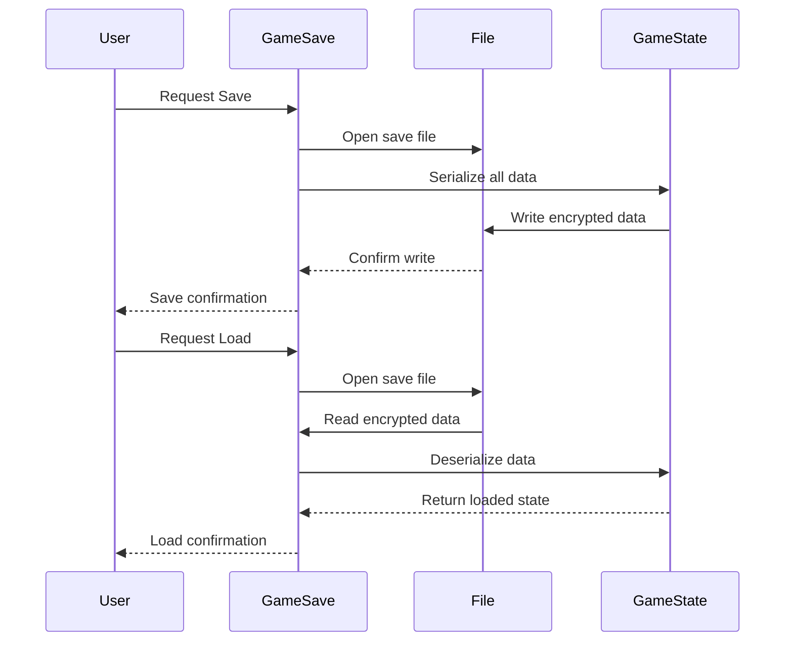

# Game Save C++ Module Documentation

## Overview

The `game_save_cpp` module provides core functionality for saving and loading game state in the Moria roguelike game. This module handles the serialization and deserialization of player character data, dungeon information, monster memories, and game configuration settings. It also manages high score saving and loading operations.

## Architecture

```mermaid
graph TD
    A[Game Save Module] --> B[Save Game Functionality]
    A --> C[Load Game Functionality]
    A --> D[High Score Management]
    A --> E[Data Serialization]
    
    B --> B1[saveGame()]
    B --> B2[saveChar()]
    B --> B3[svWrite()]
    
    C --> C1[loadGame()]
    C --> C2[restoreMemory()]
    C --> C3[restoreCharacter()]
    
    D --> D1[setFileptr()]
    D --> D2[saveHighScore()]
    D --> D3[readHighScore()]
    
    E --> E1[wrBool/wrByte/wrShort/wrLong]
    E --> E2[rdBool/rdByte/rdShort/rdLong]
    E --> E3[wrItem/wrMonster]
    E --> E4[rdItem/rdMonster]
```

## Core Components

### Main Functions

#### `saveGame()`
The primary entry point for saving the game state. This function:
- Prompts the user for a save file name
- Handles file creation and overwriting scenarios
- Manages error handling for save failures
- Returns boolean indicating success/failure

#### `loadGame(bool &generate)`
The primary entry point for loading game state:
- Validates save file existence
- Handles version compatibility checking
- Restores player character data
- Restores dungeon state and monster information
- Manages resurrection scenarios for dead characters

#### `saveChar(const std::string &filename)`
Handles the actual file I/O operations for saving:
- Opens and manages file descriptors
- Implements XOR-based encryption for save files
- Writes all game state data to disk
- Handles error recovery and cleanup

### Data Serialization Functions

#### Writing Functions


#### Reading Functions


### High Score Management

#### `saveHighScore(HighScore_t const &score)`
Saves high score information to the score file:
- Encrypts score data using XOR method
- Writes player statistics and achievements
- Maintains compatibility with existing score file format

#### `readHighScore(HighScore_t &score)`
Reads high score information from the score file:
- Decrypts score data using XOR method
- Parses player statistics and achievements
- Handles version compatibility issues

## Data Flow



## Component Interactions

### Save Process Flow
1. **User Initiation**: `saveGame()` prompts for filename
2. **File Management**: `saveChar()` handles file I/O operations
3. **Data Serialization**: `svWrite()` serializes all game state
4. **Encryption**: XOR-based encryption applied to all data
5. **File Writing**: All serialized data written to disk

### Load Process Flow
1. **File Validation**: `loadGame()` validates save file
2. **Data Reading**: File opened and data read
3. **Decryption**: XOR-based decryption applied
4. **Data Deserialization**: `svRead()` reconstructs game state
5. **State Restoration**: All game data restored to memory

## Dependencies

This module depends on several other system components:

- [headers.h](headers.md): Provides core game definitions and structures
- [version.h](version.md): Version management and compatibility checking
- [death.c](death.md): High score management integration
- [config](config.md): Configuration management for file paths
- [player](player.md): Player character data structures
- [dungeon](dungeon.md): Dungeon and level information
- [monsters](monsters.md): Monster data and recall information
- [items](items.md): Inventory and treasure management

## Security Considerations

The save system implements XOR-based encryption to protect save file integrity. However, this is a simple obfuscation method and not cryptographically secure. The encryption uses a dynamic XOR byte that changes with each byte written, providing basic protection against casual inspection.

## Error Handling

The module implements comprehensive error handling:
- File I/O errors are caught and reported
- Version compatibility checking prevents loading incompatible saves
- Data validation ensures integrity during load operations
- Graceful degradation for corrupted save files

## Performance Characteristics

- Save operations are optimized for minimal I/O overhead
- XOR encryption adds negligible performance cost
- Data compression techniques used for dungeon tile information
- Efficient serialization of large arrays and structures

## System Integration

The game save module integrates with:
- Game state management system
- Player character management
- Dungeon generation and level persistence
- High score tracking and display
- User interface for save/load operations

This module forms a critical part of the game's persistence layer, ensuring players can save their progress and continue games across sessions.
