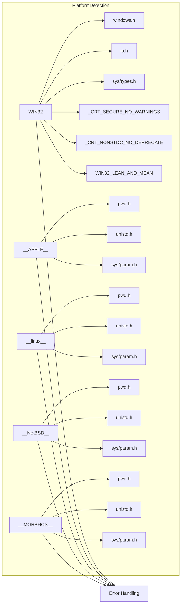
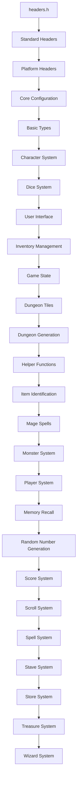
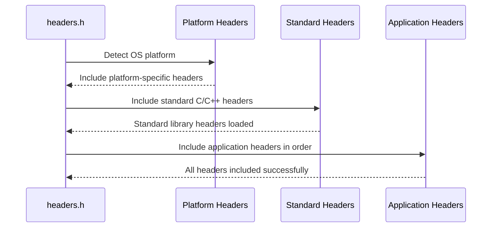

# headers_h Module Documentation

## Introduction

The `headers_h` module serves as the central header inclusion point for the Umoria game system. This module provides a unified interface for including all necessary system-specific and application-level headers required for building the game. It handles platform-specific compilation directives and ensures consistent header inclusion across different operating systems while maintaining proper dependency ordering.

## Architecture Overview

The `headers_h` module acts as a gateway for all other modules to access essential system and application headers. It manages cross-platform compatibility through conditional compilation directives and establishes the proper include order for dependent modules.

```mermaid
graph TD
    A[headers.h] --> B[System Specific Headers]
    A --> C[Standard C++ Headers]
    A --> D[Umoria Core Headers]
    B --> E[Windows Headers]
    B --> F[Unix-like Headers]
    D --> G[config.h]
    D --> H[types.h]
    D --> I[character.h]
    D --> J[dice.h]
    D --> K[ui.h]
    D --> L[inventory.h]
    D --> M[game.h]
    D --> N[dungeon_tile.h]
    D --> O[dungeon.h]
    D --> P[helpers.h]
    D --> Q[identification.h]
    D --> R[mage_spells.h]
    D --> S[monster.h]
    D --> T[player.h]
    D --> U[recall.h]
    D --> V[rng.h]
    D --> W[scores.h]
    D --> X[scrolls.h]
    D --> Y[spells.h]
    D --> Z[staves.h]
    D --> AA[store.h]
    D --> AB[treasure.h]
    D --> AC[wizard.h]
```

## Component Relationships

### Platform-Specific Header Management

The module implements conditional compilation to handle different operating systems:

### Dependency Ordering

The module enforces proper header dependency ordering to prevent compilation issues:

## Integration with Other Modules

The `headers_h` module provides foundational headers that are used throughout the Umoria system. It directly depends on several key modules:

- **[config.h](config.md)** - Configuration settings
- **[types.h](types.md)** - Basic type definitions
- **[character.h](character.md)** - Character management
- **[dice.h](dice.md)** - Dice rolling system
- **[ui.h](ui.md)** - User interface components
- **[inventory.h](inventory.md)** - Inventory management
- **[game.h](game.md)** - Game state management
- **[dungeon_tile.h](dungeon_tile.md)** - Dungeon tile definitions
- **[dungeon.h](dungeon.md)** - Dungeon generation and management
- **[helpers.h](helpers.md)** - Helper functions
- **[identification.h](identification.md)** - Item identification system
- **[mage_spells.h](mage_spells.md)** - Mage spell system
- **[monster.h](monster.md)** - Monster management
- **[player.h](player.md)** - Player character system
- **[recall.h](recall.md)** - Memory recall system
- **[rng.h](rng.md)** - Random number generation
- **[scores.h](scores.md)** - Score tracking
- **[scrolls.h](scrolls.md)** - Scroll system
- **[spells.h](spells.md)** - Spell system
- **[staves.h](staves.md)** - Stave system
- **[store.h](store.md)** - Store system
- **[treasure.h](treasure.md)** - Treasure generation
- **[wizard.h](wizard.md)** - Wizard mode functionality

## Data Flow

The header inclusion process follows a systematic approach:

1. **Platform Detection**: Determine target operating system
2. **System Headers**: Include platform-specific system headers
3. **Standard Headers**: Include standard C/C++ library headers
4. **Application Headers**: Include Umoria-specific headers in proper order

## Usage Patterns

The `headers.h` file should be included at the beginning of every source file that requires access to the Umoria system headers. This ensures consistent access to all necessary declarations and definitions across the entire codebase.

## Compilation Considerations

The module uses conditional compilation to ensure compatibility across multiple platforms:
- Windows: Uses Windows API headers and defines Windows-specific macros
- Unix-like systems: Includes POSIX-compliant headers for system operations
- Error handling: Provides clear error messages for unsupported platforms

This design allows the Umoria codebase to maintain cross-platform compatibility while providing access to platform-specific functionality when needed.
