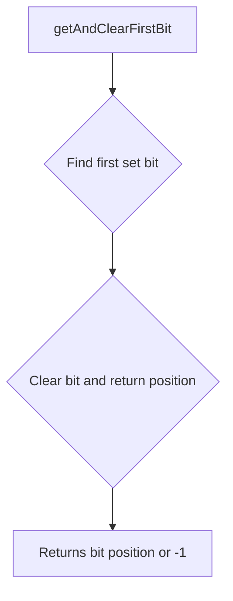
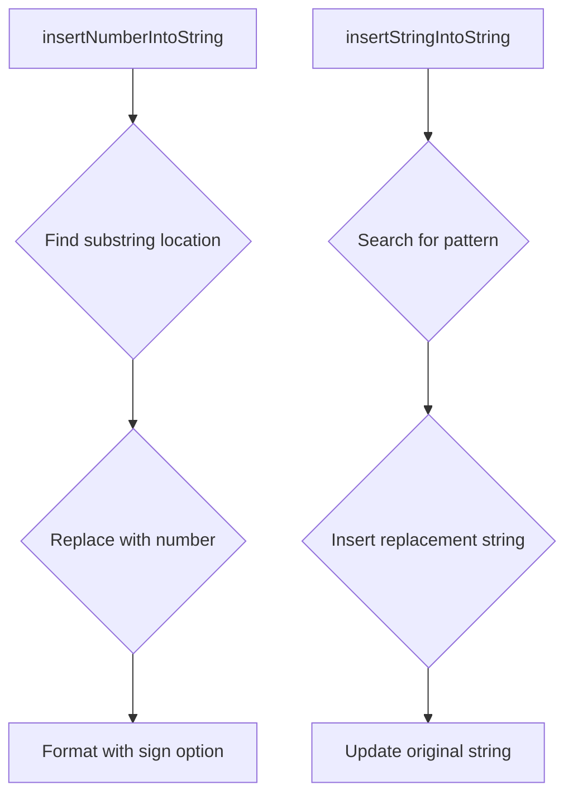
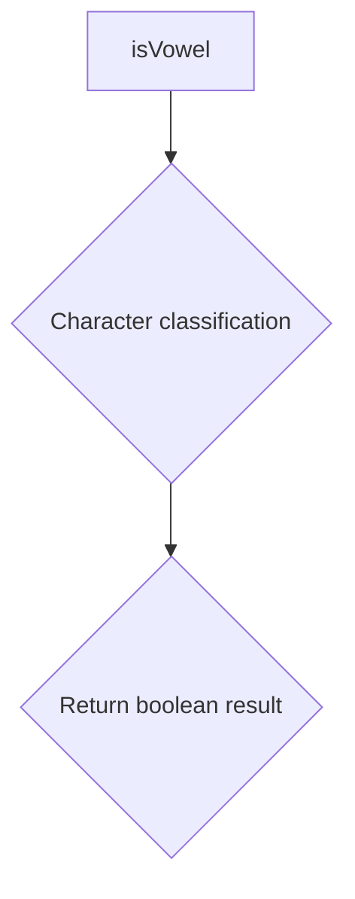
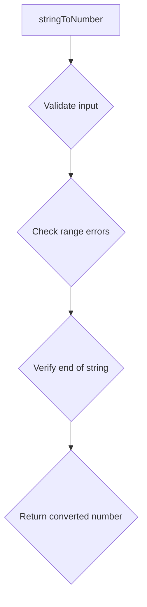
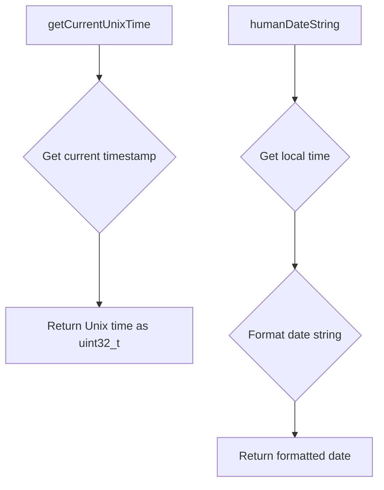
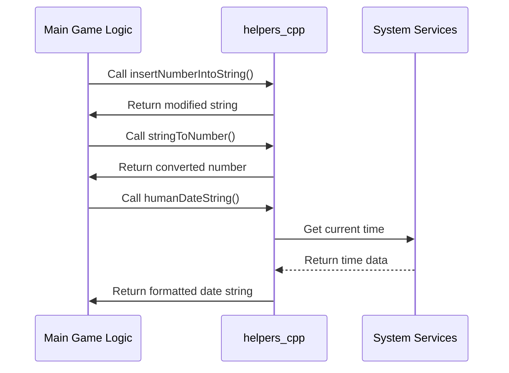
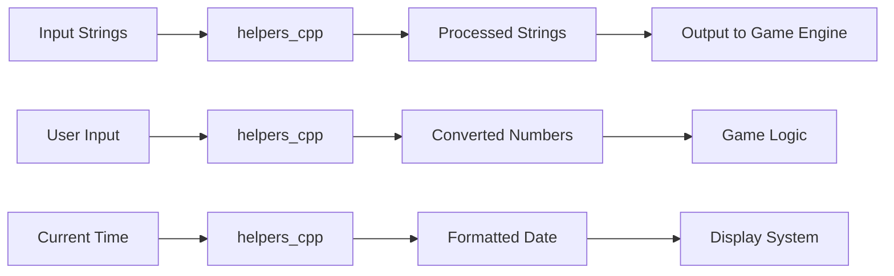

# helpers_cpp Module Documentation

## Brief Introduction

The `helpers_cpp` module provides essential utility functions for string manipulation, number conversion, and time handling within the Moria game system. This module contains helper functions that support various core functionalities including message formatting, string insertion operations, and date/time utilities.

## Comprehensive Documentation

### Module Overview

The `helpers_cpp` module serves as a collection of utility functions that provide common operations needed throughout the Moria game engine. These functions handle tasks such as bit manipulation, string processing, number conversion, and time formatting.

### Key Components

#### Bit Manipulation Functions



The `getAndClearFirstBit` function efficiently identifies and clears the first set bit in a 32-bit unsigned integer, returning its position or -1 if no bits are set.

#### String Manipulation Functions



Two primary string manipulation functions exist:
- `insertNumberIntoString`: Inserts a numeric value into a string at a specified location
- `insertStringIntoString`: Inserts one string into another at a specific pattern match

#### Character Utilities



The `isVowel` function determines whether a character is a vowel (case-insensitive).

#### Number Conversion



The `stringToNumber` function safely converts strings to integers with comprehensive error checking.

#### Time Utilities



Time-related utilities include:
- `getCurrentUnixTime`: Retrieves current Unix timestamp
- `humanDateString`: Formats current date in human-readable format

### Component Interactions



### Data Flow



### Dependencies

This module depends on:
- Standard C++ libraries (`<cassert>`, `<cstdlib>`, `<cstring>`, `<ctime>`)
- [headers.h](headers.h.md) - Provides common type definitions and constants
- [moria_constants.h](moria_constants.h.md) - Contains game-specific constants

### Integration Points

The `helpers_cpp` module integrates with several other modules:

1. **Message System**: Uses `insertNumberIntoString` for formatting game messages
2. **Save/Load System**: Utilizes `stringToNumber` for parsing save files
3. **UI System**: Employs `humanDateString` for displaying game dates
4. **Game Logic**: Leverages `getAndClearFirstBit` for state management

### Error Handling

All functions implement proper error handling:
- `stringToNumber` performs comprehensive validation with errno checking
- Boundary checks prevent buffer overflows in string operations
- Safe bit manipulation prevents undefined behavior

### Performance Considerations

- Bit manipulation uses efficient bitwise operations
- String operations use optimized standard library functions
- Memory usage is minimal with stack-based allocations
- Time functions avoid unnecessary system calls

### Usage Examples

```cpp
// Example usage of string insertion
char message[MORIA_MESSAGE_SIZE];
strcpy(message, "Damage: {damage}");
insertNumberIntoString(message, "{damage}", 25, true);

// Example usage of number conversion
int damage_value;
if (stringToNumber("42", damage_value)) {
    // Use damage_value
}

// Example usage of time functions
char date_str[11];
humanDateString(date_str);
```

### Related Modules

For complete system understanding, see:
- [headers.h](headers.h.md) - Core type definitions
- [moria_constants.h](moria_constants.h.md) - Game constants
- [game_logic.md](game_logic.md) - Main game logic implementation
- [ui_system.md](ui_system.md) - User interface components
