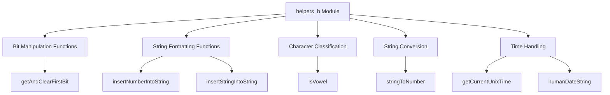
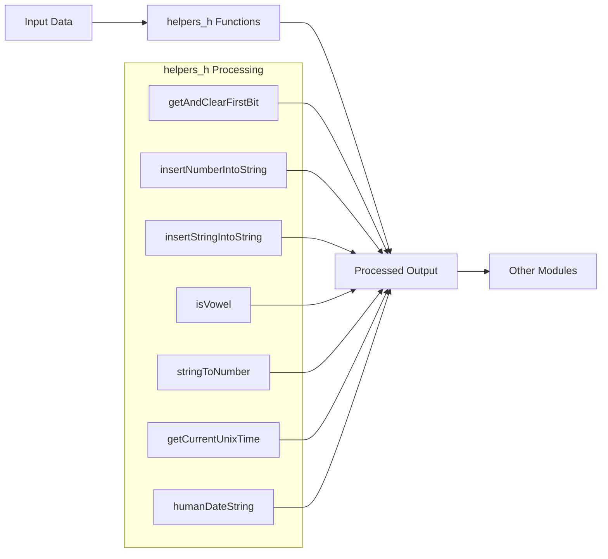

# helpers_h Module Documentation

## Brief Introduction

The `helpers_h` module provides a collection of generic helper functions that serve as utility tools throughout the codebase. These functions are designed to be lightweight, self-contained, and have minimal dependencies beyond standard library functions. The module acts as a foundational layer that supports various other components by providing common operations such as bit manipulation, string formatting, character classification, and time handling.

## Comprehensive Documentation

### Module Purpose and Scope

The `helpers_h` module serves as a centralized repository for essential utility functions that are frequently needed across different parts of the system. All functions in this module are carefully designed to have no external dependencies beyond standard library functions, ensuring portability and ease of integration.

### Core Functionality Overview

The module exposes several categories of helper functions:

1. **Bit Manipulation**: Functions for working with bit flags and binary operations
2. **String Operations**: Utilities for inserting numbers and strings into existing strings
3. **Character Classification**: Functions to identify vowels and classify characters
4. **String Conversion**: Tools for converting strings to numeric values
5. **Time Handling**: Functions for retrieving current Unix timestamps and formatted date strings

### Component Relationships

### Detailed Function Descriptions

#### Bit Manipulation Functions

**`int getAndClearFirstBit(uint32_t &flag)`**
- **Purpose**: Extracts and clears the first set bit from a 32-bit flag variable
- **Parameters**: 
  - `flag`: Reference to a uint32_t variable containing the bit flag
- **Returns**: The value of the extracted bit (0 or 1)
- **Usage**: Commonly used in state management and event processing systems

#### String Formatting Functions

**`void insertNumberIntoString(char *to_string, const char *from_string, int32_t number, bool show_sign)`**
- **Purpose**: Inserts a numeric value into a string at a specific position
- **Parameters**:
  - `to_string`: Destination buffer for the result
  - `from_string`: Source string to copy from
  - `number`: Number to insert
  - `show_sign`: Flag to determine if sign should be displayed
- **Usage**: Used for creating formatted output strings with embedded numbers

**`void insertStringIntoString(char *to_string, const char *from_string, const char *str_to_insert)`**
- **Purpose**: Inserts one string into another at a specified location
- **Parameters**:
  - `to_string`: Destination buffer for the result
  - `from_string`: Source string to copy from
  - `str_to_insert`: String to insert into the destination
- **Usage**: Enables dynamic string construction and modification

#### Character Classification

**`bool isVowel(char ch)`**
- **Purpose**: Determines if a character is a vowel (a, e, i, o, u)
- **Parameters**: 
  - `ch`: Character to test
- **Returns**: True if character is a vowel, false otherwise
- **Usage**: Text processing and linguistic analysis utilities

#### String Conversion

**`bool stringToNumber(const char *str, int &number)`**
- **Purpose**: Converts a string representation to an integer
- **Parameters**:
  - `str`: Input string to convert
  - `number`: Reference to store the converted integer
- **Returns**: True if conversion was successful, false otherwise
- **Usage**: Input validation and parsing of user-entered numeric data

#### Time Handling

**`uint32_t getCurrentUnixTime()`**
- **Purpose**: Retrieves the current Unix timestamp
- **Returns**: Current time as a 32-bit unsigned integer
- **Usage**: Timestamp generation for logging, events, and time-based operations

**`void humanDateString(char *day)`**
- **Purpose**: Formats the current day into a human-readable string format
- **Parameters**:
  - `day`: Buffer to store the formatted date string
- **Usage**: Creating readable date representations for display purposes

### Data Flow and Usage Patterns

### Integration Points

The `helpers_h` module integrates with various other modules in the system through its utility functions:

- **Configuration Management**: Uses `stringToNumber` for parsing configuration values
- **Logging Systems**: Leverages `getCurrentUnixTime` and `humanDateString` for timestamp generation
- **Event Processing**: Utilizes `getAndClearFirstBit` for managing event flags
- **User Interface**: Employs string insertion functions for dynamic content generation
- **Text Processing**: Depends on `isVowel` for linguistic operations

### Dependencies and External Requirements

The `helpers_h` module maintains strict dependency isolation by only using standard library functions. This design choice ensures:

1. **Portability**: Functions work across different platforms without additional libraries
2. **Maintainability**: Minimal risk of dependency conflicts
3. **Performance**: No overhead from external library loading
4. **Simplicity**: Easy to understand and debug

### Best Practices for Usage

1. **Memory Management**: Ensure proper buffer sizing when using string manipulation functions
2. **Error Handling**: Check return values of `stringToNumber` for conversion success
3. **Thread Safety**: Most functions are stateless and thread-safe
4. **Performance Considerations**: Avoid repeated calls to time functions when possible

### Related Modules

For complete system understanding, see:
- [main application logic](main.md) which utilizes these helpers extensively
- [data processing components](data_processing.md) that depend on string manipulation functions
- [configuration management](config.md) which uses string-to-number conversion

This module forms a critical foundation for the entire system's utility functions and should be considered a core component in any architectural analysis.
