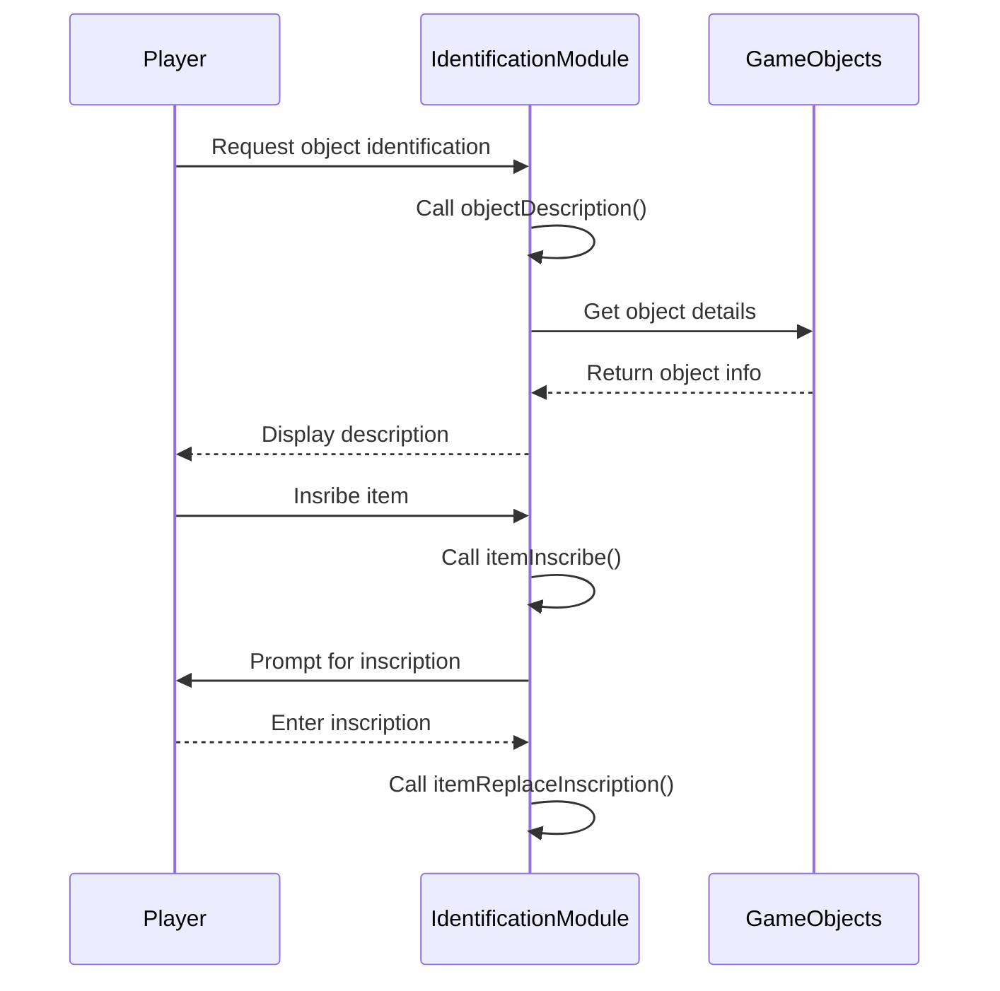
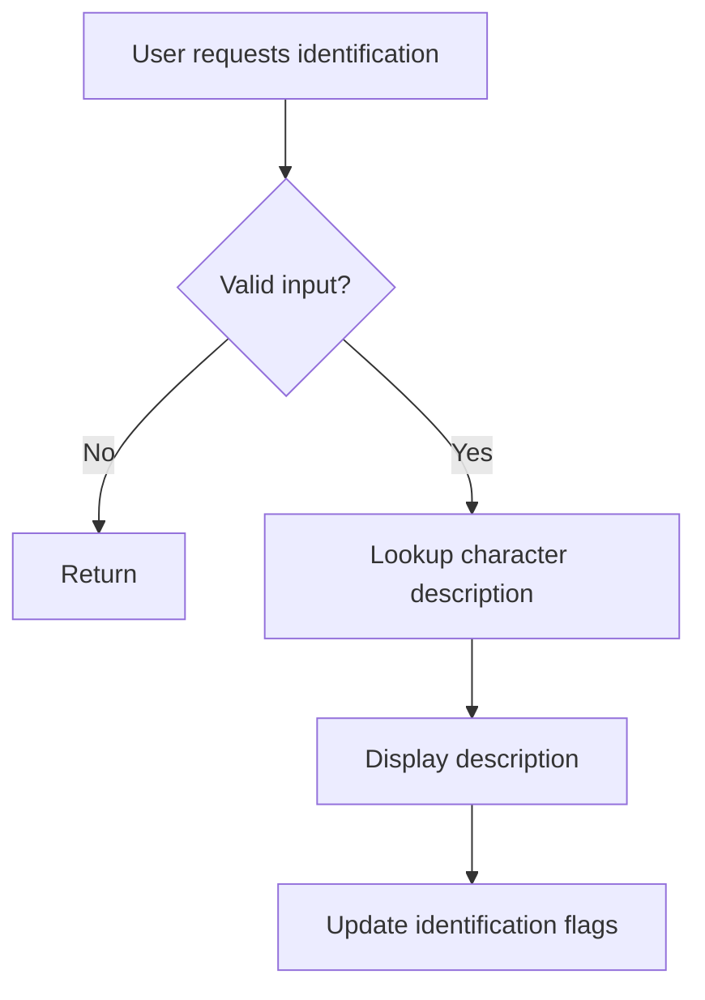
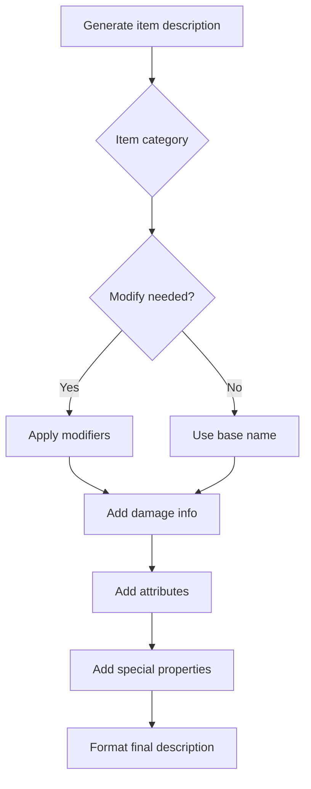

# identification_cpp Module Documentation

## Overview

The `identification_cpp` module handles object identification and descriptions within the Moria game system. It provides functionality for identifying game objects, managing object identification flags, generating item descriptions, and handling various identification-related operations such as inscriptions and magical properties.

This module works closely with the inventory management system and game object definitions to provide detailed descriptions of items and monsters encountered during gameplay.

## Architecture

```mermaid
graph TD
    A[identification.cpp] --> B[Object Identification]
    A --> C[Item Description Generation]
    A --> D[Identification Flags Management]
    A --> E[Inscription Handling]
    
    B --> F[objectDescription()]
    B --> G[identifyGameObject()]
    B --> H[magicInitializeItemNames()]
    
    C --> I[itemDescription()]
    C --> J[itemChargesRemainingDescription()]
    C --> K[itemTypeRemainingCountDescription()]
    
    D --> L[objects_identified array]
    D --> M[itemSetAsIdentified()]
    D --> N[itemSetColorlessAsIdentified()]
    D --> O[itemSetAsTried()]
    
    E --> P[itemInscribe()]
    E --> Q[itemAppendToInscription()]
    E --> R[itemReplaceInscription()]
```

## Component Relationships

### Core Data Structures

The module uses several key data structures:

1. **objects_identified**: A global array tracking identification status of objects
2. **magic_item_titles**: Array of generated item titles for magic items
3. **objectDescription()**: Function mapping ASCII characters to descriptive strings

### Key Functions

#### Object Identification Functions
- `objectDescription()`: Maps ASCII character representations to descriptive text
- `identifyGameObject()`: Handles user input for object identification
- `magicInitializeItemNames()`: Initializes randomized names for magic items

#### Identification Flag Management
- `itemSetAsIdentified()`: Marks an item as identified
- `itemSetColorlessAsIdentified()`: Checks if an item is already identified
- `itemSetAsTried()`: Marks an item as tried
- `isObjectKnown()`, `setObjectTriedFlag()`, `clearObjectTriedFlag()`: Helper functions for flag management

#### Item Description Generation
- `itemDescription()`: Main function for generating detailed item descriptions
- `itemChargesRemainingDescription()`: Shows remaining charges for items
- `itemTypeRemainingCountDescription()`: Shows remaining item count

#### Inscription Handling
- `itemInscribe()`: Allows players to inscribe items
- `itemAppendToInscription()`: Appends comments to item inscriptions
- `itemReplaceInscription()`: Replaces existing item inscriptions

## Data Flow



## Integration Points

This module integrates with several other core systems:

- **[inventory](inventory.md)**: Uses inventory data structures for item manipulation
- **[creature](creature.md)**: References creature information for monster descriptions
- **[game_objects](game_objects.md)**: Accesses object definitions for naming and properties
- **[config](config.md)**: Uses configuration constants for identification behavior
- **[messages](messages.md)**: Displays messages to the player through message system

## Process Flows

### Object Identification Process



### Item Description Generation



## Dependencies

This module depends on:
- `headers.h`: Standard headers and definitions
- [inventory](inventory.md): For inventory item structures
- [game_objects](game_objects.md): For object definitions
- [config](config.md): For configuration constants
- [messages](messages.md): For displaying messages to player

## Configuration Constants

The module references several configuration constants from the `config::identification` namespace:
- `OD_KNOWN1`: Object known flag
- `OD_TRIED`: Object tried flag
- `ID_MAGIK`: Magical item flag
- `ID_EMPTY`: Empty item flag
- `ID_DAMD`: Damned item flag
- `ID_KNOWN2`: Secondary identification flag
- `ID_STORE_BOUGHT`: Store-bought item flag
- `ID_SHOW_HIT_DAM`: Show hit/damage flag
- `ID_NO_SHOW_P1`: Don't show property 1 flag
- `ID_SHOW_P1`: Show property 1 flag

## Usage Examples

### Identifying Objects
When a player enters a character to identify, the `identifyGameObject()` function:
1. Gets user input for the character
2. Calls `objectDescription()` to get the description
3. Displays the result to the player

### Generating Item Descriptions
The `itemDescription()` function:
1. Determines the appropriate base name and modifiers
2. Applies damage calculations where applicable
3. Adds magical properties and attributes
4. Formats the final description with proper grammar

### Managing Identification Flags
Functions like `itemSetAsIdentified()` and `itemSetColorlessAsIdentified()`:
1. Check current identification status
2. Update flags appropriately
3. Handle merging of similar items from different sources

## Notes

This module contains extensive string manipulation and formatting logic for creating human-readable descriptions of game objects. The design allows for both simple and complex item descriptions depending on the item type and identification status.
