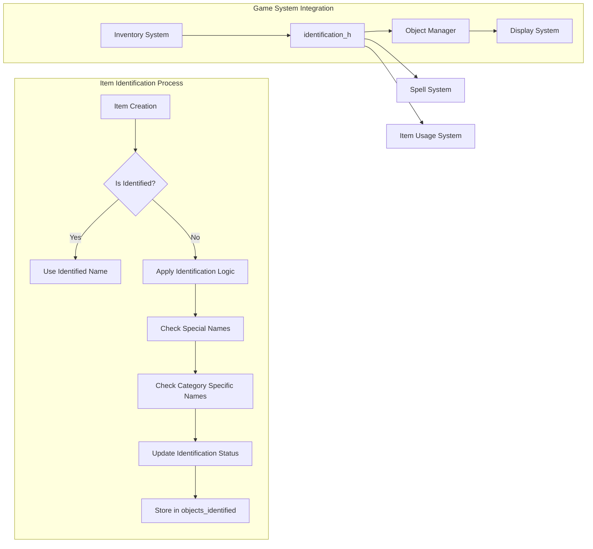
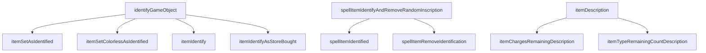
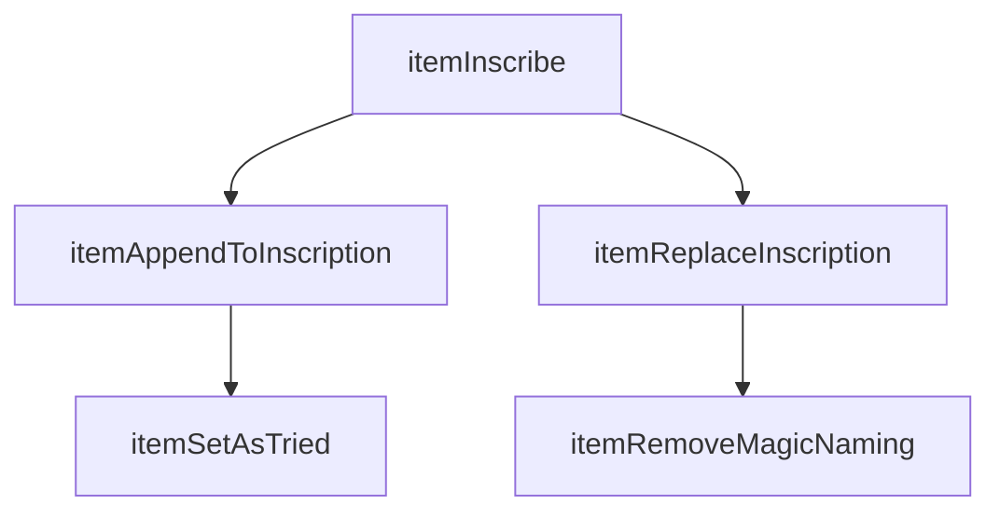

# Identification Module Documentation

## Brief Introduction

The `identification_h` module provides core functionality for item identification, naming, and description within the game system. It manages the identification state of game objects, handles special item naming conventions, and provides mechanisms for identifying items through various game actions. This module interfaces with inventory management systems and contributes to the overall item recognition and naming experience in the game.

## Module Overview

This module defines constants and interfaces for managing item identification across different categories of game objects. It includes:

- Special name identifiers for unique items
- Constants defining maximum values for different item types
- Function declarations for item identification operations
- Data structures for storing identification status and item names

## Architecture and Component Relationships

### Core Components

```mermaid
graph TD
    A[identification.h] --> B[SpecialNameIds Enum]
    A --> C[Constant Definitions]
    A --> D[External Data Arrays]
    A --> E[Identification Functions]
    
    B --> F[Item Name Constants]
    C --> G[Max Item Type Counts]
    D --> H[Item Name Arrays]
    E --> I[Identification Operations]
    
    I --> J[itemSetAsIdentified]
    I --> K[itemSetColorlessAsIdentified]
    I --> L[spellItemIdentifyAndRemoveRandomInscription]
    I --> M[spellItemIdentified]
    I --> N[spellItemRemoveIdentification]
    I --> O[itemIdentificationClearEmpty]
    I --> P[itemIdentifyAsStoreBought]
    I --> Q[itemSetAsTried]
    I --> R[itemIdentify]
    I --> S[itemRemoveMagicNaming]
    I --> T[itemDescription]
    I --> U[itemChargesRemainingDescription]
    I --> V[itemTypeRemainingCountDescription]
    I --> W[itemInscribe]
    I --> X[itemAppendToInscription]
    I --> Y[itemReplaceInscription]
```



### Data Flow Architecture



## Detailed Component Analysis

### Special Name Identifiers

The `SpecialNameIds` enum defines constants for special item names used throughout the game system. These identifiers are used to index into the `special_item_names` array and provide consistent naming for unique items.

### Constant Definitions

The module defines several maximum counts for different item categories:
- **MAX_COLORS**: 49 - Used with potions
- **MAX_MUSHROOMS**: 22 - Used with mushrooms  
- **MAX_WOODS**: 25 - Used with staffs
- **MAX_METALS**: 25 - Used with wands
- **MAX_ROCKS**: 32 - Used with rings
- **MAX_AMULETS**: 11 - Used with amulets
- **MAX_TITLES**: 45 - Used with scrolls
- **MAX_SYLLABLES**: 153 - Used with scrolls

These constants help manage memory allocation and validation for item naming systems.

### External Data Arrays

The module declares external arrays for storing item names:
- `special_item_names`: Array of special item names indexed by `SpecialNameIds`
- `colors`, `mushrooms`, `woods`, `metals`, `rocks`, `amulets`, `syllables`: Category-specific name arrays

### Identification Functions

#### Core Identification Operations



#### Inscription Management



## Integration Points

### Inventory System Integration

The `identification_h` module works closely with the inventory management system through functions like:
- `itemSetAsIdentified()` - Marks items as identified in inventory
- `itemIdentify()` - Processes full item identification
- `spellItemIdentified()` - Checks if items have been identified through spells

### Game State Management

The module maintains identification state through:
- `objects_identified[OBJECT_IDENT_SIZE]` - Global tracking array for item identification status
- `itemSetAsTried()` - Records when items have been attempted to be identified

### Display System Integration

Functions like `itemDescription()` and `itemChargesRemainingDescription()` provide formatted descriptions for display purposes, integrating with the game's UI rendering system.

## Dependencies

This module depends on:
- [inventory_h](inventory_h.md) - For inventory item handling and `Inventory_t` type
- [object_manager_h](object_manager_h.md) - For object identification and management
- [spell_h](spell_h.md) - For spell-based identification operations

## Usage Patterns

### Basic Item Identification

```c
// Mark an item as identified
itemSetAsIdentified(category_id, sub_category_id);

// Identify an item completely
itemIdentify(item, item_id);
```

### Spell-Based Identification

```c
// Identify item through spell and remove random inscription
spellItemIdentifyAndRemoveRandomInscription(item);

// Check if item is identified
if (spellItemIdentified(item)) {
    // Handle identified item
}
```

### Inscription Management

```c
// Add inscription to item
itemInscribe();
itemAppendToInscription(item, item_ident_type);

// Replace existing inscription
itemReplaceInscription(item, "New Inscription");
```

## Implementation Notes

1. The `objects_identified` array uses `OBJECT_IDENT_SIZE` which should be defined elsewhere in the system
2. All item name arrays are declared as `const char *` to prevent modification
3. The `SpecialNameIds::SN_ARRAY_SIZE` constant provides the size for arrays indexing into special item names
4. Functions like `itemSetColorlessAsIdentified()` handle special cases for colorless items
5. The module supports both automatic and manual identification processes

## Related Modules

- [inventory_h](inventory_h.md) - Core inventory management
- [object_manager_h](object_manager_h.md) - Object creation and management
- [spell_h](spell_h.md) - Spell system integration
- [display_h](display_h.md) - UI and display formatting

## Future Considerations

1. Consider expanding the identification system to support partial identification states
2. Evaluate adding localization support for item names
3. Review performance implications of the large arrays used for item names
4. Consider implementing more sophisticated identification algorithms for complex items
