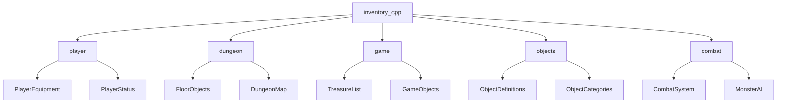
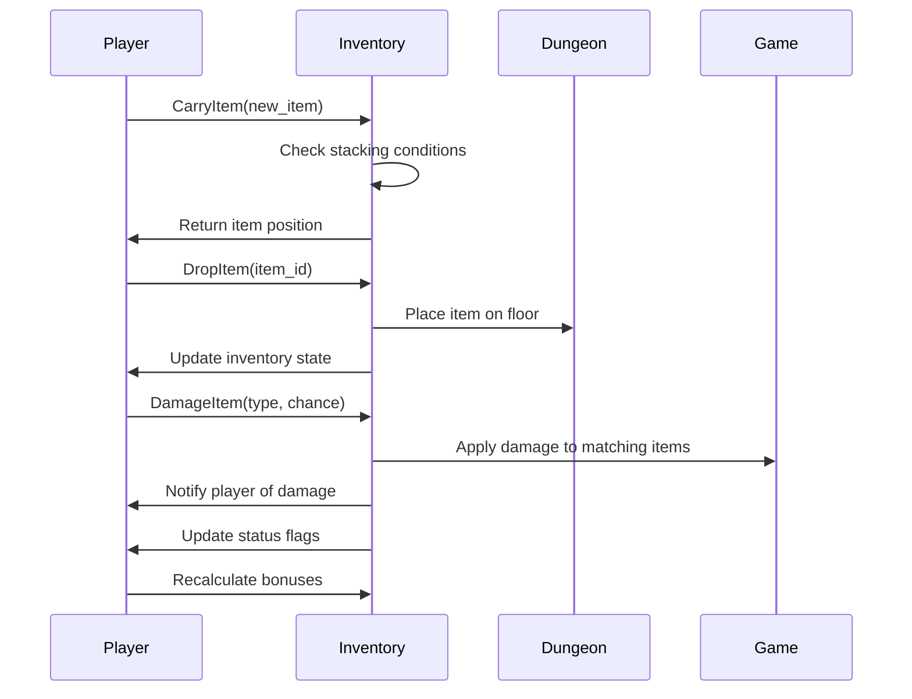
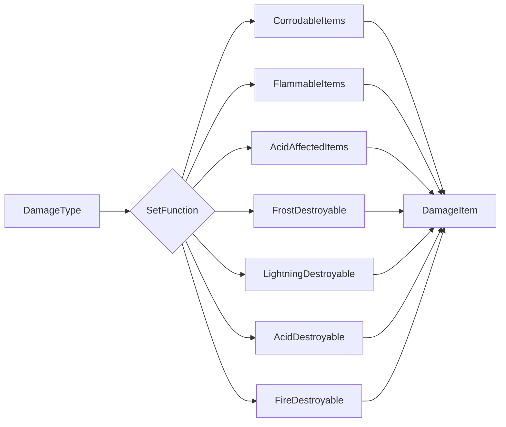
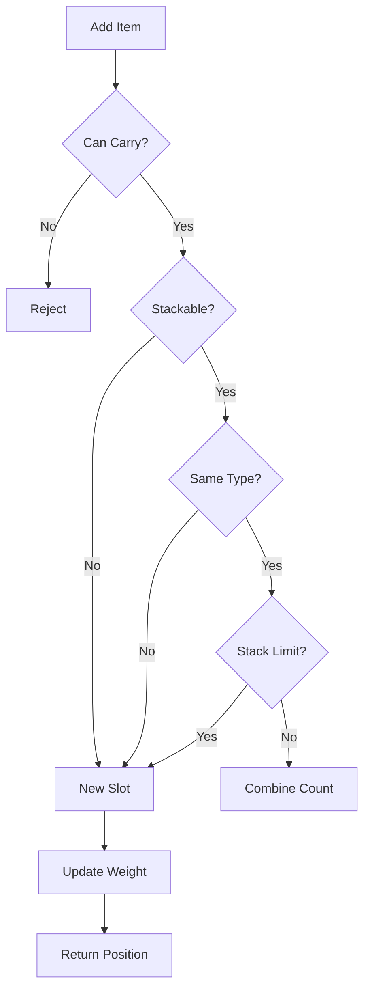
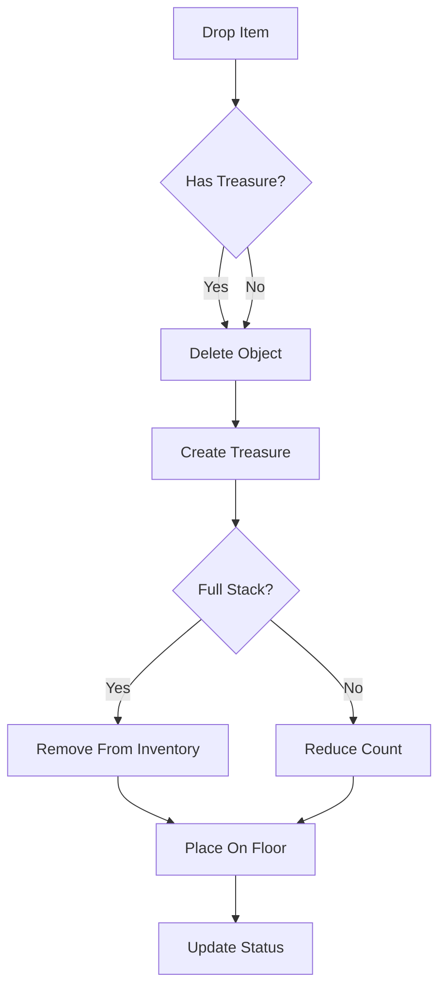

# inventory_cpp Module Documentation

## Brief Introduction

The `inventory_cpp` module handles all inventory management operations for the player character in the game. It provides functions for adding, removing, and manipulating items in the player's inventory, including item stacking, weight calculations, equipment management, and damage effects on inventory items. This module works closely with the player and dungeon modules to manage the player's carried items and their properties.

## Module Architecture

## Core Components and Functionality

### Inventory Management Operations

The module provides several key functions for managing inventory items:

1. **Item Addition and Removal**
   - `inventoryCarryItem()` - Adds items to inventory with proper stacking logic
   - `inventoryDestroyItem()` - Removes items from inventory
   - `inventoryDropItem()` - Drops items from inventory to dungeon floor

2. **Item Stackability Logic**
   - `inventoryItemStackable()` - Determines if items can be stacked
   - `inventoryItemSingleStackable()` - Checks for single-stackable items
   - `inventoryCanCarryItemCount()` - Validates stacking capacity
   - `inventoryCanCarryItem()` - Checks if player can carry additional items

3. **Equipment Handling**
   - `inventoryTakeOneItem()` - Copies items while handling single-item counts
   - `inventoryFindRange()` - Finds item ranges in inventory lists
   - `inventoryItemCopyTo()` - Copies object definitions to inventory items

4. **Damage and Effects**
   - `inventoryDamageItem()` - Applies damage to items based on type and chance
   - Various damage functions that affect inventory items:
     - `damageCorrodingGas()`
     - `damagePoisonedGas()`
     - `damageFire()`
     - `damageCold()`
     - `damageLightningBolt()`
     - `damageAcid()`

### Data Structures and Constants

The module interacts with several key data structures:

- `Inventory_t` - Represents individual inventory items
- `PlayerEquipment` - Enum defining equipment slots
- `PlayerPack` - Player's carrying capacity information
- `DungeonObject_t` - Base object definitions from game_objects

### Component Interactions

## Key Algorithms

### Item Stacking Algorithm

The inventory implements sophisticated item stacking logic that considers multiple factors:

1. **Category Matching** - Items must match category and sub-category
2. **Stacking Limits** - Maximum count of 255 per stack
3. **Grouping Rules** - Items with same `misc_use` values stack together
4. **Identification Status** - Only items with same identification status stack
5. **Special Cases** - Single-stackable items have special handling

### Damage Application Logic

The damage system uses function pointers to determine which item types are affected by different damage types:

## Integration Points

This module integrates with several other system components:

- **[player.md](player.md)** - Uses player equipment and status information
- **[dungeon.md](dungeon.md)** - Interacts with dungeon floor objects and placement
- **[objects.md](objects.md)** - References object definitions and categories
- **[combat.md](combat.md)** - Handles damage effects on inventory items during combat

## Process Flows

### Adding Items to Inventory

### Dropping Items

## Dependencies

This module depends on:
- [headers.h](headers.h) - Common header definitions
- [player.md](player.md) - Player equipment and status management
- [dungeon.md](dungeon.md) - Dungeon floor operations
- [objects.md](objects.md) - Object definitions and categories
- [combat.md](combat.md) - Combat-related damage systems

The module is designed to work seamlessly with these components to provide a complete inventory management system within the game's framework.
