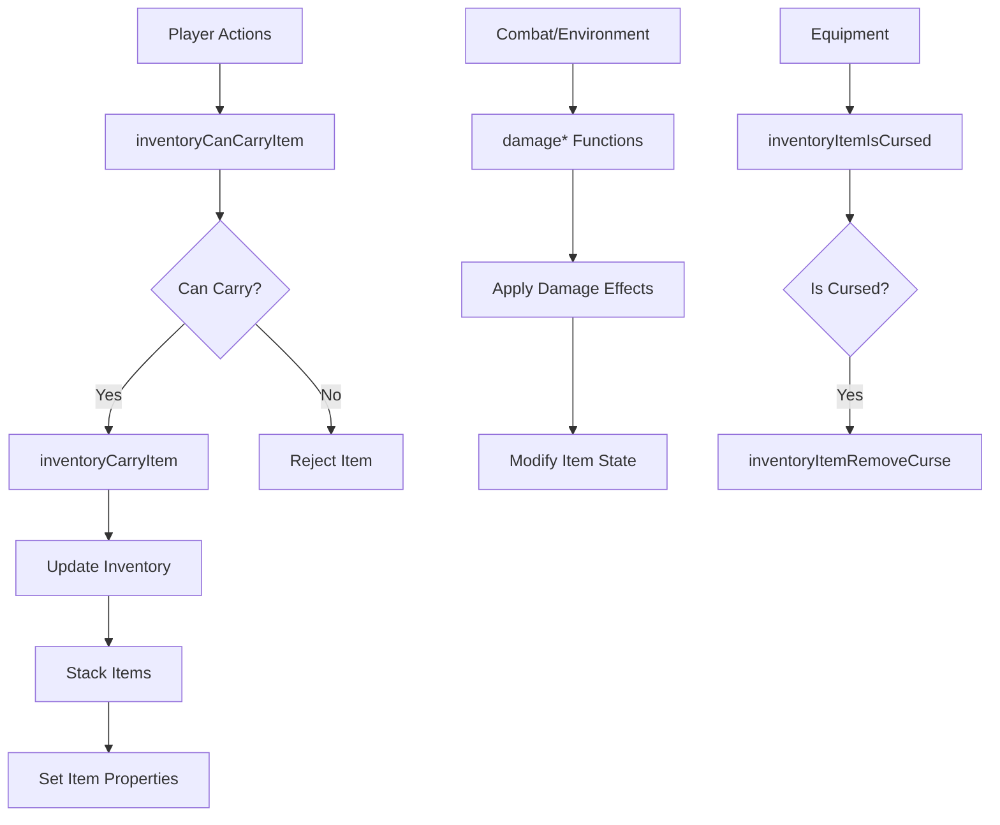
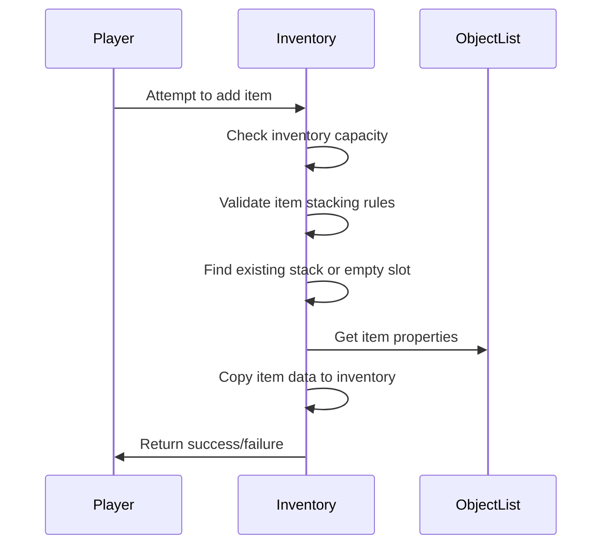
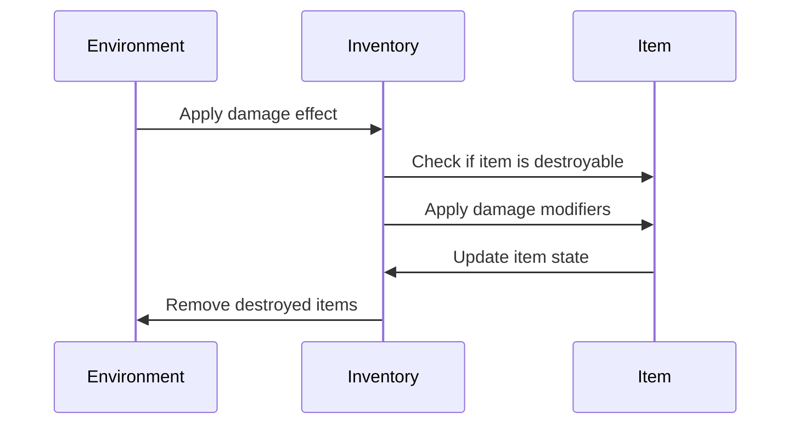

# inventory_h Module Documentation

## Introduction

The `inventory_h` module defines the core data structures and function prototypes for managing player inventory and equipment in the game. This module provides the foundation for handling item storage, stacking rules, equipment placement, and item destruction mechanics. It interfaces with the broader game system through the object list and dungeon management components.

## Core Data Structures

### Inventory_t Structure

The `Inventory_t` structure represents a single item in the player's inventory or equipment. It contains all necessary metadata for game items including:

- **Identification Fields**: Item ID, special names, inscriptions, and flags
- **Display Information**: Category, sprite character, and miscellaneous use values
- **Statistical Properties**: Cost, weight, damage, armor class, and hit bonuses
- **Gameplay Attributes**: Stacking behavior, depth found, and identification status

The structure uses fixed-size arrays and specific integer types to ensure consistent memory layout across different platforms and optimize performance.

### Equipment Enumerations

The `PlayerEquipment` enum defines the specific slots for player equipment, with `Wield` as the first slot (index 22) representing the primary weapon slot. This ordering is critical for maintaining consistent equipment handling throughout the game.

## Stack Behavior Rules

The inventory system implements three distinct stacking categories based on `sub_category_id` ranges:

1. **Never Stack Items** (0-63): These items cannot stack with others regardless of properties
2. **Single Stack Items** (64-191): These items always stack with others of the same type, requiring power-of-2 sizing
3. **Group Stack Items** (192-255): These items stack only when both `sub_category_id` and `misc_use` match

The special case at sub-category 192 treats torches as single objects but allows stacking only with matching `misc_use` values.

## Function Overview

### Item Management Functions

- `inventoryDestroyItem()`: Removes an item from inventory completely
- `inventoryTakeOneItem()`: Transfers one item from a stack to another item
- `inventoryDropItem()`: Handles item dropping logic with optional full-stack dropping
- `inventoryCarryItem()`: Adds new items to inventory with proper stacking

### Stack and Capacity Functions

- `inventoryCanCarryItemCount()`: Checks if an item count can be carried
- `inventoryCanCarryItem()`: Validates if an item can be added to inventory
- `inventoryItemSingleStackable()`: Determines if an item follows single-stack rules
- `inventoryItemStackable()`: Checks if an item can stack with existing items

### Equipment and Status Functions

- `inventoryItemIsCursed()`: Tests if an item has curse properties
- `inventoryItemRemoveCurse()`: Removes curse effects from items
- `setNull()`: Initializes an inventory item to null state
- `inventoryDiminishLightAttack()`: Handles light-based attack diminishing
- `inventoryDiminishChargesAttack()`: Manages charge-based attack reduction

### Destruction and Damage Functions

- `damageCorrodingGas()`, `damagePoisonedGas()`, `damageFire()`, etc.: Handle various environmental and combat damage types
- `setFrostDestroyableItems()`, `setLightningDestroyableItems()`, etc.: Mark items as destroyable by elemental effects

## Component Relationships

This module works closely with:
- [object_list](object_list.md): Provides item definitions and properties
- [dungeon](dungeon.md): Manages item placement and discovery
- [player](player.md): Handles player-specific inventory operations
- [combat](combat.md): Processes item-based combat interactions

## Memory Layout Considerations

The module carefully manages memory usage through:
- Fixed-size arrays for inscriptions (13 characters + null terminator)
- Consistent integer sizes for cross-platform compatibility
- Direct field access rather than pointers to prevent dangling references
- Alignment considerations for efficient memory access

## Data Flow

## Process Flows

### Item Addition Process

### Item Destruction Process

## Implementation Notes

1. **Stacking Logic**: The three-tier stacking system requires careful implementation to maintain consistency with item categorization
2. **Memory Management**: The fixed-size inscription array prevents pointer-related issues while maintaining flexibility
3. **Performance**: Direct field access and pre-calculated constants minimize runtime overhead
4. **Extensibility**: The modular design allows easy addition of new item types and stacking behaviors

This module forms a critical part of the game's resource management system, ensuring proper item handling during gameplay while maintaining performance and data integrity.
