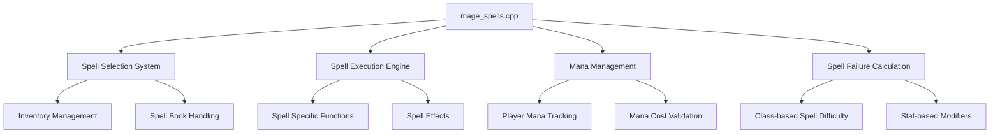
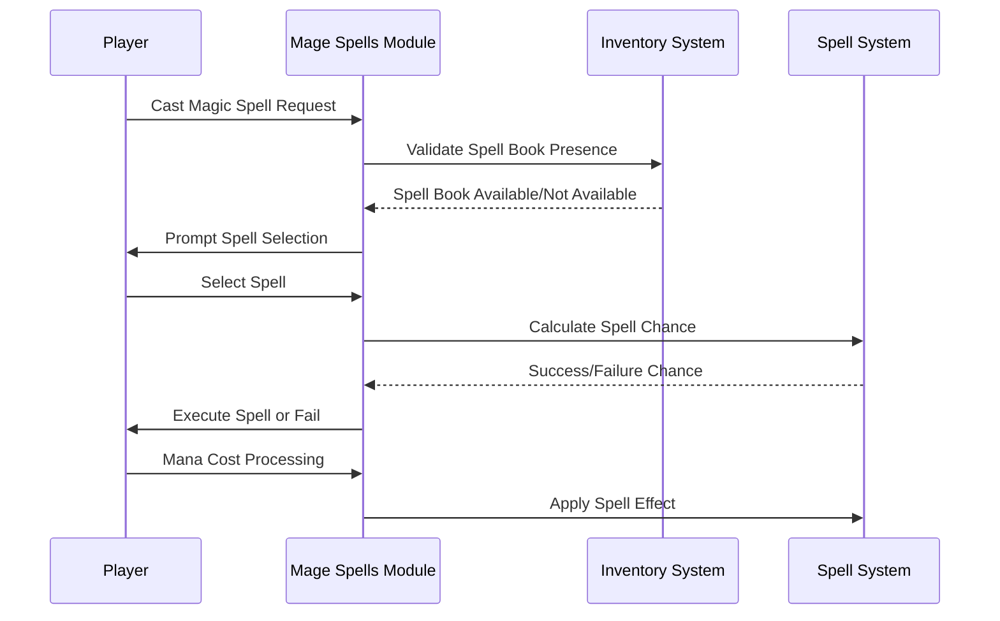
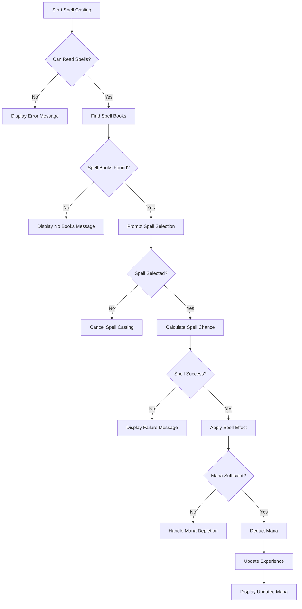
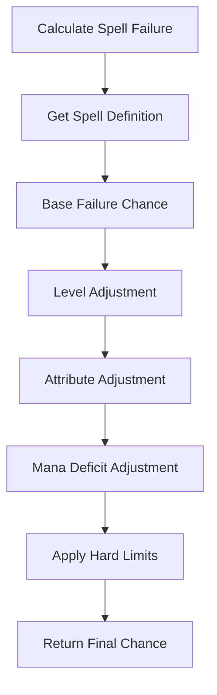

# Mage Spells C++ Module Documentation

## Brief Introduction

The `mage_spells_cpp` module implements the core functionality for mage spell casting in the game. This module handles spell selection, validation, casting mechanics, and mana management for magical abilities. It provides the interface between player actions and spell execution, ensuring proper spell usage conditions and maintaining spell progression through experience gain.

## Module Overview

This module contains the primary implementation for mage spell casting functionality, including:

- Spell selection and validation
- Spell execution logic
- Mana cost management
- Spell failure calculations
- Integration with player character systems

## Architecture and Component Relationships

### Core Components

### Data Flow

## Detailed Component Analysis

### Spell Selection and Validation

The module begins with `canReadSpells()` function which validates whether the player can cast spells based on several conditions:

- **Visibility**: Player must not be blind
- **Light**: Player must have light source
- **Confusion**: Player must not be confused
- **Class Compatibility**: Player must be a mage class

This validation ensures that spell casting only occurs under appropriate circumstances, preventing gameplay exploits.

### Spell Casting Logic

The `castSpell()` function serves as the central dispatcher for all mage spell execution. It uses a switch statement to route spell casting to specific spell functions based on the spell ID enum values. Each spell type has its own specialized handling:

- **Projectile Spells**: Magic Missile, Lightning Bolt, Frost Bolt, Fire Bolt
- **Area Effects**: Stinking Cloud, Fire Ball, Frost Ball
- **Status Effects**: Confusion, Sleep, Polymorph
- **Utility Spells**: Teleportation, Identification, Healing
- **Combat Spells**: Wall to Mud, Destruction spells

### Mana Management System

The module integrates with the broader player mana system through several key interactions:

1. **Mana Cost Validation**: Checks if player has sufficient mana before spell casting
2. **Mana Deduction**: Reduces player mana after successful spell casting
3. **Mana Depletion Consequences**: Handles player fainting when mana is insufficient
4. **Experience Gain**: Awards experience points for successfully casting new spells

### Spell Failure Calculations

The `spellChanceOfSuccess()` function calculates the probability of spell failure based on multiple factors:

- **Spell Level Requirements**: Higher level spells are harder to cast
- **Player Level**: Higher level players have better success rates
- **Class Attributes**: Intelligence for mages, Wisdom for other classes
- **Mana Deficit**: Insufficient mana increases failure chance
- **Hard Limits**: Failure chance clamped between 5% and 95%

## Integration Points

### With Player System

The module heavily depends on player state information stored in the global `py` structure, particularly:

- **Player Status Flags**: Blindness, confusion, paralysis
- **Class Information**: Class type and spell compatibility
- **Attribute Values**: Intelligence/Wisdom for spell difficulty calculations
- **Mana Resources**: Current mana and mana fraction

### With Inventory System

The spell casting process requires interaction with inventory management through:

- **Spell Book Detection**: Finding available spell books
- **Item Selection**: Choosing specific spell books
- **Inventory Item Handling**: Managing cursed items during spell casting

### With Spell System

The module interfaces with the global `magic_spells` array which contains spell definitions including:

- **Failure chances**: Base difficulty of each spell
- **Mana requirements**: Resource costs for spell casting
- **Experience gains**: Rewards for spell mastery
- **Level requirements**: Minimum player levels needed

## Process Flows

### Main Spell Casting Process

### Spell Failure Calculation Process

## Dependencies

This module relies on several other system components:

- [headers.h](headers.md): Provides essential game headers and definitions
- [data_player.cpp](data_player.cpp.md): Contains player-related data structures
- [inventory_system.md](inventory_system.md): Manages inventory operations
- [spell_system.md](spell_system.md): Provides spell definitions and effects
- [player_status.md](player_status.md): Handles player status flags and attributes

## Configuration and Constants

The module uses several configuration elements:

- **MageSpellId Enum**: Defines all available mage spells with unique identifiers
- **Spell Names Array**: Maps spell IDs to descriptive names
- **Magic Spell Definitions**: Stored in global `magic_spells` array
- **Class Type Constants**: Determines spell casting capabilities based on class

## Performance Considerations

The module is designed for efficient execution with:

- **Early Exit Conditions**: Quick validation prevents unnecessary processing
- **Direct Function Dispatch**: Switch statement provides fast spell routing
- **Minimal Memory Allocation**: Uses stack variables where possible
- **Cached Calculations**: Spell failure chances computed once per spell

## Security and Error Handling

The module includes robust error handling through:

- **Pre-casting Validation**: Comprehensive checks before spell execution
- **Safe Spell ID Handling**: Enum-based approach prevents invalid spell access
- **Graceful Degradation**: Failed spells don't crash the game
- **Input Sanitization**: Validates user selections before processing

This module forms a critical part of the game's magical system, providing the foundation for spell casting mechanics while maintaining integration with the broader game state management system.
