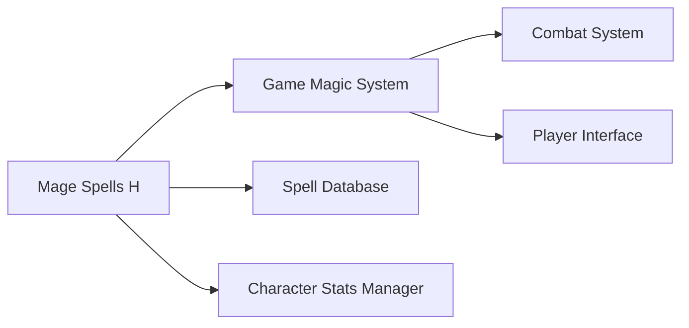
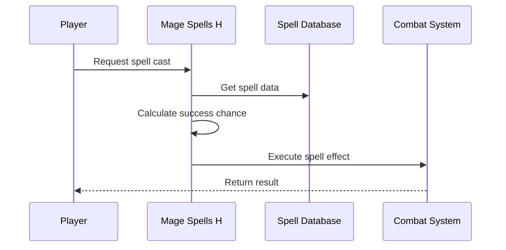

# Mage Spells Header Documentation

## Brief Introduction

The `mage_spells_h` module provides the header interface for mage spell casting functionality within the game system. This module defines the core functions and interfaces required for spell selection, casting, and success probability calculations. It serves as the primary interface for mage-related spell operations and integrates with the broader magic system architecture.

## Module Overview

This header file declares essential functions for handling mage spells, including spell casting logic and success rate calculations. The module acts as a bridge between the game's magic system and the specific implementation details of spell execution.

## Architecture and Component Relationships

### Core Components

The module exposes two primary functions:

1. `getAndCastMagicSpell()` - Main function for spell selection and execution
2. `spellChanceOfSuccess(int spell_id)` - Calculates success probability for a given spell

### Integration Points

### Data Flow

## Function Specifications

### `getAndCastMagicSpell()`
- **Purpose**: Main entry point for mage spell casting operations
- **Parameters**: None
- **Return Type**: void
- **Description**: Coordinates the entire spell casting process including spell selection, validation, and execution

### `spellChanceOfSuccess(int spell_id)`
- **Purpose**: Calculates the probability of successfully casting a spell
- **Parameters**: 
  - `spell_id`: Identifier for the spell to evaluate
- **Return Type**: int (success percentage)
- **Description**: Computes the likelihood of spell success based on various factors including character stats and spell complexity

## Dependencies

This module depends on:
- [magic_system_h.md](magic_system_h.md) - Core magic system interface
- [spell_database_h.md](spell_database_h.md) - Spell data management
- [character_stats_h.md](character_stats_h.md) - Character attribute access

## Implementation Considerations

The header file establishes the contract for mage spell operations while maintaining loose coupling with underlying systems. The module follows a clean interface design pattern, allowing for easy testing and extension of spell casting functionality.

## System Integration

This module integrates with the broader magic system architecture through:
- Spell database queries for spell properties
- Character stat evaluation for success calculations
- Combat system integration for spell effects
- Player interface updates for spell feedback

The module's design supports extensibility for new spell types while maintaining backward compatibility with existing spell implementations.
