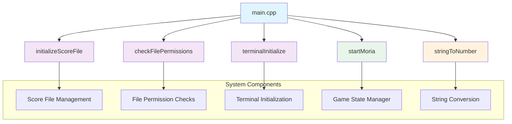

# main_cpp Module Documentation

## Brief Introduction

The `main_cpp` module serves as the entry point and primary control flow manager for the Umoria roguelike game. This module handles command-line argument parsing, system initialization, game state management, and orchestrates the overall program execution flow. It coordinates with various subsystems including terminal handling, file operations, and game initialization routines.

## Module Overview

The main module is responsible for:
- Parsing command-line arguments and options
- Initializing system resources and file permissions
- Managing game startup conditions (new game, saved game, etc.)
- Handling special modes like high score display and version information
- Coordinating the main game loop through the `startMoria` function

## Architecture and Component Relationships



## Data Flow and Process Flow

```mermaid
flowchart TD
    A[Start Program] --> B{Command Line Args?}
    B -->|Yes| C[Parse Arguments]
    B -->|No| D[Use Defaults]
    
    C --> E{Special Options?}
    E -->|Version (-v)| F[Show Version & Exit]
    E -->|Display Scores (-d)| G[Show Scores & Exit]
    E -->|Seed (-s)| H[Parsed Seed Value]
    E -->|New Game (-n)| I[Set New Game Flag]
    E -->|Roguelike Keys (-r)| J[Set Key Mode]
    E -->|Wizard Mode (-w)| K[Enable Wizard Mode]
    E -->|Help (-h)| L[Show Help & Exit]
    
    H --> M[Validate Seed Range]
    M --> N{Valid Seed?}
    N -->|Yes| O[Store Seed]
    N -->|No| P[Error Message & Exit]
    
    I --> Q[Set New Game Flag]
    J --> R[Set Roguelike Keys]
    K --> S[Enable Wizard Mode]
    
    D --> T[Load Default Settings]
    
    O --> U[Check Save Game File]
    Q --> U
    R --> U
    S --> U
    
    U --> V{Save Game File?}
    V -->|Yes| W[Load Save Game]
    V -->|No| X[Start New Game]
    
    W --> Y[Initialize Game State]
    X --> Y
    
    Y --> Z[Start Main Game Loop]
    
    Z --> AA[Game Running]
    AA --> AB{Game Over?}
    AB -->|Yes| AC[Save Game/Exit]
    AB -->|No| AD[Continue Loop]
    
    AC --> AE[End Program]
    AD --> Z
```

## Detailed Component Analysis

### Main Function (`main`)
The `main` function serves as the central coordination point for the entire application. It performs several critical initialization tasks:

1. **Score File Initialization**: Calls `initializeScoreFile()` to establish access to high score storage
2. **File Permissions Check**: Validates that all required files are accessible via `checkFilePermissions()`
3. **Terminal Setup**: Initializes the terminal interface with `terminalInitialize()`
4. **Argument Parsing**: Processes command-line arguments to determine game behavior
5. **Game Startup**: Invokes `startMoria()` to begin the actual game execution

### Argument Processing Logic
The argument parsing follows standard Unix-style option handling:
- Single character options prefixed with `-`
- Special handling for `-s` (seed), `-n` (new game), `-r` (roguelike keys), `-d` (display scores)
- Error handling for invalid options and missing parameters

### Game Seed Parsing (`parseGameSeed`)
This helper function validates and converts seed values from command-line arguments:
- Uses `stringToNumber()` for conversion
- Validates range constraints (1 to 2147483647)
- Returns boolean success/failure status

## Integration Points

This module integrates with several other system components:

- **[config](config.md)**: Accesses configuration file paths through `config::files::save_game`
- **[terminal](terminal.md)**: Manages terminal initialization and restoration
- **[score](score.md)**: Handles high score file operations
- **[game](game.md)**: Coordinates game state management and startup
- **[utils](utils.md)**: Utilizes string conversion utilities

## Dependencies

The main module depends on:
- `headers.h`: Standard system headers and definitions
- `version.h`: Version information constants
- Various utility functions from other modules
- System-level file I/O and terminal handling capabilities

## Error Handling

The module implements comprehensive error handling:
- Early termination on critical initialization failures
- Clear error messages for invalid command-line arguments
- Graceful exits with appropriate return codes
- Terminal restoration before exiting

## Usage Examples

```bash
# Start new game with default settings
umoria -n

# Load specific save game
umoria my_savegame.sav

# Start with custom seed
umoria -s 12345

# Display high scores and exit
umoria -d

# Show version information
umoria -v
```

## Return Codes

- `0`: Successful execution
- `1`: Critical initialization failure
- `-1`: Invalid command-line argument
- `0`: Help/version display completion

This module forms the foundation of the Umoria game's execution flow, ensuring proper initialization and coordination of all subsystems before entering the main game loop.
